# 机械臂抓取项目：机器人工程师技术路线图

## 📋 文档信息

**版本**：v1.0  
**日期**：2025 年 1 月  
**目标人群**：机器人工程师（运动规划、控制、系统集成方向）  
**项目周期**：3 个月（基础demo + 系统优化）  
**适用场景**：3C 领域视觉引导机械臂抓取  
**前置要求**：
- 熟悉 ROS/ROS2 基础
- 了解机器人运动学（正逆运动学）
- 熟悉 C++ 或 Python 编程
- 了解控制理论基础

---

## 🎯 项目目标与里程碑

### 项目整体目标
构建一个稳定、高效的机械臂运动控制系统，能够：
- ✅ 精确的运动规划（避障、平滑、快速）
- ✅ 实时的轨迹控制（位置/速度/力控）
- ✅ 完善的安全机制（碰撞检测、紧急停止）
- ✅ 良好的系统集成（感知→规划→控制→执行）

### 三个月里程碑

| 阶段 | 时间 | 核心任务 | 交付物 | 成功标准 |
|------|------|---------|--------|----------|
| **第一个月<br/>基础控制** | 第 1-4 周 | • ROS2环境搭建<br/>• MoveIt2配置<br/>• 基础运动控制 | • 仿真环境<br/>• 运动规划器<br/>• 简单抓取demo | • 规划成功率 >95%<br/>• 轨迹平滑性良好 |
| **第二个月<br/>高级规划** | 第 5-8 周 | • 笛卡尔路径规划<br/>• 碰撞检测优化<br/>• 力控制集成 | • 直线运动规划<br/>• Planning Scene<br/>• 力反馈控制 | • 规划时间 <2秒<br/>• 力控精度 <0.5N |
| **第三个月<br/>系统优化** | 第 9-12 周 | • 性能优化<br/>• 错误处理<br/>• 系统集成测试 | • 完整系统<br/>• 测试报告<br/>• 技术文档 | • 端到端成功率 >85%<br/>• 系统稳定性 >95% |

---

## 🗺️ 系统架构总览（机器人工程师视角）

### 完整系统流程图（Mermaid）

```mermaid
flowchart TB
    Start([系统启动]) --> SysInit[系统初始化]
    
    subgraph Init["🔧 系统初始化模块"]
        SysInit --> LoadConfig[加载配置<br/>URDF/SRDF/Controllers]
        LoadConfig --> InitROS[初始化ROS2节点<br/>Topics/Services/Actions]
        InitROS --> InitMoveIt[初始化MoveIt2<br/>Planning Scene/Kinematics]
        InitMoveIt --> Calibrate[机械臂标定<br/>Home位置]
    end
    
    Calibrate --> WaitTask[等待任务指令]
    
    WaitTask --> RecvGoal[接收目标位姿<br/>来自感知模块]
    
    subgraph Planning["🛣️ 运动规划模块"]
        RecvGoal --> ValidateGoal{目标<br/>有效?}
        ValidateGoal -->|无效| ErrorHandle1[错误处理]
        ValidateGoal -->|有效| IKSolve[逆运动学求解<br/>TRAC-IK/KDL]
        
        IKSolve --> IKSuccess{IK<br/>有解?}
        IKSuccess -->|无解| RetryIK[调整目标/重试]
        RetryIK --> IKSolve
        IKSuccess -->|有解| UpdateScene[更新Planning Scene<br/>添加障碍物]
        
        UpdateScene --> SelectPlanner[选择规划算法<br/>RRT/PRM/Cartesian]
        SelectPlanner --> Plan[执行规划]
        
        Plan --> PlanResult{规划<br/>成功?}
        PlanResult -->|失败| TryAlternative[尝试备选算法]
        TryAlternative --> Plan
        PlanResult -->|成功| ValidatePath[路径验证<br/>碰撞检测/关节限制]
        
        ValidatePath --> PathOK{路径<br/>安全?}
        PathOK -->|否| AdjustPlan[调整规划参数]
        AdjustPlan --> Plan
        PathOK -->|是| SmoothTraj[轨迹平滑<br/>Time Parameterization]
    end
    
    SmoothTraj --> SendTraj[发送轨迹到控制器]
    
    subgraph Control["⚙️ 控制执行模块"]
        SendTraj --> TrajController[轨迹控制器<br/>JointTrajectoryController]
        
        TrajController --> Monitor[实时监控]
        
        subgraph Monitoring["监控系统"]
            Monitor --> CheckJoint[关节状态检查]
            Monitor --> CheckForce[力/力矩检查]
            Monitor --> CheckColl[碰撞检测]
        end
        
        CheckJoint --> Anomaly{异常<br/>检测?}
        CheckForce --> Anomaly
        CheckColl --> Anomaly
        
        Anomaly -->|是| EmergencyStop[紧急停止<br/>Halt Controller]
        Anomaly -->|否| Continue[继续执行]
        
        Continue --> TrajProgress{轨迹<br/>完成?}
        TrajProgress -->|否| TrajController
        TrajProgress -->|是| ReachGoal[到达目标]
    end
    
    ReachGoal --> GripperAction{需要<br/>夹爪动作?}
    
    subgraph Gripper["🤏 夹爪控制"]
        GripperAction -->|开/关| GripperCmd[发送夹爪指令<br/>GripperActionController]
        GripperCmd --> WaitGripper[等待夹爪完成]
        WaitGripper --> GripperDone[夹爪动作完成]
    end
    
    GripperAction -->|否| TaskComplete
    GripperDone --> TaskComplete[任务完成]
    
    TaskComplete --> Verify[验证结果<br/>位置/力反馈]
    
    Verify --> Success{成功?}
    Success -->|是| LogSuccess[记录成功数据]
    Success -->|否| LogFailure[记录失败原因]
    
    EmergencyStop --> Recovery[恢复流程]
    ErrorHandle1 --> Recovery
    
    Recovery --> RecoverSuccess{恢复<br/>成功?}
    RecoverSuccess -->|是| WaitTask
    RecoverSuccess -->|否| Shutdown[系统关闭]
    
    LogSuccess --> NextTask{下一个<br/>任务?}
    LogFailure --> NextTask
    
    NextTask -->|是| WaitTask
    NextTask -->|否| HomePos[回到Home位置]
    
    HomePos --> End([系统结束])
    
    %% 样式定义
    classDef initStyle fill:#e3f2fd,stroke:#1565c0,stroke-width:2px
    classDef planStyle fill:#fff3e0,stroke:#ef6c00,stroke-width:2px
    classDef controlStyle fill:#e8f5e9,stroke:#2e7d32,stroke-width:2px
    classDef gripperStyle fill:#f3e5f5,stroke:#6a1b9a,stroke-width:2px
    classDef monitorStyle fill:#fce4ec,stroke:#c2185b,stroke-width:2px
    classDef decisionStyle fill:#fff9c4,stroke:#f57f17,stroke-width:3px
    classDef errorStyle fill:#ffebee,stroke:#c62828,stroke-width:2px
    
    class LoadConfig,InitROS,InitMoveIt,Calibrate initStyle
    class IKSolve,UpdateScene,SelectPlanner,Plan,ValidatePath,SmoothTraj planStyle
    class TrajController,Continue,ReachGoal controlStyle
    class CheckJoint,CheckForce,CheckColl,Monitor monitorStyle
    class GripperCmd,WaitGripper,GripperDone gripperStyle
    class ValidateGoal,IKSuccess,PlanResult,PathOK,Anomaly,TrajProgress,GripperAction,Success,RecoverSuccess,NextTask decisionStyle
    class EmergencyStop,ErrorHandle1,Recovery,Shutdown errorStyle
```



### 机器人系统层次架构

```
┌─────────────────────────────────────────────────────────────┐
│               应用层 (Application Layer)                     │
│  ┌──────────────┐  ┌──────────────┐  ┌──────────────┐      │
│  │ 任务协调器    │  │ 状态监控器    │  │ 数据记录器    │      │
│  │Task Manager  │  │State Monitor │  │Data Logger   │      │
│  └──────────────┘  └──────────────┘  └──────────────┘      │
└─────────────────────────────────────────────────────────────┘
                          ↓ ROS2 Actions/Services
┌─────────────────────────────────────────────────────────────┐
│            规划层 (Planning Layer) - MoveIt2                │
│  ┌──────────────┐  ┌──────────────┐  ┌──────────────┐      │
│  │ 运动规划器    │  │ 碰撞检测      │  │ 运动学求解器  │      │
│  │OMPL/CHOMP    │  │Planning Scene│  │IK/FK Solver  │      │
│  └──────────────┘  └──────────────┘  └──────────────┘      │
└─────────────────────────────────────────────────────────────┘
                          ↓ Trajectory Messages
┌─────────────────────────────────────────────────────────────┐
│          控制层 (Control Layer) - ros2_control              │
│  ┌──────────────┐  ┌──────────────┐  ┌──────────────┐      │
│  │ 轨迹控制器    │  │ 夹爪控制器    │  │ 力控制器      │      │
│  │JTC           │  │Gripper Ctrl  │  │Force Ctrl    │      │
│  └──────────────┘  └──────────────┘  └──────────────┘      │
└─────────────────────────────────────────────────────────────┘
                          ↓ Joint Commands
┌─────────────────────────────────────────────────────────────┐
│       硬件接口层 (Hardware Interface) - Gazebo/Real         │
│  ┌──────────────┐  ┌──────────────┐  ┌──────────────┐      │
│  │ 关节接口      │  │ 传感器接口    │  │ 夹爪接口      │      │
│  │Joint HW IF   │  │Sensor HW IF  │  │Gripper HW IF │      │
│  └──────────────┘  └──────────────┘  └──────────────┘      │
└─────────────────────────────────────────────────────────────┘
                          ↓ Simulator/Driver
┌─────────────────────────────────────────────────────────────┐
│              物理层 (Physical Layer)                         │
│            Gazebo 仿真器 / 真实机械臂硬件                     │
└─────────────────────────────────────────────────────────────┘
```

---

## 📚 机器人技术栈详解

### 1. ROS2 核心技术栈

#### 1.1 ROS2 通信机制

| 机制 | 用途 | 特点 | 适用场景 |
|------|------|------|----------|
| **Topic** | 发布/订阅 | 异步、多对多 | 传感器数据流、状态发布 |
| **Service** | 请求/响应 | 同步、一对一 | 参数查询、快速操作 |
| **Action** | 长时间任务 | 异步、带反馈 | 运动规划、抓取执行 |

**关键 Topics**：
```yaml
# 机械臂状态
/joint_states                      # sensor_msgs/JointState
/robot_state                       # moveit_msgs/RobotState

# 控制命令
/joint_trajectory_controller/joint_trajectory  # trajectory_msgs/JointTrajectory
/gripper_controller/gripper_cmd    # control_msgs/GripperCommand

# 规划相关
/planning_scene                    # moveit_msgs/PlanningScene
/display_planned_path              # moveit_msgs/DisplayTrajectory
```

**关键 Services**：
```yaml
# MoveIt2 服务
/plan_kinematic_path               # moveit_msgs/GetMotionPlan
/compute_ik                        # moveit_msgs/GetPositionIK
/compute_fk                        # moveit_msgs/GetPositionFK
/get_planning_scene                # moveit_msgs/GetPlanningScene
```

**关键 Actions**：
```yaml
# 运动执行
/execute_trajectory                # moveit_msgs/ExecuteTrajectory
/move_group                        # moveit_msgs/MoveGroup

# 夹爪控制
/gripper_controller/gripper_cmd    # control_msgs/GripperCommand
```

#### 1.2 TF2 坐标变换

**坐标系层次结构**：
```
world (固定参考系)
 └── base_link (机械臂基座)
      └── shoulder_link
           └── upper_arm_link
                └── forearm_link
                     └── wrist_1_link
                          └── wrist_2_link
                               └── wrist_3_link
                                    └── tool0 (法兰)
                                         ├── ee_link (末端执行器)
                                         └── gripper_base
                                              ├── left_finger
                                              └── right_finger

world (固定参考系)
 └── camera_link (相机)
      └── camera_color_optical_frame
```

**常用TF操作**：
```python
from tf2_ros import Buffer, TransformListener, TransformBroadcaster
from geometry_msgs.msg import TransformStamped

class TFManager:
    def __init__(self, node):
        self.tf_buffer = Buffer()
        self.tf_listener = TransformListener(self.tf_buffer, node)
        self.tf_broadcaster = TransformBroadcaster(node)
        
    def get_transform(self, target_frame, source_frame):
        """获取两个坐标系之间的变换"""
        try:
            transform = self.tf_buffer.lookup_transform(
                target_frame, source_frame, 
                rclpy.time.Time(), 
                timeout=rclpy.duration.Duration(seconds=1.0)
            )
            return transform
        except Exception as e:
            print(f"TF lookup failed: {e}")
            return None
            
    def publish_transform(self, parent, child, translation, rotation):
        """发布静态变换"""
        t = TransformStamped()
        t.header.stamp = self.node.get_clock().now().to_msg()
        t.header.frame_id = parent
        t.child_frame_id = child
        t.transform.translation.x = translation[0]
        t.transform.translation.y = translation[1]
        t.transform.translation.z = translation[2]
        t.transform.rotation.x = rotation[0]
        t.transform.rotation.y = rotation[1]
        t.transform.rotation.z = rotation[2]
        t.transform.rotation.w = rotation[3]
        self.tf_broadcaster.sendTransform(t)
```

---

### 2. MoveIt2 运动规划技术栈

#### 2.1 MoveIt2 核心组件

```
MoveIt2 架构
├── Planning Scene (规划场景管理)
│   ├── Robot State (机器人状态)
│   ├── Collision Objects (碰撞物体)
│   ├── Octomap (3D占用地图)
│   └── Allowed Collision Matrix (允许碰撞矩阵)
│
├── Kinematics Solver (运动学求解器)
│   ├── KDL (默认，快速但成功率一般)
│   ├── TRAC-IK (推荐，成功率高)
│   ├── IKFast (最快，需要预生成)
│   └── Bio-IK (优化求解，支持多目标)
│
├── Motion Planners (运动规划器)
│   ├── OMPL (Open Motion Planning Library)
│   │   ├── RRT (快速随机树)
│   │   ├── RRTConnect (双向RRT，推荐)
│   │   ├── RRT* (渐进最优)
│   │   ├── PRM (概率路图)
│   │   └── EST (扩展空间树)
│   ├── CHOMP (协变哈密顿优化)
│   ├── STOMP (随机轨迹优化)
│   └── Pilz Industrial Motion (工业运动，直线/圆弧)
│
├── Trajectory Processing (轨迹处理)
│   ├── Time Parameterization (时间参数化)
│   ├── Iterative Parabolic (抛物线插值，推荐)
│   └── Trajectory Smoothing (平滑)
│
└── Controllers (控制器接口)
    ├── JointTrajectoryController
    ├── GripperActionController
    └── FollowJointTrajectory Action
```

#### 2.2 规划算法对比

| 算法 | 类型 | 速度 | 路径质量 | 成功率 | 适用场景 |
|------|------|------|---------|--------|----------|
| **RRTConnect** | 采样 | ⭐⭐⭐⭐ | ⭐⭐⭐ | ⭐⭐⭐⭐ | 通用，推荐 |
| **RRT*** | 采样 | ⭐⭐ | ⭐⭐⭐⭐⭐ | ⭐⭐⭐⭐ | 需要最优路径 |
| **PRM** | 采样 | ⭐⭐⭐ | ⭐⭐⭐ | ⭐⭐⭐ | 多次规划（预计算路图）|
| **CHOMP** | 优化 | ⭐⭐⭐ | ⭐⭐⭐⭐ | ⭐⭐⭐ | 需要平滑轨迹 |
| **Pilz Linear** | 插值 | ⭐⭐⭐⭐⭐ | ⭐⭐⭐⭐⭐ | ⭐⭐ | 直线运动（接近抓取）|

**配置示例** (`ompl_planning.yaml`):
```yaml
planning_plugin: ompl_interface/OMPLPlanner
request_adapters: >-
  default_planner_request_adapters/AddTimeOptimalParameterization
  default_planner_request_adapters/FixWorkspaceBounds
  default_planner_request_adapters/FixStartStateBounds
  default_planner_request_adapters/FixStartStateCollision
  default_planner_request_adapters/FixStartStatePathConstraints

start_state_max_bounds_error: 0.1

ur_manipulator:
  planner_configs:
    - RRTConnect
    - RRTstar
    - PRM
  projection_evaluator: joints(shoulder_pan_joint,shoulder_lift_joint)
  
  RRTConnect:
    type: geometric::RRTConnect
    range: 0.0  # 0 = 自动设置
    
  RRTstar:
    type: geometric::RRTstar
    range: 0.0
    goal_bias: 0.05
    delay_collision_checking: true
```

#### 2.3 Planning Scene 管理

**添加碰撞物体**：
```python
from moveit_msgs.msg import CollisionObject, PlanningScene
from shape_msgs.msg import SolidPrimitive
from geometry_msgs.msg import Pose

class PlanningSceneManager:
    def __init__(self, node):
        self.scene_pub = node.create_publisher(
            PlanningScene, '/planning_scene', 10
        )
        
    def add_box(self, name, pose, size):
        """添加箱体障碍物"""
        collision_object = CollisionObject()
        collision_object.header.frame_id = "world"
        collision_object.id = name
        
        # 定义形状
        box = SolidPrimitive()
        box.type = SolidPrimitive.BOX
        box.dimensions = size  # [length, width, height]
        
        collision_object.primitives.append(box)
        collision_object.primitive_poses.append(pose)
        collision_object.operation = CollisionObject.ADD
        
        # 发布到 Planning Scene
        scene_msg = PlanningScene()
        scene_msg.world.collision_objects.append(collision_object)
        scene_msg.is_diff = True
        self.scene_pub.publish(scene_msg)
        
    def add_table(self):
        """添加桌面"""
        table_pose = Pose()
        table_pose.position.x = 0.5
        table_pose.position.y = 0.0
        table_pose.position.z = -0.025  # 桌面厚度一半
        table_pose.orientation.w = 1.0
        
        self.add_box("table", table_pose, [0.8, 1.0, 0.05])
        
    def remove_object(self, name):
        """移除物体"""
        collision_object = CollisionObject()
        collision_object.id = name
        collision_object.operation = CollisionObject.REMOVE
        
        scene_msg = PlanningScene()
        scene_msg.world.collision_objects.append(collision_object)
        scene_msg.is_diff = True
        self.scene_pub.publish(scene_msg)
```

---

### 3. ros2_control 控制技术栈

#### 3.1 ros2_control 架构

```
ros2_control 架构
├── Controller Manager (控制器管理器)
│   ├── 加载/卸载控制器
│   ├── 启动/停止控制器
│   └── 管理控制器生命周期
│
├── Controllers (控制器)
│   ├── JointTrajectoryController (关节轨迹控制器) ⭐
│   ├── JointGroupPositionController (位置控制)
│   ├── JointGroupVelocityController (速度控制)
│   ├── ForceController (力控制)
│   └── GripperActionController (夹爪控制)
│
├── Hardware Interface (硬件接口)
│   ├── Command Interface (命令接口)
│   │   ├── position
│   │   ├── velocity
│   │   └── effort (力/力矩)
│   └── State Interface (状态接口)
│       ├── position
│       ├── velocity
│       └── effort
│
└── Resource Manager (资源管理器)
    └── 管理硬件资源的读写
```

#### 3.2 控制器配置

**JointTrajectoryController 配置** (`controller.yaml`):
```yaml
controller_manager:
  ros__parameters:
    update_rate: 100  # Hz
    
    joint_trajectory_controller:
      type: joint_trajectory_controller/JointTrajectoryController
      
    gripper_controller:
      type: position_controllers/GripperActionController

joint_trajectory_controller:
  ros__parameters:
    joints:
      - shoulder_pan_joint
      - shoulder_lift_joint
      - elbow_joint
      - wrist_1_joint
      - wrist_2_joint
      - wrist_3_joint
      
    command_interfaces:
      - position
      
    state_interfaces:
      - position
      - velocity
      
    state_publish_rate: 50.0
    action_monitor_rate: 20.0
    
    allow_partial_joints_goal: false
    
    constraints:
      stopped_velocity_tolerance: 0.01
      goal_time: 0.0
      shoulder_pan_joint:
        trajectory: 0.05  # rad
        goal: 0.01        # rad
      # ... 其他关节类似
```

**夹爪控制器配置**：
```yaml
gripper_controller:
  ros__parameters:
    joint: robotiq_85_left_knuckle_joint
    
    goal_tolerance: 0.001
    max_effort: 100.0
    
    allow_stalling: true
    stall_velocity_threshold: 0.001
    stall_timeout: 1.0
```

#### 3.3 实时控制示例

```python
from rclpy.action import ActionClient
from control_msgs.action import FollowJointTrajectory, GripperCommand
from trajectory_msgs.msg import JointTrajectory, JointTrajectoryPoint

class RobotController:
    def __init__(self, node):
        self.node = node
        
        # 创建 Action 客户端
        self.traj_client = ActionClient(
            node,
            FollowJointTrajectory,
            '/joint_trajectory_controller/follow_joint_trajectory'
        )
        
        self.gripper_client = ActionClient(
            node,
            GripperCommand,
            '/gripper_controller/gripper_cmd'
        )
        
    def execute_trajectory(self, trajectory):
        """执行关节轨迹"""
        goal_msg = FollowJointTrajectory.Goal()
        goal_msg.trajectory = trajectory
        
        # 发送目标
        self.traj_client.wait_for_server()
        future = self.traj_client.send_goal_async(goal_msg)
        
        # 等待结果
        rclpy.spin_until_future_complete(self.node, future)
        goal_handle = future.result()
        
        if not goal_handle.accepted:
            self.node.get_logger().error("Goal rejected")
            return False
            
        result_future = goal_handle.get_result_async()
        rclpy.spin_until_future_complete(self.node, result_future)
        
        result = result_future.result().result
        return result.error_code == FollowJointTrajectory.Result.SUCCESSFUL
        
    def close_gripper(self, position=0.0, max_effort=10.0):
        """关闭夹爪"""
        goal_msg = GripperCommand.Goal()
        goal_msg.command.position = position
        goal_msg.command.max_effort = max_effort
        
        self.gripper_client.wait_for_server()
        future = self.gripper_client.send_goal_async(goal_msg)
        
        rclpy.spin_until_future_complete(self.node, future)
        goal_handle = future.result()
        
        result_future = goal_handle.get_result_async()
        rclpy.spin_until_future_complete(self.node, result_future)
        
        return result_future.result().result.reached_goal
```

---

## 📅 三个月实施计划（机器人工程师视角）

### 第一个月：基础运动控制

#### 第 1 周：环境搭建与机器人配置

**目标**：搭建完整的 ROS2 + MoveIt2 环境，配置 UR5e 机械臂

**任务清单**：
- [ ] 安装 ROS2 Humble (Docker 推荐)
- [ ] 安装 MoveIt2 和依赖包
- [ ] 获取 UR5e URDF 模型
- [ ] 生成 MoveIt2 配置包（使用 MoveIt Setup Assistant）
- [ ] 配置 Gazebo 仿真环境
- [ ] 测试基本启动

**详细步骤**：

**1. Docker 环境搭建**：
```bash
# Dockerfile
FROM osrf/ros:humble-desktop-full

# 安装 MoveIt2
RUN apt-get update && apt-get install -y \
    ros-humble-moveit \
    ros-humble-moveit-resources \
    ros-humble-moveit-visual-tools \
    ros-humble-ros2-control \
    ros-humble-ros2-controllers \
    ros-humble-gazebo-ros2-control \
    python3-colcon-common-extensions \
    && rm -rf /var/lib/apt/lists/*

# 设置工作空间
WORKDIR /root/ros2_ws
```

**2. 创建工作空间**：
```bash
mkdir -p ~/ros2_ws/src
cd ~/ros2_ws/src

# 克隆 UR 机械臂包
git clone -b humble https://github.com/UniversalRobots/Universal_Robots_ROS2_Driver.git
git clone -b ros2 https://github.com/robotiq/robotiq_2f_gripper.git

# 编译
cd ~/ros2_ws
colcon build --symlink-install
source install/setup.bash
```

**3. 使用 MoveIt Setup Assistant 配置**：
```bash
ros2 launch moveit_setup_assistant setup_assistant.launch.py
```

配置步骤：
1. **Start** → 加载 UR5e URDF
2. **Self-Collisions** → 生成允许碰撞矩阵（采样密度 10000）
3. **Virtual Joints** → 添加 `world` → `base_link` 固定关节
4. **Planning Groups** → 添加规划组：
   - `ur_manipulator`：包含 6 个关节（shoulder_pan 到 wrist_3）
   - `gripper`：包含夹爪关节
5. **Robot Poses** → 定义常用姿态：
   - `home`: [0, -π/2, π/2, -π/2, -π/2, 0]
   - `ready`: [0, -π/3, π/2, -π/6, -π/2, 0]
6. **End Effectors** → 添加 `gripper` 到 `wrist_3_link`
7. **Passive Joints** → 标记被动关节（夹爪的mimic关节）
8. **Controllers** → 配置 ros2_control
9. **Generate** → 生成配置包

**验收标准**：
- 能够启动 MoveIt2 和 RViz2
- 在 RViz2 中看到 UR5e 模型
- 能够拖动交互式标记规划运动

**代码测试**：
```python
import rclpy
from rclpy.node import Node
from moveit_py import MoveItPy

class TestMoveIt(Node):
    def __init__(self):
        super().__init__('test_moveit')
        
        # 初始化 MoveIt
        self.robot = MoveItPy(node_name="moveit_py")
        self.arm = self.robot.get_planning_component("ur_manipulator")
        
        # 测试移动到 home 位置
        self.get_logger().info("Moving to home position...")
        self.arm.set_goal_state(configuration_name="home")
        plan_result = self.arm.plan()
        
        if plan_result:
            self.get_logger().info("✅ Planning succeeded!")
        else:
            self.get_logger().error("❌ Planning failed!")

def main():
    rclpy.init()
    node = TestMoveIt()
    rclpy.spin(node)
    rclpy.shutdown()
```

---

#### 第 2 周：运动学与基础规划

**目标**：掌握正逆运动学，实现基础的点到点运动

**任务清单**：
- [ ] 理解 DH 参数与运动学
- [ ] 配置 IK 求解器（TRAC-IK）
- [ ] 实现正运动学查询
- [ ] 实现逆运动学求解
- [ ] 测试不同目标位姿的可达性
- [ ] 实现简单的Pick & Place

**正运动学 (FK) 示例**：
```python
from moveit_msgs.srv import GetPositionFK
from sensor_msgs.msg import JointState

class KinematicsSolver:
    def __init__(self, node):
        self.node = node
        self.fk_client = node.create_client(
            GetPositionFK,
            '/compute_fk'
        )
        
    def compute_fk(self, joint_values):
        """计算正运动学：关节角度 → 末端位姿"""
        request = GetPositionFK.Request()
        request.fk_link_names = ['tool0']
        request.robot_state.joint_state.name = [
            'shoulder_pan_joint', 'shoulder_lift_joint', 
            'elbow_joint', 'wrist_1_joint', 
            'wrist_2_joint', 'wrist_3_joint'
        ]
        request.robot_state.joint_state.position = joint_values
        
        future = self.fk_client.call_async(request)
        rclpy.spin_until_future_complete(self.node, future)
        
        response = future.result()
        if response.error_code.val == 1:  # SUCCESS
            pose = response.pose_stamped[0].pose
            return pose
        else:
            return None
```

**逆运动学 (IK) 示例**：
```python
from moveit_msgs.srv import GetPositionIK
from geometry_msgs.msg import PoseStamped

class IKSolver:
    def __init__(self, node):
        self.node = node
        self.ik_client = node.create_client(
            GetPositionIK,
            '/compute_ik'
        )
        
    def compute_ik(self, target_pose, timeout=1.0):
        """计算逆运动学：末端位姿 → 关节角度"""
        request = GetPositionIK.Request()
        request.ik_request.group_name = 'ur_manipulator'
        request.ik_request.pose_stamped = target_pose
        request.ik_request.timeout = Duration(seconds=timeout)
        request.ik_request.avoid_collisions = True
        
        future = self.ik_client.call_async(request)
        rclpy.spin_until_future_complete(self.node, future)
        
        response = future.result()
        if response.error_code.val == 1:  # SUCCESS
            joint_values = response.solution.joint_state.position
            return list(joint_values)
        else:
            self.node.get_logger().warn(
                f"IK failed with code {response.error_code.val}"
            )
            return None
```

**Pick & Place 基础流程**：
```python
class SimplePickPlace:
    def __init__(self, node, move_group):
        self.node = node
        self.move_group = move_group
        
    def pick_and_place(self, pick_pose, place_pose):
        """简单的拾取放置流程"""
        
        # 1. 移动到预抓取位置（在抓取点上方10cm）
        pre_grasp_pose = pick_pose.copy()
        pre_grasp_pose.position.z += 0.10
        
        success = self.move_to_pose(pre_grasp_pose)
        if not success:
            return False
            
        # 2. 打开夹爪
        self.open_gripper()
        
        # 3. 下降到抓取点
        success = self.move_to_pose(pick_pose)
        if not success:
            return False
            
        # 4. 关闭夹爪
        self.close_gripper()
        
        # 5. 抬起
        success = self.move_to_pose(pre_grasp_pose)
        if not success:
            return False
            
        # 6. 移动到放置位置上方
        pre_place_pose = place_pose.copy()
        pre_place_pose.position.z += 0.10
        success = self.move_to_pose(pre_place_pose)
        if not success:
            return False
            
        # 7. 下降
        success = self.move_to_pose(place_pose)
        if not success:
            return False
            
        # 8. 打开夹爪
        self.open_gripper()
        
        # 9. 撤回
        success = self.move_to_pose(pre_place_pose)
        
        return success
        
    def move_to_pose(self, target_pose):
        """移动到目标位姿"""
        self.move_group.set_pose_target(target_pose)
        plan = self.move_group.plan()
        
        if plan[0]:  # 规划成功
            self.move_group.execute(plan[1])
            return True
        else:
            return False
```

**验收标准**：
- IK 求解成功率 > 90%（在工作空间内）
- 能够完成简单的 Pick & Place（固定位置）
- 理解奇异点问题并能避免

---

#### 第 3 周：路径规划与碰撞检测

**目标**：掌握多种规划算法，配置 Planning Scene

**任务清单**：
- [ ] 配置多种规划器（RRT, RRT*, PRM）
- [ ] 比较不同规划器的性能
- [ ] 添加障碍物到 Planning Scene
- [ ] 实现碰撞检测查询
- [ ] 实现安全的避障运动

**规划器性能测试**：
```python
import time
from collections import defaultdict

class PlannerBenchmark:
    def __init__(self, move_group):
        self.move_group = move_group
        self.results = defaultdict(list)
        
    def benchmark_planner(self, planner_name, start_pose, goal_pose, num_trials=10):
        """测试规划器性能"""
        self.move_group.set_planner_id(planner_name)
        
        for i in range(num_trials):
            self.move_group.set_start_state_to_current_state()
            self.move_group.set_pose_target(goal_pose)
            
            start_time = time.time()
            plan = self.move_group.plan()
            planning_time = time.time() - start_time
            
            if plan[0]:  # 成功
                trajectory = plan[1]
                path_length = self.compute_path_length(trajectory)
                
                self.results[planner_name].append({
                    'success': True,
                    'time': planning_time,
                    'length': path_length,
                    'num_waypoints': len(trajectory.joint_trajectory.points)
                })
            else:
                self.results[planner_name].append({
                    'success': False,
                    'time': planning_time
                })
                
        # 统计
        stats = self.compute_statistics(planner_name)
        return stats
        
    def compute_path_length(self, trajectory):
        """计算路径长度（关节空间）"""
        total_length = 0.0
        points = trajectory.joint_trajectory.points
        
        for i in range(1, len(points)):
            prev = points[i-1].positions
            curr = points[i].positions
            distance = sum((c - p)**2 for c, p in zip(curr, prev)) ** 0.5
            total_length += distance
            
        return total_length
        
    def compute_statistics(self, planner_name):
        """计算统计信息"""
        data = self.results[planner_name]
        successes = [d for d in data if d['success']]
        
        if not successes:
            return {
                'success_rate': 0.0,
                'avg_time': None,
                'avg_length': None
            }
            
        return {
            'success_rate': len(successes) / len(data),
            'avg_time': sum(d['time'] for d in successes) / len(successes),
            'avg_length': sum(d['length'] for d in successes) / len(successes),
            'avg_waypoints': sum(d['num_waypoints'] for d in successes) / len(successes)
        }
```

**Planning Scene 管理**：
```python
from moveit_msgs.msg import CollisionObject, AttachedCollisionObject
from shape_msgs.msg import SolidPrimitive, Mesh
from geometry_msgs.msg import Pose

class SceneManager:
    def __init__(self, scene):
        self.scene = scene
        
    def add_obstacle_box(self, name, pose, size):
        """添加箱体障碍物"""
        self.scene.add_box(name, pose, size)
        
    def add_obstacle_cylinder(self, name, pose, height, radius):
        """添加圆柱体障碍物"""
        self.scene.add_cylinder(name, pose, height, radius)
        
    def attach_object_to_gripper(self, object_name):
        """将物体附加到夹爪（抓取后）"""
        touch_links = [
            'robotiq_85_left_finger_tip_link',
            'robotiq_85_right_finger_tip_link'
        ]
        self.scene.attach_box(
            'tool0', object_name, 
            touch_links=touch_links
        )
        
    def detach_object_from_gripper(self, object_name):
        """从夹爪分离物体（放置后）"""
        self.scene.remove_attached_object('tool0', name=object_name)
        
    def check_collision(self, robot_state):
        """检查给定状态是否碰撞"""
        # 使用 MoveIt 的碰撞检测
        return self.scene.is_state_valid(robot_state, group_name='ur_manipulator')
```

**实战：在有障碍物的环境中规划**：
```python
def demo_obstacle_avoidance():
    """演示避障规划"""
    
    # 1. 添加桌面
    table_pose = Pose()
    table_pose.position.x = 0.5
    table_pose.position.y = 0.0
    table_pose.position.z = -0.025
    table_pose.orientation.w = 1.0
    scene_manager.add_obstacle_box("table", table_pose, (0.8, 1.0, 0.05))
    
    # 2. 添加障碍物（例如墙壁）
    wall_pose = Pose()
    wall_pose.position.x = 0.3
    wall_pose.position.y = 0.3
    wall_pose.position.z = 0.3
    wall_pose.orientation.w = 1.0
    scene_manager.add_obstacle_box("wall", wall_pose, (0.05, 0.4, 0.6))
    
    # 3. 设置目标（需要绕过障碍物）
    target_pose = Pose()
    target_pose.position.x = 0.4
    target_pose.position.y = 0.35
    target_pose.position.z = 0.3
    target_pose.orientation.w = 1.0
    
    # 4. 规划
    move_group.set_pose_target(target_pose)
    success = move_group.plan()
    
    if success[0]:
        print("✅ Found collision-free path!")
        move_group.execute(success[1])
    else:
        print("❌ Planning failed (possibly no collision-free path)")
```

**验收标准**：
- 规划成功率 > 95%（无障碍环境）
- 规划成功率 > 80%（有障碍环境）
- 能够正确检测碰撞
- 理解不同规划器的优缺点

---

#### 第 4 周：笛卡尔路径与轨迹优化

**目标**：实现直线运动，优化轨迹质量

**任务清单**：
- [ ] 实现笛卡尔直线运动
- [ ] 配置时间参数化
- [ ] 实现轨迹平滑
- [ ] 测试不同速度和加速度限制
- [ ] 完成第一个月总结报告

**笛卡尔路径规划**：
```python
from geometry_msgs.msg import Pose

class CartesianPlanner:
    def __init__(self, move_group):
        self.move_group = move_group
        
    def plan_cartesian_path(self, waypoints, eef_step=0.01, jump_threshold=0.0):
        """
        规划笛卡尔空间中的直线路径
        
        Args:
            waypoints: 路径点列表 (Pose对象)
            eef_step: 末端执行器步长 (m)
            jump_threshold: 跳跃阈值 (0.0 = 禁用跳跃检测)
        """
        (plan, fraction) = self.move_group.compute_cartesian_path(
            waypoints,
            eef_step,
            jump_threshold
        )
        
        if fraction > 0.95:  # 至少95%的路径规划成功
            return plan, True
        else:
            print(f"⚠️ Only {fraction*100:.1f}% of path computed")
            return None, False
            
    def approach_from_above(self, target_pose, approach_distance=0.15):
        """从上方接近目标（用于抓取）"""
        waypoints = []
        
        # 起始点：当前位置
        current_pose = self.move_group.get_current_pose().pose
        waypoints.append(current_pose)
        
        # 中间点：目标正上方
        approach_pose = target_pose.copy()
        approach_pose.position.z += approach_distance
        waypoints.append(approach_pose)
        
        # 终点：目标位置
        waypoints.append(target_pose)
        
        plan, success = self.plan_cartesian_path(waypoints)
        
        if success:
            self.move_group.execute(plan, wait=True)
            return True
        else:
            return False
            
    def retreat_upward(self, distance=0.15):
        """向上撤回（抓取后）"""
        waypoints = []
        
        # 当前位置
        current_pose = self.move_group.get_current_pose().pose
        waypoints.append(current_pose)
        
        # 向上移动
        retreat_pose = current_pose.copy()
        retreat_pose.position.z += distance
        waypoints.append(retreat_pose)
        
        plan, success = self.plan_cartesian_path(waypoints)
        
        if success:
            self.move_group.execute(plan, wait=True)
            return True
        else:
            return False
```

**时间参数化与速度限制**：
```yaml
# joint_limits.yaml
joint_limits:
  shoulder_pan_joint:
    has_velocity_limits: true
    max_velocity: 2.0  # rad/s
    has_acceleration_limits: true
    max_acceleration: 1.5  # rad/s^2
    
  shoulder_lift_joint:
    has_velocity_limits: true
    max_velocity: 2.0
    has_acceleration_limits: true
    max_acceleration: 1.5
    
  # ... 其他关节类似
```

**代码中调整速度**：
```python
# 设置速度和加速度比例（0.0 ~ 1.0）
move_group.set_max_velocity_scaling_factor(0.5)  # 50% 最大速度
move_group.set_max_acceleration_scaling_factor(0.3)  # 30% 最大加速度

# 规划并执行
move_group.go()
```

**轨迹平滑**：
```python
from moveit_msgs.msg import RobotTrajectory
from trajectory_processing import IterativeParabolicTimeParameterization

def smooth_trajectory(trajectory, velocity_scale=0.5, acceleration_scale=0.5):
    """平滑轨迹"""
    # 创建时间参数化器
    iptp = IterativeParabolicTimeParameterization()
    
    # 平滑处理
    success = iptp.computeTimeStamps(
        trajectory,
        velocity_scale,
        acceleration_scale
    )
    
    if success:
        return trajectory
    else:
        return None
```

**第一个月综合Demo**：
```python
class Month1Demo:
    """第一个月完整演示：避障抓取"""
    
    def __init__(self, move_group, scene_manager):
        self.move_group = move_group
        self.scene_manager = scene_manager
        self.cartesian_planner = CartesianPlanner(move_group)
        
    def run(self):
        """运行完整流程"""
        
        print("=== 第一个月 Demo：避障抓取 ===")
        
        # 1. 设置场景
        print("1. 设置场景...")
        self.scene_manager.add_obstacle_box(
            "table", 
            Pose(position=Point(0.5, 0, -0.025), orientation=Quaternion(0,0,0,1)),
            (0.8, 1.0, 0.05)
        )
        time.sleep(1)
        
        # 2. 移动到 Home 位置
        print("2. 移动到 Home 位置...")
        self.move_group.set_named_target("home")
        self.move_group.go(wait=True)
        
        # 3. 移动到抓取准备位置
        print("3. 移动到抓取准备位置...")
        ready_pose = Pose()
        ready_pose.position.x = 0.4
        ready_pose.position.y = 0.1
        ready_pose.position.z = 0.4
        ready_pose.orientation.w = 1.0
        
        self.move_group.set_pose_target(ready_pose)
        success = self.move_group.go(wait=True)
        if not success:
            print("❌ Failed to reach ready pose")
            return False
            
        # 4. 笛卡尔直线下降到抓取点
        print("4. 直线下降到抓取点...")
        grasp_pose = ready_pose.copy()
        grasp_pose.position.z = 0.2
        
        success = self.cartesian_planner.approach_from_above(
            grasp_pose, approach_distance=0.0
        )
        if not success:
            print("❌ Cartesian path failed")
            return False
            
        # 5. 模拟关闭夹爪
        print("5. 关闭夹爪...")
        time.sleep(1)
        
        # 6. 向上撤回
        print("6. 向上撤回...")
        success = self.cartesian_planner.retreat_upward(distance=0.2)
        
        # 7. 移动到放置位置
        print("7. 移动到放置位置...")
        place_pose = Pose()
        place_pose.position.x = 0.3
        place_pose.position.y = -0.2
        place_pose.position.z = 0.3
        place_pose.orientation.w = 1.0
        
        self.move_group.set_pose_target(place_pose)
        self.move_group.go(wait=True)
        
        # 8. 下降
        print("8. 下降到放置点...")
        place_pose.position.z = 0.2
        success = self.cartesian_planner.approach_from_above(
            place_pose, approach_distance=0.0
        )
        
        # 9. 打开夹爪
        print("9. 打开夹爪...")
        time.sleep(1)
        
        # 10. 回到 Home
        print("10. 返回 Home 位置...")
        self.move_group.set_named_target("home")
        self.move_group.go(wait=True)
        
        print("✅ Demo 完成！")
        return True
```

**验收标准**：
- 笛卡尔路径规划成功率 > 90%
- 轨迹平滑，无抖动
- 完成第一个月完整 Demo
- 撰写技术总结（5-10页）

---

### 第二个月：高级规划与力控制

#### 第 5 周：复杂场景规划与约束

**目标**：处理复杂场景，添加路径约束

**任务清单**：
- [ ] 实现路径约束（姿态约束、方向约束）
- [ ] 处理狭窄空间规划
- [ ] 实现多阶段规划（复合动作）
- [ ] 优化规划参数

**路径约束示例**：
```python
from moveit_msgs.msg import Constraints, OrientationConstraint, PositionConstraint
from shape_msgs.msg import SolidPrimitive

class ConstrainedPlanner:
    def __init__(self, move_group):
        self.move_group = move_group
        
    def plan_with_upright_constraint(self, target_pose, tolerance=0.1):
        """规划时保持末端向下（例如避免液体洒出）"""
        
        # 创建姿态约束
        constraint = Constraints()
        orientation_constraint = OrientationConstraint()
        orientation_constraint.header.frame_id = "world"
        orientation_constraint.link_name = "tool0"
        orientation_constraint.orientation = target_pose.orientation
        orientation_constraint.absolute_x_axis_tolerance = tolerance
        orientation_constraint.absolute_y_axis_tolerance = tolerance
        orientation_constraint.absolute_z_axis_tolerance = 3.14  # Z轴可旋转
        orientation_constraint.weight = 1.0
        
        constraint.orientation_constraints.append(orientation_constraint)
        
        # 应用约束
        self.move_group.set_path_constraints(constraint)
        self.move_group.set_pose_target(target_pose)
        
        plan = self.move_group.plan()
        
        # 清除约束
        self.move_group.clear_path_constraints()
        
        return plan
        
    def plan_through_waypoints_with_constraints(self, waypoints):
        """通过多个路径点规划（带约束）"""
        
        all_plans = []
        
        for i in range(len(waypoints) - 1):
            start_pose = waypoints[i]
            goal_pose = waypoints[i + 1]
            
            # 设置起点
            self.move_group.set_start_state_to_current_state()
            
            # 规划到下一个点
            plan = self.plan_with_upright_constraint(goal_pose)
            
            if plan[0]:
                all_plans.append(plan[1])
                # 模拟移动到该点（更新起点）
                self.move_group.execute(plan[1], wait=True)
            else:
                print(f"❌ Failed to plan segment {i} → {i+1}")
                return None, False
                
        return all_plans, True
```

**狭窄空间规划技巧**：
```python
def plan_through_narrow_space(move_group, target_pose):
    """通过狭窄空间的规划技巧"""
    
    # 技巧1: 降低规划分辨率，增加采样密度
    move_group.set_planning_time(10.0)  # 增加规划时间
    move_group.set_num_planning_attempts(20)  # 增加尝试次数
    
    # 技巧2: 使用更保守的规划器
    move_group.set_planner_id("RRTstar")  # 使用RRT*
    
    # 技巧3: 手动设置中间路径点
    current_pose = move_group.get_current_pose().pose
    
    # 计算中间点（简单线性插值）
    waypoints = []
    num_intermediate = 5
    for i in range(num_intermediate + 1):
        t = i / num_intermediate
        intermediate_pose = interpolate_pose(current_pose, target_pose, t)
        waypoints.append(intermediate_pose)
    
    # 使用笛卡尔路径
    plan, fraction = move_group.compute_cartesian_path(
        waypoints, 
        eef_step=0.005,  # 更小的步长
        jump_threshold=0.0
    )
    
    if fraction > 0.9:
        return plan, True
    else:
        # 回退到关节空间规划
        move_group.set_pose_target(target_pose)
        return move_group.plan()
        
def interpolate_pose(pose1, pose2, t):
    """在两个位姿之间插值"""
    result = Pose()
    result.position.x = pose1.position.x + t * (pose2.position.x - pose1.position.x)
    result.position.y = pose1.position.y + t * (pose2.position.y - pose1.position.y)
    result.position.z = pose1.position.z + t * (pose2.position.z - pose1.position.z)
    # 四元数插值（SLERP）
    result.orientation = slerp(pose1.orientation, pose2.orientation, t)
    return result
```

**验收标准**：
- 能够处理带约束的规划
- 狭窄空间规划成功率 > 70%
- 理解约束对规划的影响

---

#### 第 6 周：力控制集成

**目标**：集成力/力矩传感器，实现力控制

**任务清单**：
- [ ] 配置力/力矩传感器（UR5e内置）
- [ ] 实现力反馈读取
- [ ] 实现接触检测
- [ ] 实现柔顺控制（Compliance Control）
- [ ] 测试恒力跟踪

**力传感器接口**：
```python
from geometry_msgs.msg import WrenchStamped

class ForceTorqueSensor:
    def __init__(self, node):
        self.node = node
        self.current_wrench = None
        
        # 订阅力/力矩话题
        self.sub = node.create_subscription(
            WrenchStamped,
            '/force_torque_sensor_broadcaster/wrench',
            self.wrench_callback,
            10
        )
        
    def wrench_callback(self, msg):
        """接收力/力矩数据"""
        self.current_wrench = msg.wrench
        
    def get_force(self):
        """获取当前力（Fx, Fy, Fz）"""
        if self.current_wrench:
            return (
                self.current_wrench.force.x,
                self.current_wrench.force.y,
                self.current_wrench.force.z
            )
        return None
        
    def get_force_magnitude(self):
        """获取力的大小"""
        force = self.get_force()
        if force:
            return (force[0]**2 + force[1]**2 + force[2]**2) ** 0.5
        return 0.0
        
    def detect_contact(self, threshold=5.0):
        """检测接触（力超过阈值）"""
        force_mag = self.get_force_magnitude()
        return force_mag > threshold
```

**接触检测与安全停止**：
```python
class SafetyMonitor:
    def __init__(self, node, ft_sensor, controller):
        self.node = node
        self.ft_sensor = ft_sensor
        self.controller = controller
        
        # 安全阈值
        self.force_threshold = 50.0  # N
        self.torque_threshold = 10.0  # Nm
        
        # 创建定时器，周期性检查
        self.timer = node.create_timer(0.01, self.check_safety)  # 100Hz
        
    def check_safety(self):
        """周期性安全检查"""
        force_mag = self.ft_sensor.get_force_magnitude()
        
        if force_mag > self.force_threshold:
            self.node.get_logger().error(
                f"⚠️ Excessive force detected: {force_mag:.2f}N"
            )
            self.emergency_stop()
            
    def emergency_stop(self):
        """紧急停止"""
        self.node.get_logger().error("🛑 EMERGENCY STOP!")
        self.controller.stop()
        # 可以发送停止命令到控制器
        # ...
```

**柔顺控制（阻抗控制）**：
```python
class ComplianceController:
    """柔顺控制器：实现虚拟弹簧-阻尼"""
    
    def __init__(self, node, ft_sensor, controller):
        self.node = node
        self.ft_sensor = ft_sensor
        self.controller = controller
        
        # 阻抗参数
        self.stiffness = 500.0  # N/m (刚度)
        self.damping = 50.0     # N·s/m (阻尼)
        
        # 目标力
        self.target_force = np.array([0.0, 0.0, -10.0])  # Z方向10N下压力
        
    def compute_compliance_correction(self, current_force):
        """计算柔顺修正"""
        force_error = self.target_force - current_force
        
        # 简化的阻抗控制：位置修正 = 力误差 / 刚度
        position_correction = force_error / self.stiffness
        
        return position_correction
        
    def run_force_control_loop(self, target_pose, duration=5.0):
        """运行力控制循环"""
        
        rate = self.node.create_rate(100)  # 100Hz
        start_time = time.time()
        
        while time.time() - start_time < duration:
            # 1. 读取当前力
            current_force = np.array(self.ft_sensor.get_force())
            
            # 2. 计算修正
            correction = self.compute_compliance_correction(current_force)
            
            # 3. 更新目标位姿
            adjusted_pose = target_pose.copy()
            adjusted_pose.position.x += correction[0]
            adjusted_pose.position.y += correction[1]
            adjusted_pose.position.z += correction[2]
            
            # 4. 发送到控制器（小步长移动）
            self.controller.move_to_pose_small_step(adjusted_pose)
            
            # 5. 记录数据
            self.log_force_data(current_force, correction)
            
            rate.sleep()
```

**恒力插入任务示例**：
```python
def force_controlled_insertion():
    """力控制的插入任务（例如插USB）"""
    
    # 1. 移动到插入起点（正上方）
    print("移动到起点...")
    approach_pose = Pose()
    approach_pose.position.x = 0.4
    approach_pose.position.y = 0.0
    approach_pose.position.z = 0.3
    approach_pose.orientation = get_downward_orientation()
    
    move_group.set_pose_target(approach_pose)
    move_group.go(wait=True)
    
    # 2. 启用力控制
    compliance_controller = ComplianceController(node, ft_sensor, controller)
    
    # 3. 缓慢下降，保持恒定力
    insertion_pose = approach_pose.copy()
    insertion_pose.position.z = 0.15  # 下降15cm
    
    compliance_controller.target_force = np.array([0, 0, -5.0])  # 5N下压
    
    print("开始力控制插入...")
    compliance_controller.run_force_control_loop(insertion_pose, duration=5.0)
    
    # 4. 检查成功
    final_force = ft_sensor.get_force()
    if abs(final_force[2] - (-5.0)) < 1.0:
        print("✅ 插入成功！")
    else:
        print("❌ 插入失败")
```

**验收标准**：
- 能够读取力/力矩数据（100Hz以上）
- 接触检测延迟 < 100ms
- 恒力跟踪误差 < 1N
- 完成力控制插入任务

---

#### 第 7 周：系统集成与多模块协同

**目标**：集成感知模块，实现完整的感知-规划-控制pipeline

**任务清单**：
- [ ] 创建系统协调节点
- [ ] 实现模块间通信
- [ ] 实现状态机管理
- [ ] 测试端到端流程
- [ ] 性能优化

**系统协调节点**：
```python
from enum import Enum
from rclpy.action import ActionServer
from custom_interfaces.action import PickAndPlace

class SystemState(Enum):
    IDLE = 0
    WAITING_FOR_PERCEPTION = 1
    PLANNING_GRASP = 2
    PLANNING_MOTION = 3
    EXECUTING = 4
    VERIFYING = 5
    ERROR = 6

class SystemCoordinator(Node):
    """系统协调器：协调感知、规划、控制模块"""
    
    def __init__(self):
        super().__init__('system_coordinator')
        
        # 状态机
        self.state = SystemState.IDLE
        
        # 子模块客户端
        self.perception_client = self.create_client(
            GetGraspPose, '/perception/get_grasp_pose'
        )
        self.planning_client = ActionClient(
            self, MoveGroup, '/move_group'
        )
        self.control_client = ActionClient(
            self, FollowJointTrajectory,
            '/joint_trajectory_controller/follow_joint_trajectory'
        )
        
        # Action 服务器（供上层调用）
        self.action_server = ActionServer(
            self,
            PickAndPlace,
            '/pick_and_place',
            self.execute_pick_and_place
        )
        
    async def execute_pick_and_place(self, goal_handle):
        """执行完整的 Pick and Place 流程"""
        
        feedback_msg = PickAndPlace.Feedback()
        
        try:
            # 1. 感知阶段
            self.state = SystemState.WAITING_FOR_PERCEPTION
            feedback_msg.current_stage = "perception"
            goal_handle.publish_feedback(feedback_msg)
            
            grasp_pose = await self.call_perception()
            if grasp_pose is None:
                raise Exception("Perception failed")
                
            # 2. 抓取规划
            self.state = SystemState.PLANNING_GRASP
            feedback_msg.current_stage = "grasp_planning"
            goal_handle.publish_feedback(feedback_msg)
            
            # （实际项目中，这里会调用抓取规划模块）
            
            # 3. 运动规划
            self.state = SystemState.PLANNING_MOTION
            feedback_msg.current_stage = "motion_planning"
            goal_handle.publish_feedback(feedback_msg)
            
            trajectory = await self.plan_motion(grasp_pose)
            if trajectory is None:
                raise Exception("Motion planning failed")
                
            # 4. 执行
            self.state = SystemState.EXECUTING
            feedback_msg.current_stage = "executing"
            goal_handle.publish_feedback(feedback_msg)
            
            success = await self.execute_trajectory(trajectory)
            if not success:
                raise Exception("Execution failed")
                
            # 5. 验证
            self.state = SystemState.VERIFYING
            feedback_msg.current_stage = "verifying"
            goal_handle.publish_feedback(feedback_msg)
            
            verified = await self.verify_result()
            
            # 6. 返回结果
            result = PickAndPlace.Result()
            result.success = verified
            goal_handle.succeed()
            
            self.state = SystemState.IDLE
            return result
            
        except Exception as e:
            self.get_logger().error(f"Pick and place failed: {e}")
            self.state = SystemState.ERROR
            goal_handle.abort()
            return PickAndPlace.Result(success=False)
            
    async def call_perception(self):
        """调用感知模块"""
        request = GetGraspPose.Request()
        future = self.perception_client.call_async(request)
        response = await future
        
        if response.success:
            return response.grasp_pose
        else:
            return None
            
    async def plan_motion(self, target_pose):
        """调用运动规划"""
        goal_msg = MoveGroup.Goal()
        goal_msg.request.group_name = "ur_manipulator"
        goal_msg.request.goal_constraints = self.create_pose_goal(target_pose)
        
        future = self.planning_client.send_goal_async(goal_msg)
        goal_handle = await future
        
        result_future = goal_handle.get_result_async()
        result = await result_future
        
        if result.result.error_code.val == 1:  # SUCCESS
            return result.result.planned_trajectory
        else:
            return None
            
    async def execute_trajectory(self, trajectory):
        """执行轨迹"""
        goal_msg = FollowJointTrajectory.Goal()
        goal_msg.trajectory = trajectory.joint_trajectory
        
        future = self.control_client.send_goal_async(goal_msg)
        goal_handle = await future
        
        result_future = goal_handle.get_result_async()
        result = await result_future
        
        return result.result.error_code == FollowJointTrajectory.Result.SUCCESSFUL
```

**性能监控**：
```python
import time
from collections import deque

class PerformanceMonitor:
    """性能监控器"""
    
    def __init__(self, window_size=100):
        self.timing_data = {
            'perception': deque(maxlen=window_size),
            'grasp_planning': deque(maxlen=window_size),
            'motion_planning': deque(maxlen=window_size),
            'execution': deque(maxlen=window_size),
            'total': deque(maxlen=window_size)
        }
        
        self.success_count = 0
        self.failure_count = 0
        
    def log_timing(self, stage, duration):
        """记录时间"""
        self.timing_data[stage].append(duration)
        
    def log_result(self, success):
        """记录结果"""
        if success:
            self.success_count += 1
        else:
            self.failure_count += 1
            
    def get_statistics(self):
        """获取统计信息"""
        stats = {}
        
        for stage, data in self.timing_data.items():
            if data:
                stats[stage] = {
                    'mean': np.mean(data),
                    'std': np.std(data),
                    'min': np.min(data),
                    'max': np.max(data)
                }
                
        total = self.success_count + self.failure_count
        stats['success_rate'] = self.success_count / total if total > 0 else 0.0
        
        return stats
        
    def print_report(self):
        """打印性能报告"""
        stats = self.get_statistics()
        
        print("\n" + "="*50)
        print("性能统计报告")
        print("="*50)
        
        for stage, data in stats.items():
            if stage != 'success_rate':
                print(f"\n{stage.upper()}:")
                print(f"  平均: {data['mean']:.3f}s")
                print(f"  标准差: {data['std']:.3f}s")
                print(f"  范围: [{data['min']:.3f}s, {data['max']:.3f}s]")
                
        print(f"\n成功率: {stats['success_rate']*100:.1f}%")
        print(f"成功次数: {self.success_count}")
        print(f"失败次数: {self.failure_count}")
        print("="*50 + "\n")
```

**验收标准**：
- 模块间通信延迟 < 50ms
- 端到端成功率 > 80%
- 平均完成时间 < 30秒
- 完成系统集成测试

---

#### 第 8 周：性能优化与压力测试

**目标**：优化系统性能，进行稳定性测试

**任务清单**：
- [ ] 规划性能优化
- [ ] 并行化处理
- [ ] 内存和CPU优化
- [ ] 压力测试（100次连续运行）
- [ ] 撰写第二个月总结

**规划性能优化**：
```python
class OptimizedPlanner:
    """优化的规划器"""
    
    def __init__(self, move_group):
        self.move_group = move_group
        self.planning_cache = {}
        
    def plan_with_cache(self, start_state, goal_state):
        """带缓存的规划（适用于重复场景）"""
        
        # 生成缓存键
        cache_key = self.state_to_key(start_state, goal_state)
        
        # 检查缓存
        if cache_key in self.planning_cache:
            print("✅ Using cached plan")
            return self.planning_cache[cache_key], True
            
        # 规划
        plan, success = self.move_group.plan()
        
        # 存入缓存
        if success:
            self.planning_cache[cache_key] = plan
            
        return plan, success
        
    def parallel_multi_start_planning(self, goal_pose, num_attempts=5):
        """并行多起点规划"""
        import concurrent.futures
        
        with concurrent.futures.ThreadPoolExecutor(max_workers=num_attempts) as executor:
            futures = []
            
            for i in range(num_attempts):
                # 扰动初始位置
                future = executor.submit(self.plan_single_attempt, goal_pose, i)
                futures.append(future)
                
            # 等待第一个成功的规划
            for future in concurrent.futures.as_completed(futures):
                result = future.result()
                if result[1]:  # 成功
                    # 取消其他任务
                    for f in futures:
                        f.cancel()
                    return result
                    
        return None, False
```

**并行处理示例**：
```python
from threading import Thread
from queue import Queue

class ParallelGraspSystem:
    """并行化抓取系统"""
    
    def __init__(self):
        self.perception_queue = Queue(maxsize=5)
        self.planning_queue = Queue(maxsize=5)
        
        # 启动工作线程
        self.perception_thread = Thread(target=self.perception_worker)
        self.planning_thread = Thread(target=self.planning_worker)
        self.execution_thread = Thread(target=self.execution_worker)
        
        self.perception_thread.start()
        self.planning_thread.start()
        self.execution_thread.start()
        
    def perception_worker(self):
        """感知工作线程：持续获取物体位姿"""
        while True:
            grasp_pose = self.run_perception()
            if grasp_pose:
                self.perception_queue.put(grasp_pose)
            time.sleep(0.5)  # 2Hz
            
    def planning_worker(self):
        """规划工作线程：为感知结果规划路径"""
        while True:
            grasp_pose = self.perception_queue.get()
            trajectory = self.run_planning(grasp_pose)
            if trajectory:
                self.planning_queue.put(trajectory)
                
    def execution_worker(self):
        """执行工作线程：执行规划好的轨迹"""
        while True:
            trajectory = self.planning_queue.get()
            self.execute_trajectory(trajectory)
```

**压力测试脚本**：
```python
class StressTest:
    """压力测试"""
    
    def __init__(self, system_coordinator, performance_monitor):
        self.coordinator = system_coordinator
        self.monitor = performance_monitor
        
    def run_stress_test(self, num_iterations=100):
        """运行压力测试"""
        
        print(f"开始压力测试: {num_iterations} 次迭代")
        print("="*60)
        
        failure_log = []
        
        for i in range(num_iterations):
            print(f"\n迭代 {i+1}/{num_iterations}")
            
            # 随机化场景
            self.randomize_scene()
            
            # 执行任务
            start_time = time.time()
            success, failure_reason = self.coordinator.run()
            duration = time.time() - start_time
            
            # 记录结果
            self.monitor.log_result(success)
            self.monitor.log_timing('total', duration)
            
            if not success:
                failure_log.append({
                    'iteration': i+1,
                    'reason': failure_reason,
                    'time': duration
                })
                
            # 每10次打印一次统计
            if (i + 1) % 10 == 0:
                self.monitor.print_report()
                
            # 检查系统健康状态
            if not self.check_system_health():
                print("⚠️ System health check failed, stopping test")
                break
                
        # 最终报告
        print("\n" + "="*60)
        print("压力测试完成")
        print("="*60)
        self.monitor.print_report()
        
        # 失败分析
        if failure_log:
            print("\n失败案例分析:")
            failure_reasons = {}
            for fail in failure_log:
                reason = fail['reason']
                failure_reasons[reason] = failure_reasons.get(reason, 0) + 1
                
            for reason, count in sorted(failure_reasons.items(), 
                                       key=lambda x: x[1], 
                                       reverse=True):
                print(f"  {reason}: {count} 次")
                
    def check_system_health(self):
        """检查系统健康状态"""
        # 检查内存使用
        # 检查CPU使用
        # 检查ROS节点状态
        # ...
        return True
```

**验收标准**：
- 100次连续运行成功率 > 85%
- 平均时间 < 25秒
- 内存无泄漏
- CPU使用率 < 80%
- 完成第二个月总结报告

---

### 第三个月：系统优化与部署准备

#### 第 9 周：错误处理与恢复机制

**目标**：构建完善的错误处理体系

**任务清单**：
- [ ] 设计错误分类体系
- [ ] 实现自动恢复策略
- [ ] 实现错误日志系统
- [ ] 测试各类故障场景

**错误分类与处理**：
```python
from enum import Enum

class ErrorType(Enum):
    # 规划错误
    IK_FAILED = "IK求解失败"
    PLANNING_FAILED = "运动规划失败"
    COLLISION_DETECTED = "检测到碰撞"
    
    # 执行错误
    TRAJECTORY_EXECUTION_FAILED = "轨迹执行失败"
    JOINT_LIMIT_EXCEEDED = "超出关节限制"
    EXCESSIVE_FORCE = "力过大"
    
    # 感知错误
    OBJECT_NOT_FOUND = "未检测到物体"
    POSE_ESTIMATION_FAILED = "位姿估计失败"
    
    # 系统错误
    TIMEOUT = "超时"
    COMMUNICATION_ERROR = "通信错误"
    HARDWARE_FAULT = "硬件故障"

class ErrorRecovery:
    """错误恢复系统"""
    
    def __init__(self, node, move_group):
        self.node = node
        self.move_group = move_group
        
        # 恢复策略映射
        self.recovery_strategies = {
            ErrorType.IK_FAILED: self.recover_from_ik_failure,
            ErrorType.PLANNING_FAILED: self.recover_from_planning_failure,
            ErrorType.COLLISION_DETECTED: self.recover_from_collision,
            ErrorType.EXCESSIVE_FORCE: self.recover_from_excessive_force,
            ErrorType.TIMEOUT: self.recover_from_timeout,
        }
        
        # 恢复统计
        self.recovery_stats = {}
        
    def handle_error(self, error_type, context=None):
        """处理错误"""
        self.node.get_logger().error(f"Error occurred: {error_type.value}")
        
        # 查找恢复策略
        strategy = self.recovery_strategies.get(error_type)
        
        if strategy:
            self.node.get_logger().info("尝试自动恢复...")
            success = strategy(context)
            
            # 记录统计
            if error_type not in self.recovery_stats:
                self.recovery_stats[error_type] = {'success': 0, 'failure': 0}
                
            if success:
                self.recovery_stats[error_type]['success'] += 1
                self.node.get_logger().info("✅ 恢复成功")
                return True
            else:
                self.recovery_stats[error_type]['failure'] += 1
                self.node.get_logger().error("❌ 恢复失败")
                return False
        else:
            self.node.get_logger().error("无可用的恢复策略")
            return False
            
    def recover_from_ik_failure(self, context):
        """IK失败恢复：调整目标位姿"""
        target_pose = context['target_pose']
        
        # 策略1: 微调目标姿态
        for i in range(5):
            adjusted_pose = self.perturb_pose(target_pose, translation=0.01, rotation=5)
            joint_values = self.solve_ik(adjusted_pose)
            
            if joint_values:
                context['adjusted_pose'] = adjusted_pose
                return True
                
        # 策略2: 改变接近角度
        for angle in [0, 45, -45, 90, -90]:
            rotated_pose = self.rotate_about_z(target_pose, angle)
            joint_values = self.solve_ik(rotated_pose)
            
            if joint_values:
                context['adjusted_pose'] = rotated_pose
                return True
                
        return False
        
    def recover_from_planning_failure(self, context):
        """规划失败恢复"""
        # 策略1: 增加规划时间
        self.move_group.set_planning_time(15.0)
        plan = self.move_group.plan()
        if plan[0]:
            return True
            
        # 策略2: 切换规划器
        original_planner = self.move_group.get_planner_id()
        alternative_planners = ["RRTstar", "PRM", "EST"]
        
        for planner in alternative_planners:
            if planner != original_planner:
                self.move_group.set_planner_id(planner)
                plan = self.move_group.plan()
                if plan[0]:
                    return True
                    
        # 策略3: 先移动到中间点
        current_pose = self.move_group.get_current_pose().pose
        target_pose = context['target_pose']
        intermediate_pose = self.interpolate_pose(current_pose, target_pose, 0.5)
        
        self.move_group.set_pose_target(intermediate_pose)
        if self.move_group.go(wait=True):
            # 再规划到最终目标
            self.move_group.set_pose_target(target_pose)
            return self.move_group.go(wait=True)
            
        return False
        
    def recover_from_collision(self, context):
        """碰撞恢复：撤回到安全位置"""
        self.node.get_logger().warn("检测到碰撞，执行紧急撤回")
        
        # 立即停止当前运动
        self.move_group.stop()
        
        # 撤回一小段距离
        current_pose = self.move_group.get_current_pose().pose
        retreat_pose = current_pose.copy()
        retreat_pose.position.z += 0.05  # 向上5cm
        
        # 使用笛卡尔路径撤回
        waypoints = [current_pose, retreat_pose]
        plan, fraction = self.move_group.compute_cartesian_path(waypoints, 0.01, 0.0)
        
        if fraction > 0.9:
            self.move_group.execute(plan, wait=True)
            return True
        else:
            # 如果笛卡尔路径失败，移动到预定义的安全位置
            self.move_group.set_named_target("home")
            return self.move_group.go(wait=True)
            
    def recover_from_excessive_force(self, context):
        """力过大恢复"""
        # 立即停止
        self.move_group.stop()
        
        # 减小力控制的目标力
        if 'force_controller' in context:
            force_controller = context['force_controller']
            force_controller.target_force *= 0.7  # 减少30%
            
        # 撤回
        return self.recover_from_collision(context)
        
    def recover_from_timeout(self, context):
        """超时恢复：取消当前操作并重置"""
        self.move_group.stop()
        self.move_group.clear_pose_targets()
        
        # 重置到已知状态
        self.move_group.set_named_target("home")
        return self.move_group.go(wait=True)
```

**错误日志系统**：
```python
import json
from datetime import datetime

class ErrorLogger:
    """错误日志记录器"""
    
    def __init__(self, log_file="error_log.json"):
        self.log_file = log_file
        self.logs = []
        
    def log_error(self, error_type, context, recovery_success, additional_info=None):
        """记录错误"""
        log_entry = {
            'timestamp': datetime.now().isoformat(),
            'error_type': error_type.value,
            'context': str(context),
            'recovery_success': recovery_success,
            'additional_info': additional_info or {}
        }
        
        self.logs.append(log_entry)
        
        # 实时写入文件
        self.save_to_file()
        
    def save_to_file(self):
        """保存到文件"""
        with open(self.log_file, 'w') as f:
            json.dump(self.logs, f, indent=2)
            
    def analyze_errors(self):
        """分析错误模式"""
        error_counts = {}
        recovery_rates = {}
        
        for log in self.logs:
            error_type = log['error_type']
            
            # 统计次数
            error_counts[error_type] = error_counts.get(error_type, 0) + 1
            
            # 统计恢复率
            if error_type not in recovery_rates:
                recovery_rates[error_type] = {'success': 0, 'total': 0}
                
            recovery_rates[error_type]['total'] += 1
            if log['recovery_success']:
                recovery_rates[error_type]['success'] += 1
                
        # 打印报告
        print("\n错误分析报告")
        print("="*60)
        
        print("\n错误频率:")
        for error_type, count in sorted(error_counts.items(), 
                                       key=lambda x: x[1], 
                                       reverse=True):
            print(f"  {error_type}: {count} 次")
            
        print("\n恢复成功率:")
        for error_type, stats in recovery_rates.items():
            rate = stats['success'] / stats['total'] if stats['total'] > 0 else 0
            print(f"  {error_type}: {rate*100:.1f}% ({stats['success']}/{stats['total']})")
```

**验收标准**：
- 恢复成功率 > 70%
- 错误响应时间 < 1秒
- 完整的错误日志
- 测试至少10种故障场景

---

#### 第 10 周：实时性能优化

**目标**：提升系统实时性能

**任务清单**：
- [ ] 优化控制回路频率
- [ ] 减少通信延迟
- [ ] 优化计算性能
- [ ] 配置实时内核（可选）

**实时性能监控**：
```python
import time
import threading

class RealtimeMonitor:
    """实时性能监控"""
    
    def __init__(self, target_frequency=100.0):
        self.target_frequency = target_frequency
        self.target_period = 1.0 / target_frequency
        
        self.timing_violations = []
        self.loop_times = []
        
        self.running = False
        self.thread = None
        
    def start_monitoring(self, callback):
        """开始监控"""
        self.running = True
        self.thread = threading.Thread(target=self._monitor_loop, args=(callback,))
        self.thread.start()
        
    def stop_monitoring(self):
        """停止监控"""
        self.running = False
        if self.thread:
            self.thread.join()
            
    def _monitor_loop(self, callback):
        """监控循环"""
        while self.running:
            start_time = time.perf_counter()
            
            # 执行回调
            callback()
            
            # 计算耗时
            elapsed = time.perf_counter() - start_time
            self.loop_times.append(elapsed)
            
            # 检查是否超时
            if elapsed > self.target_period:
                self.timing_violations.append({
                    'timestamp': time.time(),
                    'expected': self.target_period,
                    'actual': elapsed,
                    'overrun': elapsed - self.target_period
                })
                
            # 睡眠到下一个周期
            sleep_time = max(0, self.target_period - elapsed)
            time.sleep(sleep_time)
            
    def get_statistics(self):
        """获取统计信息"""
        if not self.loop_times:
            return None
            
        return {
            'mean_time': np.mean(self.loop_times),
            'max_time': np.max(self.loop_times),
            'min_time': np.min(self.loop_times),
            'std_time': np.std(self.loop_times),
            'violation_rate': len(self.timing_violations) / len(self.loop_times),
            'mean_frequency': 1.0 / np.mean(self.loop_times) if np.mean(self.loop_times) > 0 else 0
        }
        
    def print_report(self):
        """打印报告"""
        stats = self.get_statistics()
        
        if stats:
            print("\n实时性能报告")
            print("="*60)
            print(f"目标频率: {self.target_frequency} Hz")
            print(f"实际平均频率: {stats['mean_frequency']:.2f} Hz")
            print(f"循环时间: {stats['mean_time']*1000:.2f}ms (±{stats['std_time']*1000:.2f}ms)")
            print(f"最大循环时间: {stats['max_time']*1000:.2f}ms")
            print(f"超时率: {stats['violation_rate']*100:.1f}%")
            
            if self.timing_violations:
                print(f"\n超时事件: {len(self.timing_violations)} 次")
                worst = max(self.timing_violations, key=lambda x: x['overrun'])
                print(f"最大超时: {worst['overrun']*1000:.2f}ms")
```

**优化技巧**：
```python
# 1. 使用 Intra-process 通信
from rclpy.executors import SingleThreadedExecutor

executor = SingleThreadedExecutor()
# 在同一进程中运行多个节点
executor.add_node(perception_node)
executor.add_node(planning_node)
executor.add_node(control_node)

# 2. 调整 QoS
from rclpy.qos import QoSProfile, QoSReliabilityPolicy, QoSHistoryPolicy

qos = QoSProfile(
    reliability=QoSReliabilityPolicy.BEST_EFFORT,
    history=QoSHistoryPolicy.KEEP_LAST,
    depth=1
)

# 3. 使用更快的序列化
# 在消息定义中使用固定大小数组而非动态数组

# 4. 减少日志输出
self.get_logger().set_level(rclpy.logging.LoggingSeverity.WARN)

# 5. 使用 C++ 实现关键路径
# 将计算密集的部分用 C++ 重写，通过 Python bindings 调用
```

**验收标准**：
- 控制回路频率 ≥ 100Hz
- 平均延迟 < 10ms
- 超时率 < 5%

---

#### 第 11 周：安全机制与认证

**目标**：构建完善的安全系统

**任务清单**：
- [ ] 实现工作空间限制
- [ ] 实现速度/加速度监控
- [ ] 实现紧急停止按钮
- [ ] 实现碰撞后安全协议
- [ ] 安全认证测试

**工作空间安全边界**：
```python
from geometry_msgs.msg import Point
from shape_msgs.msg import SolidPrimitive

class WorkspaceSafety:
    """工作空间安全管理"""
    
    def __init__(self, move_group):
        self.move_group = move_group
        
        # 定义安全工作空间
        self.workspace_bounds = {
            'x_min': 0.2, 'x_max': 0.7,
            'y_min': -0.4, 'y_max': 0.4,
            'z_min': 0.0, 'z_max': 0.6
        }
        
        # 禁止区域（例如人员工作区）
        self.forbidden_zones = []
        
    def add_forbidden_zone(self, center, size):
        """添加禁止区域"""
        self.forbidden_zones.append({
            'center': center,
            'size': size
        })
        
    def is_pose_safe(self, pose):
        """检查位姿是否在安全范围内"""
        x, y, z = pose.position.x, pose.position.y, pose.position.z
        
        # 检查工作空间边界
        if not (self.workspace_bounds['x_min'] <= x <= self.workspace_bounds['x_max']):
            return False, "X轴超出边界"
        if not (self.workspace_bounds['y_min'] <= y <= self.workspace_bounds['y_max']):
            return False, "Y轴超出边界"
        if not (self.workspace_bounds['z_min'] <= z <= self.workspace_bounds['z_max']):
            return False, "Z轴超出边界"
            
        # 检查禁止区域
        for zone in self.forbidden_zones:
            if self.is_in_box(pose.position, zone['center'], zone['size']):
                return False, "进入禁止区域"
                
        return True, "安全"
        
    def is_in_box(self, point, center, size):
        """检查点是否在长方体内"""
        return (abs(point.x - center.x) < size[0]/2 and
                abs(point.y - center.y) < size[1]/2 and
                abs(point.z - center.z) < size[2]/2)
                
    def enforce_safe_planning(self, target_pose):
        """强制安全规划"""
        safe, reason = self.is_pose_safe(target_pose)
        
        if not safe:
            raise ValueError(f"目标位姿不安全: {reason}")
            
        # 添加工作空间约束到MoveIt
        workspace = moveit_msgs.msg.WorkspaceParameters()
        workspace.header.frame_id = "world"
        workspace.min_corner.x = self.workspace_bounds['x_min']
        workspace.min_corner.y = self.workspace_bounds['y_min']
        workspace.min_corner.z = self.workspace_bounds['z_min']
        workspace.max_corner.x = self.workspace_bounds['x_max']
        workspace.max_corner.y = self.workspace_bounds['y_max']
        workspace.max_corner.z = self.workspace_bounds['z_max']
        
        self.move_group.set_workspace(workspace)
```

**速度与加速度监控**：
```python
class VelocityMonitor:
    """速度监控"""
    
    def __init__(self, node, joint_names, max_velocities):
        self.node = node
        self.joint_names = joint_names
        self.max_velocities = max_velocities  # 字典 {joint_name: max_vel}
        
        self.sub = node.create_subscription(
            JointState,
            '/joint_states',
            self.joint_state_callback,
            10
        )
        
        self.violations = []
        
    def joint_state_callback(self, msg):
        """监控关节速度"""
        for i, name in enumerate(msg.name):
            if name in self.joint_names:
                velocity = abs(msg.velocity[i])
                max_vel = self.max_velocities.get(name, float('inf'))
                
                if velocity > max_vel:
                    self.node.get_logger().error(
                        f"⚠️ 速度超限: {name} = {velocity:.3f} rad/s (限制: {max_vel:.3f})"
                    )
                    self.violations.append({
                        'joint': name,
                        'velocity': velocity,
                        'limit': max_vel,
                        'timestamp': time.time()
                    })
                    
                    # 触发紧急停止
                    self.emergency_stop()
                    
    def emergency_stop(self):
        """紧急停止"""
        # 发送停止命令到控制器
        # ...
        pass
```

**紧急停止机制**：
```python
import signal

class EmergencyStopHandler:
    """紧急停止处理器"""
    
    def __init__(self, node, controller):
        self.node = node
        self.controller = controller
        self.stopped = False
        
        # 订阅紧急停止话题
        self.sub = node.create_subscription(
            std_msgs.msg.Bool,
            '/emergency_stop',
            self.emergency_stop_callback,
            10
        )
        
        # 注册信号处理（Ctrl+C）
        signal.signal(signal.SIGINT, self.signal_handler)
        
    def emergency_stop_callback(self, msg):
        """紧急停止回调"""
        if msg.data and not self.stopped:
            self.execute_emergency_stop()
            
    def signal_handler(self, sig, frame):
        """处理Ctrl+C"""
        self.node.get_logger().warn("接收到中断信号，执行紧急停止")
        self.execute_emergency_stop()
        
    def execute_emergency_stop(self):
        """执行紧急停止"""
        if self.stopped:
            return
            
        self.stopped = True
        self.node.get_logger().error("🛑 紧急停止！")
        
        # 1. 立即停止所有运动
        self.controller.stop_all_motion()
        
        # 2. 切断控制器
        self.controller.halt()
        
        # 3. 启用制动（如果硬件支持）
        # self.controller.engage_brakes()
        
        # 4. 记录事件
        self.log_emergency_stop()
        
        # 5. 等待确认后才能恢复
        self.wait_for_reset()
        
    def wait_for_reset(self):
        """等待手动重置"""
        self.node.get_logger().info("等待安全确认...")
        # 实际应用中，这里需要物理按钮或安全确认
        input("按Enter键确认安全并重置系统...")
        self.stopped = False
        self.node.get_logger().info("系统已重置")
```

**验收标准**：
- 所有安全机制工作正常
- 紧急停止响应时间 < 100ms
- 通过安全认证测试
- 编写安全操作手册

---

#### 第 12 周：最终集成、测试与文档

**目标**：完成最终集成，撰写完整文档

**任务清单**：
- [ ] 最终系统集成
- [ ] 完整功能测试（包含所有功能）
- [ ] 性能基准测试
- [ ] 编写技术文档
- [ ] 制作演示视频
- [ ] 项目总结报告

**最终测试清单**：
```markdown
## 功能测试清单

### 基础功能
- [ ] 系统启动与初始化
- [ ] Home位置移动
- [ ] 关节空间规划
- [ ] 笛卡尔空间规划
- [ ] 夹爪控制

### 高级功能
- [ ] 避障规划
- [ ] 带约束规划
- [ ] 力控制
- [ ] 多阶段任务

### 集成功能
- [ ] 感知-规划-控制pipeline
- [ ] 完整Pick & Place
- [ ] 错误处理与恢复
- [ ] 实时性能

### 安全功能
- [ ] 工作空间限制
- [ ] 速度监控
- [ ] 碰撞检测
- [ ] 紧急停止

### 性能指标
- [ ] 规划成功率 > 95%
- [ ] 端到端成功率 > 85%
- [ ] 平均时间 < 25s
- [ ] 控制频率 ≥ 100Hz
```

**性能基准测试**：
```python
class BenchmarkSuite:
    """性能基准测试套件"""
    
    def __init__(self):
        self.results = {}
        
    def run_all_benchmarks(self):
        """运行所有基准测试"""
        
        print("\n" + "="*60)
        print("机器人系统性能基准测试")
        print("="*60)
        
        # 1. IK求解性能
        print("\n[1/7] IK求解性能测试...")
        self.results['ik_performance'] = self.benchmark_ik_solver()
        
        # 2. 规划器性能
        print("\n[2/7] 运动规划器性能测试...")
        self.results['planning_performance'] = self.benchmark_planners()
        
        # 3. 笛卡尔路径性能
        print("\n[3/7] 笛卡尔路径规划测试...")
        self.results['cartesian_performance'] = self.benchmark_cartesian()
        
        # 4. 控制回路延迟
        print("\n[4/7] 控制回路延迟测试...")
        self.results['control_latency'] = self.benchmark_control_latency()
        
        # 5. 端到端性能
        print("\n[5/7] 端到端性能测试...")
        self.results['end_to_end'] = self.benchmark_end_to_end()
        
        # 6. 错误恢复性能
        print("\n[6/7] 错误恢复测试...")
        self.results['error_recovery'] = self.benchmark_error_recovery()
        
        # 7. 压力测试
        print("\n[7/7] 压力测试...")
        self.results['stress_test'] = self.benchmark_stress_test()
        
        # 生成报告
        self.generate_report()
        
    def generate_report(self):
        """生成测试报告"""
        print("\n" + "="*60)
        print("基准测试报告")
        print("="*60)
        
        print("\n【IK求解性能】")
        print(f"  平均时间: {self.results['ik_performance']['mean_time']:.4f}s")
        print(f"  成功率: {self.results['ik_performance']['success_rate']*100:.1f}%")
        
        print("\n【运动规划性能】")
        for planner, stats in self.results['planning_performance'].items():
            print(f"  {planner}:")
            print(f"    平均时间: {stats['mean_time']:.3f}s")
            print(f"    成功率: {stats['success_rate']*100:.1f}%")
            
        print("\n【端到端性能】")
        print(f"  平均时间: {self.results['end_to_end']['mean_time']:.2f}s")
        print(f"  成功率: {self.results['end_to_end']['success_rate']*100:.1f}%")
        
        print("\n【系统稳定性】")
        print(f"  连续成功次数: {self.results['stress_test']['max_consecutive_success']}")
        print(f"  100次测试成功率: {self.results['stress_test']['success_rate']*100:.1f}%")
        
        # 保存到文件
        with open('benchmark_report.json', 'w') as f:
            json.dump(self.results, f, indent=2)
            
        print("\n✅ 报告已保存到 benchmark_report.json")
```

**技术文档大纲**：
```markdown
# 机械臂抓取系统技术文档

## 1. 系统概述
- 1.1 项目背景
- 1.2 系统架构
- 1.3 技术栈

## 2. 环境搭建
- 2.1 硬件要求
- 2.2 软件依赖
- 2.3 安装步骤
- 2.4 配置说明

## 3. 系统组件
- 3.1 ROS2节点架构
- 3.2 运动规划模块
- 3.3 控制模块
- 3.4 安全模块

## 4. 使用指南
- 4.1 快速开始
- 4.2 基础操作
- 4.3 高级功能
- 4.4 故障排除

## 5. API 参考
- 5.1 Topics
- 5.2 Services
- 5.3 Actions
- 5.4 Parameters

## 6. 性能指标
- 6.1 基准测试结果
- 6.2 性能优化建议

## 7. 安全规范
- 7.1 操作安全
- 7.2 工作空间设置
- 7.3 紧急程序

## 8. 维护与扩展
- 8.1 日常维护
- 8.2 常见问题
- 8.3 扩展开发

## 附录
- A. 配置文件模板
- B. 代码示例
- C. 参考资料
```

**验收标准**：
- 所有测试通过
- 完整的技术文档（50+页）
- 10分钟演示视频
- 项目总结报告（20+页）
- 代码注释覆盖率 > 80%

---

## 🐛 调试技巧与工具

### 1. ROS2 调试命令

```bash
# 查看所有节点
ros2 node list

# 查看节点信息
ros2 node info /move_group

# 查看 Topics
ros2 topic list
ros2 topic echo /joint_states
ros2 topic hz /joint_states  # 查看频率

# 查看 TF 树
ros2 run tf2_tools view_frames
# 生成 frames.pdf

# 查看 TF 变换
ros2 run tf2_ros tf2_echo world tool0

# 查看服务
ros2 service list
ros2 service type /compute_ik

# 调用服务（测试）
ros2 service call /compute_ik moveit_msgs/srv/GetPositionIK "{...}"

# 录制 bag (用于复现问题)
ros2 bag record -a  # 录制所有话题
ros2 bag play <bag_file>

# 查看计算图
rqt_graph
```

### 2. MoveIt2 调试

**RViz2 可视化**：
```bash
# 启动 MoveIt2 with RViz
ros2 launch moveit_config demo.launch.py

# 在 RViz 中添加显示：
# - PlanningScene: 显示碰撞物体
# - Trajectory: 显示规划路径
# - TF: 显示坐标系
# - RobotModel: 显示机器人模型
```

**Planning Scene 调试**：
```python
# 发布 Planning Scene 到话题（可在 RViz 中查看）
scene_pub = node.create_publisher(PlanningScene, '/planning_scene', 10)

# 打印 Planning Scene 信息
def print_scene_info(scene):
    print(f"Collision objects: {len(scene.world.collision_objects)}")
    for obj in scene.world.collision_objects:
        print(f"  - {obj.id}: {obj.operation}")
```

**运动学调试**：
```python
# 测试 IK 多次，找出成功率
def test_ik_success_rate(target_pose, num_trials=100):
    success_count = 0
    
    for i in range(num_trials):
        joint_values = solve_ik(target_pose)
        if joint_values:
            success_count += 1
            
    print(f"IK Success Rate: {success_count/num_trials*100:.1f}%")
```

### 3. 控制器调试

**检查控制器状态**：
```bash
# 列出所有控制器
ros2 control list_controllers

# 输出示例：
# joint_trajectory_controller[active]
# gripper_controller[inactive]

# 查看控制器配置
ros2 control list_hardware_interfaces

# 启动/停止控制器
ros2 control switch_controllers --start joint_trajectory_controller
ros2 control switch_controllers --stop joint_trajectory_controller
```

**手动发送轨迹测试**：
```python
# 手动构造简单轨迹
def create_test_trajectory():
    traj = JointTrajectory()
    traj.joint_names = ['shoulder_pan_joint', 'shoulder_lift_joint', ...]
    
    # 添加路径点
    point1 = JointTrajectoryPoint()
    point1.positions = [0.0, -1.57, 0.0, -1.57, 0.0, 0.0]
    point1.time_from_start = Duration(seconds=0.0)
    
    point2 = JointTrajectoryPoint()
    point2.positions = [0.5, -1.57, 0.0, -1.57, 0.0, 0.0]
    point2.time_from_start = Duration(seconds=2.0)
    
    traj.points = [point1, point2]
    return traj
```

### 4. 性能分析工具

**使用 ros2_tracing 分析延迟**：
```bash
# 安装
sudo apt install ros-humble-tracetools ros-humble-tracetools-analysis

# 开始跟踪
ros2 trace

# 分析结果
ros2 trace-analysis <trace_folder>
```

**Python 性能分析**：
```python
import cProfile
import pstats

# 分析函数性能
profiler = cProfile.Profile()
profiler.enable()

# 执行代码
run_grasp_pipeline()

profiler.disable()
stats = pstats.Stats(profiler)
stats.sort_stats('cumulative')
stats.print_stats(20)  # 打印前20个最耗时的函数
```

### 5. 常见问题排查

#### Q1: IK 求解总是失败

**排查步骤**：
1. 检查目标位姿是否在工作空间内
   ```python
   # 打印目标位姿
   print(f"Target: x={pose.position.x}, y={pose.position.y}, z={pose.position.z}")
   
   # 检查是否在工作空间内
   if not is_in_workspace(pose):
       print("❌ Target out of workspace!")
   ```

2. 检查 IK 求解器配置
   ```yaml
   # kinematics.yaml
   ur_manipulator:
     kinematics_solver: trac_ik_kinematics_plugin/TRAC_IKKinematicsPlugin
     kinematics_solver_search_resolution: 0.005
     kinematics_solver_timeout: 0.05  # 增加超时时间
   ```

3. 尝试不同的种子值
   ```python
   # 使用当前关节状态作为种子
   seed_state = move_group.get_current_joint_values()
   joint_values = solve_ik(target_pose, seed_state=seed_state)
   ```

#### Q2: 规划经常失败

**解决方案**：
```python
# 1. 增加规划时间和尝试次数
move_group.set_planning_time(10.0)
move_group.set_num_planning_attempts(20)

# 2. 简化 Planning Scene（移除不必要的障碍物）
scene.remove_world_object("unnecessary_object")

# 3. 检查起始状态是否有效
current_state = robot.get_current_state()
if scene.is_state_colliding(current_state):
    print("❌ Starting state in collision!")
    
# 4. 尝试不同的规划器
for planner in ["RRTConnect", "RRTstar", "PRM"]:
    move_group.set_planner_id(planner)
    plan = move_group.plan()
    if plan[0]:
        break
```

#### Q3: 轨迹执行中抖动

**解决方案**：
```python
# 1. 调整速度和加速度限制
move_group.set_max_velocity_scaling_factor(0.3)  # 降低速度
move_group.set_max_acceleration_scaling_factor(0.3)

# 2. 使用时间参数化
from trajectory_processing.iterative_parabolic_time_parameterization import IterativeParabolicTimeParameterization

iptp = IterativeParabolicTimeParameterization()
success = iptp.computeTimeStamps(trajectory)

# 3. 检查控制器配置
# 确保 PID 增益合理
```

#### Q4: TF 变换查找失败

**解决方案**：
```bash
# 1. 查看 TF 树
ros2 run tf2_tools view_frames

# 2. 检查变换是否发布
ros2 run tf2_ros tf2_echo world tool0

# 3. 检查时间戳
# 确保使用 rclpy.time.Time() 而不是固定时间

# 4. 增加查找超时
transform = tf_buffer.lookup_transform(
    target_frame, source_frame,
    rclpy.time.Time(),
    timeout=rclpy.duration.Duration(seconds=2.0)  # 增加超时
)
```

---

## 📖 术语表

| 术语 | 英文全称 | 解释 |
|------|---------|------|
| **DOF** | Degrees of Freedom | 自由度，UR5e有6个自由度 |
| **IK** | Inverse Kinematics | 逆运动学，从末端位姿计算关节角度 |
| **FK** | Forward Kinematics | 正运动学，从关节角度计算末端位姿 |
| **EEF** | End-Effector | 末端执行器，通常指夹爪 |
| **JTC** | Joint Trajectory Controller | 关节轨迹控制器 |
| **RRT** | Rapidly-exploring Random Tree | 快速随机树，一种规划算法 |
| **OMPL** | Open Motion Planning Library | 开源运动规划库 |
| **URDF** | Unified Robot Description Format | 统一机器人描述格式 |
| **SRDF** | Semantic Robot Description Format | 语义机器人描述格式（MoveIt用） |
| **TF** | Transform | 坐标变换 |
| **QoS** | Quality of Service | 服务质量（ROS2通信参数） |
| **Planning Scene** | - | MoveIt中的规划场景（含机器人+障碍物） |
| **Collision Object** | - | 碰撞物体 |
| **Workspace** | - | 工作空间，机械臂可达的空间范围 |
| **Configuration Space** | C-Space | 配置空间，关节空间 |
| **Cartesian Space** | Task Space | 笛卡尔空间，任务空间，末端执行器的xyz空间 |
| **Joint Limits** | - | 关节限制（位置、速度、加速度） |
| **Singularity** | - | 奇异点，某些姿态下运动学退化的配置 |
| **Jacobian** | - | 雅可比矩阵，关节速度与末端速度的映射 |
| **Force Closure** | - | 力封闭，抓取稳定性的条件 |
| **Compliance** | - | 柔顺性，系统对外力的响应特性 |
| **Impedance Control** | - | 阻抗控制，一种力控制方法 |
| **Admittance Control** | - | 导纳控制，力控制的另一种形式 |
| **Trajectory** | - | 轨迹，一系列随时间变化的位置/速度/加速度 |
| **Waypoint** | - | 路径点，轨迹中的关键点 |
| **Time Parameterization** | - | 时间参数化，为路径添加时间信息 |
| **ros2_control** | - | ROS2的实时控制框架 |
| **Hardware Interface** | - | 硬件接口，连接软件控制器与实际硬件 |
| **Command Interface** | - | 命令接口（position/velocity/effort） |
| **State Interface** | - | 状态接口（读取关节状态） |

---

## 🎓 学习资源

### 官方文档
- **ROS2**: https://docs.ros.org/en/humble/
- **MoveIt2**: https://moveit.ros.org/
- **ros2_control**: https://control.ros.org/
- **OMPL**: https://ompl.kavrakilab.org/
- **Gazebo**: https://gazebosim.org/docs

### 推荐书籍
1. **《机器人学、机器视觉与控制》** - Peter Corke
2. **《现代机器人学》** - Kevin Lynch
3. **《机器人规划算法》** - Steven M. LaValle（免费在线：http://planning.cs.uiuc.edu/）
4. **《Springer Handbook of Robotics》** - 机器人学权威手册

### 在线课程
- **CS287 (Berkeley)**: Advanced Robotics
- **16-350 (CMU)**: Planning Techniques for Robotics
- **ROS2 官方教程**: Beginner → Intermediate → Advanced

### 论文阅读
**必读论文**（运动规划）：
1. **RRT** - LaValle & Kuffner, 2001
2. **RRT*** - Karaman & Frazzoli, 2011
3. **CHOMP** - Ratliff et al., 2009
4. **STOMP** - Kalakrishnan et al., 2011

**必读论文**（力控制）：
5. **Impedance Control** - Hogan, 1985
6. **Hybrid Force-Position Control** - Raibert & Craig, 1981

### 开源项目
- **MoveIt2**: https://github.com/ros-planning/moveit2
- **Universal_Robots_ROS2_Driver**: https://github.com/UniversalRobots/Universal_Robots_ROS2_Driver
- **ros2_control**: https://github.com/ros-controls/ros2_control

---

## 📊 项目检查清单

### 开发环境
- [ ] ROS2 Humble 安装完成
- [ ] MoveIt2 配置正确
- [ ] Gazebo 仿真可运行
- [ ] RViz2 可视化正常
- [ ] TF 树正确

### 代码质量
- [ ] 代码通过 linting (ament_lint)
- [ ] 单元测试覆盖率 > 70%
- [ ] 集成测试通过
- [ ] 注释覆盖率 > 80%
- [ ] 符合 ROS2 代码规范

### 功能完整性
- [ ] 基础运动规划
- [ ] 笛卡尔路径规划
- [ ] 碰撞检测
- [ ] 力控制
- [ ] 夹爪控制
- [ ] 错误处理
- [ ] 安全机制

### 性能指标
- [ ] 规划成功率 > 95%
- [ ] IK 求解时间 < 50ms
- [ ] 规划时间 < 2s
- [ ] 控制回路频率 ≥ 100Hz
- [ ] 端到端成功率 > 85%

### 文档
- [ ] README 完整
- [ ] API 文档
- [ ] 用户手册
- [ ] 开发者指南
- [ ] 故障排除指南

### 测试
- [ ] 单元测试
- [ ] 集成测试
- [ ] 性能测试
- [ ] 压力测试
- [ ] 安全测试

---

## 🎯 总结与展望

### 三个月成果

完成本路线图后，您将：

**✅ 技术能力**：
- 精通 ROS2 系统开发
- 掌握 MoveIt2 运动规划
- 熟练 ros2_control 实时控制
- 理解机器人运动学与动力学
- 能够进行系统集成与调试

**✅ 工程能力**：
- 构建完整的机器人系统
- 实施错误处理与恢复
- 进行性能优化
- 编写技术文档
- 进行系统测试

**✅ 交付物**：
- 完整的机械臂抓取系统（仿真）
- 技术文档（100+页）
- 测试报告
- 演示视频
- 开源代码库

### 后续发展方向

**1. 实物部署**
- 购买 UR5e 实物
- 硬件接口适配
- Sim-to-Real 调优
- 现场部署与调试

**2. 高级功能**
- 轨迹学习（Learning from Demonstration）
- 自适应控制
- 多机器人协作
- 任务级规划

**3. 工业化**
- 性能优化到工业级
- 可靠性提升（99.9%+）
- 实时性增强（<1ms抖动）
- 工业认证（CE, ISO）

**4. 研究方向**
- 最优控制
- 学习型运动规划
- 安全强化学习
- 敏捷操作

---

## 📞 技术支持

### 社区
- **ROS Discourse**: https://discourse.ros.org/
- **Robotics Stack Exchange**: https://robotics.stackexchange.com/
- **MoveIt Discourse**: https://discourse.moveit.ros.org/

### 会议
- **ICRA**: IEEE International Conference on Robotics and Automation
- **IROS**: IEEE/RSJ International Conference on Intelligent Robots
- **RSS**: Robotics: Science and Systems

---

**文档结束** 🎉

**祝您在机器人工程师的道路上取得成功！** 🤖💪

如有问题，欢迎交流讨论。

---

## 📝 变更日志

**v1.0** (2025-01-09)
- 初始版本发布
- 完整的三个月路线图
- 详细的代码示例和调试技巧

