# 机械臂抓取项目：算法工程师技术路线图

## 📋 文档信息

**版本**：v1.0  
**日期**：2025 年 1 月  
**目标人群**：算法工程师（计算机视觉、机器学习、机器人算法方向）  
**项目周期**：3 个月（基础demo + 算法优化）  
**适用场景**：3C 领域视觉引导机械臂抓取  
**前置要求**：
- 熟悉 Python 编程
- 了解深度学习基础（PyTorch/TensorFlow）
- 了解计算机视觉基础（OpenCV）
- 中级 ROS2 经验（或愿意快速学习）

---

## 🎯 项目目标与里程碑

### 项目整体目标
构建一个基于视觉引导的机械臂抓取系统，能够在 3C 场景（手机、平板等电子产品）中实现：
- ✅ 准确的物体检测与识别
- ✅ 精确的 6D 位姿估计
- ✅ 稳定的抓取规划与执行
- ✅ 良好的 Sim-to-Real 迁移能力

### 三个月里程碑

| 阶段 | 时间 | 核心任务 | 交付物 | 成功标准 |
|------|------|---------|--------|----------|
| **第一个月<br/>基础Demo** | 第 1-4 周 | • 环境搭建<br/>• 基础抓取流程<br/>• 简单视觉算法 | • 仿真环境<br/>• 基础抓取demo<br/>• ArUco标记检测 | • 能在仿真中抓取已知位置物体<br/>• 成功率 >80% |
| **第二个月<br/>视觉算法** | 第 5-8 周 | • 深度学习检测<br/>• 3D 点云处理<br/>• 6D 位姿估计 | • YOLO 检测器<br/>• 点云分割<br/>• ICP 配准 | • 检测 mAP >0.7<br/>• 位姿误差 <5mm/2° |
| **第三个月<br/>抓取算法** | 第 9-12 周 | • 抓取规划算法<br/>• 强化学习探索<br/>• Sim2Real | • GraspNet 集成<br/>• RL 基线<br/>• 性能报告 | • 抓取成功率 >85%<br/>• 规划时间 <2秒 |

---

## 🗺️ 算法流程总览

### 完整算法流程图（Mermaid）

```mermaid
flowchart TB
    Start([任务开始]) --> Init[系统初始化]
    
    Init --> Capture[图像采集]
    
    subgraph Perception["🔍 感知模块 (Perception)"]
        Capture --> Preprocess[图像预处理<br/>去噪、归一化]
        Preprocess --> Detection2D[2D 目标检测<br/>YOLO v8/Mask R-CNN]
        Detection2D --> Segment3D[3D 点云分割<br/>聚类、滤波]
    end
    
    subgraph PoseEst["📐 位姿估计模块 (Pose Estimation)"]
        Segment3D --> CoarseEst[粗估计<br/>2D→3D映射/模板匹配]
        CoarseEst --> FineEst[精细配准<br/>ICP/NDT/深度学习]
        FineEst --> PoseOpt[位姿优化<br/>卡尔曼滤波/Bundle Adjustment]
    end
    
    subgraph GraspPlan["🤏 抓取规划模块 (Grasp Planning)"]
        PoseOpt --> GenGrasp[生成候选抓取<br/>GraspNet/分析法/采样]
        GenGrasp --> EvalGrasp[抓取质量评估<br/>稳定性/可达性/碰撞]
        EvalGrasp --> SelectGrasp[选择最优抓取<br/>评分排序]
    end
    
    subgraph MotionPlan["🛣️ 运动规划模块 (Motion Planning)"]
        SelectGrasp --> IKSolve[逆运动学求解<br/>KDL/TRAC-IK]
        IKSolve --> CollCheck[碰撞检测<br/>Planning Scene]
        CollCheck --> PathPlan[路径规划<br/>RRT/PRM/Cartesian]
    end
    
    subgraph Execution["⚙️ 执行模块 (Execution)"]
        PathPlan --> TrajGen[轨迹生成<br/>速度规划]
        TrajGen --> Control[控制器<br/>PID/力控]
        Control --> Monitor[监控反馈<br/>力/视觉/状态]
    end
    
    Monitor --> Success{成功?}
    Success -->|是| Log[记录数据<br/>成功案例]
    Success -->|否| Retry{重试?}
    
    Retry -->|次数未超限| GenGrasp
    Retry -->|超限| Fail[记录失败<br/>分析原因]
    
    Log --> NextTask{下一任务?}
    Fail --> NextTask
    
    NextTask -->|是| Capture
    NextTask -->|否| Report[生成报告<br/>统计分析]
    
    Report --> End([任务结束])
    
    %% 样式定义
    classDef perception fill:#e3f2fd,stroke:#1976d2,stroke-width:2px
    classDef pose fill:#fff3e0,stroke:#f57c00,stroke-width:2px
    classDef grasp fill:#f3e5f5,stroke:#7b1fa2,stroke-width:2px
    classDef motion fill:#e8f5e9,stroke:#388e3c,stroke-width:2px
    classDef exec fill:#fce4ec,stroke:#c2185b,stroke-width:2px
    classDef decision fill:#fff9c4,stroke:#f57f17,stroke-width:3px
    
    class Preprocess,Detection2D,Segment3D perception
    class CoarseEst,FineEst,PoseOpt pose
    class GenGrasp,EvalGrasp,SelectGrasp grasp
    class IKSolve,CollCheck,PathPlan motion
    class TrajGen,Control,Monitor exec
    class Success,Retry,NextTask decision
```



### 算法模块依赖关系

```
传感器数据
    ↓
┌─────────────────┐
│  感知算法模块    │  ← 数据驱动：需要训练检测模型
├─────────────────┤
│ • 2D检测 (YOLO) │
│ • 3D分割 (PCL)  │
│ • 特征提取       │
└─────────────────┘
    ↓ [物体候选区域 + 点云]
┌─────────────────┐
│  位姿估计模块    │  ← 数据+模型驱动
├─────────────────┤
│ • ICP配准        │
│ • 深度学习估计   │
│ • 位姿优化       │
└─────────────────┘
    ↓ [6D位姿: x,y,z,roll,pitch,yaw]
┌─────────────────┐
│  抓取规划模块    │  ← 学习驱动：可用RL/IL
├─────────────────┤
│ • 抓取采样       │
│ • 质量评估       │
│ • 策略选择       │
└─────────────────┘
    ↓ [抓取配置: 位置+姿态+夹爪宽度]
┌─────────────────┐
│  运动规划模块    │  ← 几何驱动：传统算法
├─────────────────┤
│ • 逆运动学       │
│ • 路径规划       │
│ • 轨迹优化       │
└─────────────────┘
    ↓ [关节空间轨迹]
┌─────────────────┐
│  控制执行模块    │  ← 控制理论
├─────────────────┤
│ • 轨迹跟踪       │
│ • 力控制         │
│ • 碰撞保护       │
└─────────────────┘
    ↓
机械臂执行动作
```

---

## 📚 算法技术栈详解

### 1. 感知算法栈（2D + 3D）

#### 1.1 2D 视觉算法

| 技术 | 用途 | 推荐方案 | 难度 | 性能 |
|------|------|----------|------|------|
| **目标检测** | 定位物体2D位置 | YOLO v8 | ⭐⭐⭐ | mAP 0.7-0.9 |
| **实例分割** | 精确物体边界 | Mask R-CNN | ⭐⭐⭐⭐ | mIoU 0.6-0.8 |
| **关键点检测** | 识别特定特征点 | HRNet | ⭐⭐⭐⭐ | PCK 0.8+ |
| **标记识别** | 简单定位（初期） | ArUco | ⭐ | 100% |

**第一个月**：使用 ArUco 标记快速搭建流程  
**第二个月**：集成 YOLO v8 进行真实物体检测  
**第三个月**：优化模型，探索实例分割

#### 1.2 3D 视觉算法

| 技术 | 用途 | 推荐工具 | 难度 | 精度 |
|------|------|----------|------|------|
| **点云滤波** | 去除噪声 | PCL Filters | ⭐⭐ | - |
| **点云分割** | 分离物体 | RANSAC/聚类 | ⭐⭐⭐ | - |
| **表面重建** | 3D模型生成 | Poisson/MLS | ⭐⭐⭐⭐ | - |
| **特征提取** | 描述物体几何 | FPFH/SHOT | ⭐⭐⭐ | - |

**核心库**：PCL (Point Cloud Library), Open3D

### 2. 位姿估计算法栈

| 方法 | 原理 | 优点 | 缺点 | 适用场景 |
|------|------|------|------|----------|
| **PnP** | 2D-3D对应 | 快速、鲁棒 | 需要特征点 | 纹理丰富物体 |
| **ICP** | 点云配准 | 精度高 | 需要好的初值 | 精细调整 |
| **模板匹配** | 模板对比 | 简单 | 对光照敏感 | 固定形状物体 |
| **深度学习** | 端到端 | 泛化性好 | 需要大量数据 | 复杂场景 |

**推荐组合**：
- **粗定位**：2D检测框 + 深度图 → 初始3D位置
- **精细配准**：ICP 或深度学习模型（如 FoundationPose）
- **位姿追踪**：卡尔曼滤波平滑轨迹

**关键算法实现**：
- **ICP**：PCL `iterative_closest_point`
- **NDT**：PCL `ndt` (Normal Distributions Transform)
- **深度学习**：NVIDIA FoundationPose, DOPE, PoseCNN

### 3. 抓取规划算法栈

| 方法类别 | 代表算法 | 原理 | 优点 | 缺点 |
|----------|----------|------|------|------|
| **分析法** | Force Closure | 几何分析 | 可解释性强 | 计算复杂 |
| **采样法** | GPD | 随机采样+评估 | 快速 | 质量不稳定 |
| **学习法** | GraspNet | 深度学习 | 泛化性好 | 需要数据 |
| **强化学习** | SAC/PPO | 试错学习 | 最优策略 | 训练时间长 |

**第一个月**：使用简单的几何分析（平行夹爪，垂直抓取）  
**第二个月**：集成 GraspNet-1Billion 或 GPD  
**第三个月**：探索强化学习（可选），构建奖励函数

#### 3.1 GraspNet-1Billion 详解

**论文**：Fang et al., "GraspNet-1Billion: A Large-Scale Benchmark for General Object Grasping" (CVPR 2020)

**核心思想**：
- 输入：物体点云
- 输出：抓取姿态（位置 + 方向 + 夹爪宽度）+ 质量评分

**集成步骤**：
1. 安装 GraspNet API：`pip install graspnetAPI`
2. 下载预训练模型
3. 输入点云，调用推理
4. 筛选高质量抓取（评分 > 0.5）
5. 转换到机械臂坐标系

**代码框架**（简化）：
```python
from graspnetAPI import GraspNet

# 初始化
model = GraspNet(checkpoint_path='path/to/model')

# 推理
grasp_group = model.predict(point_cloud, return_scores=True)

# 筛选
good_grasps = grasp_group[grasp_group.scores > 0.5]

# 选择最优
best_grasp = good_grasps[0]
```

### 4. 运动规划算法栈

| 算法 | 类型 | 优点 | 缺点 | MoveIt2支持 |
|------|------|------|------|-------------|
| **RRT** | 采样法 | 快速 | 路径不优 | ✅ |
| **RRT*** | 采样法 | 渐进最优 | 慢 | ✅ |
| **PRM** | 采样法 | 预计算 | 动态环境差 | ✅ |
| **CHOMP** | 优化法 | 平滑 | 局部最优 | ✅ |
| **TrajOpt** | 优化法 | 最优 | 慢 | ❌ (需自行集成) |

**推荐配置**：
- **快速规划**：RRTConnect
- **平滑优化**：CHOMP (后处理)
- **笛卡尔路径**：直接使用 MoveIt2 的 `computeCartesianPath`

### 5. 学习算法栈（进阶）

#### 5.1 模仿学习 (Imitation Learning)

**适用场景**：有人工示教数据

**方法**：
- **行为克隆 (BC)**：监督学习，直接拟合专家动作
- **DAgger**：迭代式数据增强

**实施路径**：
1. 收集 100-500 次人工示教轨迹
2. 提取状态（点云 + 机械臂状态）和动作（抓取点）
3. 训练神经网络：`state → action`
4. 在线部署并评估

#### 5.2 强化学习 (Reinforcement Learning)

**适用场景**：优化抓取策略，提高成功率

**推荐算法**：
- **SAC (Soft Actor-Critic)**：适合连续动作空间
- **PPO (Proximal Policy Optimization)**：稳定、易调
- **DDPG**：经典的actor-critic

**奖励函数设计**（关键）：
```python
reward = 0.0

# 成功抓取: +10
if grasp_success:
    reward += 10.0

# 抓取稳定性: +5
if force_stable:
    reward += 5.0

# 碰撞惩罚: -5
if collision:
    reward -= 5.0

# 时间惩罚: -0.01 (每步)
reward -= 0.01

# 接近目标: +1 / distance
reward += 1.0 / max(distance_to_object, 0.01)
```

**训练环境**：
- 使用 Gazebo + ROS2 + gym 接口
- 推荐框架：`stable-baselines3`, `cleanrl`, `tianshou`

---

## 📅 三个月实施计划（算法工程师视角）

### 第一个月：基础Demo与流程搭建

#### 第 1 周：环境搭建与熟悉

**目标**：建立开发环境，理解整体流程

**任务清单**：
- [ ] 搭建 ROS2 Humble + Gazebo 环境（Docker优先）
- [ ] 配置 UR5e + Robotiq 2F-85 仿真模型
- [ ] 运行 MoveIt2 demo，熟悉运动规划接口
- [ ] 测试 RealSense 相机驱动（仿真插件）
- [ ] 搭建简单场景（桌面 + 单个立方体）

**学习资源**：
- ROS2 官方教程：https://docs.ros.org/en/humble/
- MoveIt2 教程：https://moveit.picknik.ai/main/
- Gazebo 教程：https://gazebosim.org/docs

**交付物**：
- 能够启动仿真环境
- 能够通过 MoveIt2 控制机械臂移动到指定位置

**代码示例**：
```python
# 测试 MoveIt2 基本功能
import rclpy
from moveit_py import MoveItPy

def test_moveit():
    rclpy.init()
    robot = MoveItPy(node_name="test_moveit")
    arm = robot.get_planning_component("ur_manipulator")
    
    # 移动到 Home 位置
    arm.set_named_target("home")
    plan = arm.plan()
    arm.execute(plan)
    
    print("✅ MoveIt2 测试成功")

if __name__ == "__main__":
    test_moveit()
```

#### 第 2 周：基础视觉与简单抓取

**目标**：实现基于 ArUco 标记的简单抓取

**任务清单**：
- [ ] 在 Gazebo 中添加 ArUco 标记到物体上
- [ ] 编写 ArUco 检测节点（OpenCV）
- [ ] 实现 2D→3D 位置转换（通过相机内参）
- [ ] 编写固定抓取点计算（物体顶部垂直抓取）
- [ ] 完成一次完整的抓取流程

**算法要点**：
- **ArUco 检测**：`cv2.aruco.detectMarkers()`
- **PnP 求解**：`cv2.solvePnP()` 获取 marker 的 6D 位姿
- **坐标变换**：相机坐标系 → 机械臂基座坐标系（TF2）

**代码框架**：
```python
import cv2
import numpy as np
from cv_bridge import CvBridge

class ArucoDetector:
    def __init__(self):
        self.bridge = CvBridge()
        self.aruco_dict = cv2.aruco.getPredefinedDictionary(cv2.aruco.DICT_6X6_250)
        self.aruco_params = cv2.aruco.DetectorParameters()
        
    def detect(self, image, camera_matrix, dist_coeffs):
        """检测 ArUco 标记并返回位姿"""
        gray = cv2.cvtColor(image, cv2.COLOR_BGR2GRAY)
        corners, ids, _ = cv2.aruco.detectMarkers(
            gray, self.aruco_dict, parameters=self.aruco_params
        )
        
        if ids is None:
            return None
            
        # 估计位姿
        rvecs, tvecs, _ = cv2.aruco.estimatePoseSingleMarkers(
            corners, 0.05, camera_matrix, dist_coeffs  # marker_size=5cm
        )
        
        # 返回第一个检测到的标记位姿
        return {
            'position': tvecs[0][0],      # [x, y, z]
            'rotation': rvecs[0][0],      # 旋转向量
            'id': ids[0][0]
        }
```

**验收标准**：
- ArUco 检测成功率 100%
- 抓取成功率 > 80%

#### 第 3 周：点云处理基础

**目标**：处理 3D 点云数据，实现物体分割

**任务清单**：
- [ ] 获取 RealSense 仿真深度图
- [ ] 转换深度图为点云（PCL 或 Open3D）
- [ ] 实现平面检测（RANSAC）
- [ ] 实现物体聚类分割（欧式聚类）
- [ ] 可视化点云（RViz2）

**算法要点**：
- **点云滤波**：体素降采样、统计滤波
- **平面分割**：RANSAC 拟合桌面平面
- **聚类**：欧式聚类或 K-means

**代码框架**：
```python
import open3d as o3d
import numpy as np

class PointCloudProcessor:
    def __init__(self):
        pass
    
    def remove_plane(self, pcd, distance_threshold=0.01):
        """移除平面（桌面）"""
        plane_model, inliers = pcd.segment_plane(
            distance_threshold=distance_threshold,
            ransac_n=3,
            num_iterations=1000
        )
        object_cloud = pcd.select_by_index(inliers, invert=True)
        return object_cloud
    
    def cluster_objects(self, pcd, eps=0.02, min_points=100):
        """聚类分割物体"""
        labels = np.array(pcd.cluster_dbscan(
            eps=eps, min_points=min_points
        ))
        
        max_label = labels.max()
        objects = []
        for i in range(max_label + 1):
            object_pcd = pcd.select_by_index(np.where(labels == i)[0])
            objects.append(object_pcd)
            
        return objects
```

**验收标准**：
- 能正确分割出桌面上的物体点云
- 支持 2-3 个物体的同时分割

#### 第 4 周：完整流程集成与测试

**目标**：整合所有模块，形成完整的抓取pipeline

**任务清单**：
- [ ] 设计状态机，协调各模块
- [ ] 实现错误处理与重试机制
- [ ] 编写测试脚本，批量测试（50次）
- [ ] 记录数据：成功率、时间、失败原因
- [ ] 撰写第一个月总结报告

**状态机设计**：
```python
from enum import Enum

class GraspState(Enum):
    IDLE = 0
    PERCEPTION = 1
    PLANNING = 2
    MOVING = 3
    GRASPING = 4
    SUCCESS = 5
    FAILURE = 6

class GraspStateMachine:
    def __init__(self):
        self.state = GraspState.IDLE
        self.retry_count = 0
        self.max_retries = 3
        
    def run(self):
        while True:
            if self.state == GraspState.IDLE:
                self.state = GraspState.PERCEPTION
                
            elif self.state == GraspState.PERCEPTION:
                success = self.run_perception()
                self.state = GraspState.PLANNING if success else GraspState.FAILURE
                
            elif self.state == GraspState.PLANNING:
                success = self.run_planning()
                self.state = GraspState.MOVING if success else GraspState.FAILURE
                
            # ... 其他状态
            
            elif self.state == GraspState.FAILURE:
                if self.retry_count < self.max_retries:
                    self.retry_count += 1
                    self.state = GraspState.PERCEPTION
                else:
                    break
```

**验收标准**：
- 50 次测试成功率 > 80%
- 平均抓取时间 < 30 秒

---

### 第二个月：深度学习视觉算法

#### 第 5 周：YOLO 目标检测

**目标**：训练 YOLO v8 检测 3C 物体

**任务清单**：
- [ ] 准备数据集（仿真 + 标注，500-1000 张）
- [ ] 训练 YOLO v8 模型
- [ ] 部署到 ROS2 节点
- [ ] 性能测试（mAP, FPS）

**数据集准备**：
- **仿真数据采集**：在 Gazebo 中随机摆放物体，自动截图
- **标注工具**：LabelImg, CVAT, Roboflow
- **类别**：手机、平板、充电器、数据线等（5-10类）
- **数量**：每类至少 100 张，总计 500-1000 张

**标注格式（YOLO）**：
```
# 文件：annotations/img_0001.txt
# 格式：class_id center_x center_y width height（归一化到 0-1）
0 0.512 0.634 0.234 0.156  # 手机
1 0.234 0.412 0.123 0.089  # 充电器
```

**训练脚本**：
```python
from ultralytics import YOLO

# 加载预训练模型
model = YOLO('yolov8n.pt')  # nano 版本，快速

# 训练
results = model.train(
    data='dataset.yaml',    # 数据集配置
    epochs=100,
    imgsz=640,
    batch=16,
    device=0,               # GPU
    project='runs/3c_detection',
    name='yolov8_3c_v1'
)

# 验证
metrics = model.val()
print(f"mAP50: {metrics.box.map50}")
print(f"mAP50-95: {metrics.box.map}")
```

**ROS2 集成**：
```python
import rclpy
from rclpy.node import Node
from sensor_msgs.msg import Image
from vision_msgs.msg import Detection2DArray
from ultralytics import YOLO

class YOLODetectorNode(Node):
    def __init__(self):
        super().__init__('yolo_detector')
        self.model = YOLO('best.pt')
        
        self.sub = self.create_subscription(
            Image, '/camera/color/image_raw', self.image_callback, 10
        )
        self.pub = self.create_publisher(Detection2DArray, '/detections', 10)
        
    def image_callback(self, msg):
        # 转换图像
        image = self.bridge.imgmsg_to_cv2(msg, 'bgr8')
        
        # 推理
        results = self.model(image, conf=0.5)
        
        # 发布结果
        detection_msg = self.results_to_msg(results)
        self.pub.publish(detection_msg)
```

**验收标准**：
- mAP@0.5 > 0.7
- 推理速度 > 10 FPS（GPU）

#### 第 6 周：3D 点云与 2D 融合

**目标**：将 2D 检测与 3D 点云结合，获取物体 3D 位置

**任务清单**：
- [ ] 实现 2D bbox → 3D 点云投影
- [ ] 提取每个物体的点云
- [ ] 计算物体中心位置（3D）
- [ ] 估计物体朝向（PCA 主方向）

**算法流程**：
```
1. YOLO 检测 → bbox [x1, y1, x2, y2]
2. 从深度图中提取 bbox 内的点
3. 反投影到 3D 空间（使用相机内参）
4. 聚类过滤噪声点
5. 计算质心作为物体位置
6. PCA 分析主方向作为朝向
```

**代码实现**：
```python
import numpy as np
from sklearn.decomposition import PCA

class Object3DLocalizer:
    def __init__(self, camera_matrix):
        self.K = camera_matrix  # 3x3 内参矩阵
        
    def bbox_to_3d(self, bbox, depth_image):
        """将 2D bbox 转换为 3D 点云"""
        x1, y1, x2, y2 = bbox
        
        # 提取 bbox 内的深度值
        depth_roi = depth_image[int(y1):int(y2), int(x1):int(x2)]
        
        # 反投影到 3D
        points_3d = []
        for v in range(depth_roi.shape[0]):
            for u in range(depth_roi.shape[1]):
                z = depth_roi[v, u]
                if z > 0:  # 有效深度
                    x = (u + x1 - self.K[0, 2]) * z / self.K[0, 0]
                    y = (v + y1 - self.K[1, 2]) * z / self.K[1, 1]
                    points_3d.append([x, y, z])
                    
        return np.array(points_3d)
    
    def estimate_pose(self, points_3d):
        """估计物体位姿"""
        # 位置：质心
        position = np.mean(points_3d, axis=0)
        
        # 朝向：PCA 主方向
        pca = PCA(n_components=3)
        pca.fit(points_3d)
        orientation = pca.components_[0]  # 第一主成分
        
        return position, orientation
```

**验收标准**：
- 3D 位置误差 < 10mm
- 朝向误差 < 10°

#### 第 7 周：ICP 精细配准

**目标**：使用 ICP 算法优化位姿估计精度

**任务清单**：
- [ ] 准备物体 CAD 模型（简化点云）
- [ ] 实现 ICP 配准（PCL 或 Open3D）
- [ ] 比较粗估计与精细配准的精度
- [ ] 分析 ICP 失败案例

**ICP 原理**：
- **输入**：源点云（观测）+ 目标点云（模型）+ 初始位姿
- **迭代**：
  1. 找到最近点对应
  2. 计算变换矩阵
  3. 应用变换
  4. 重复直到收敛
- **输出**：精细化的位姿

**代码实现**：
```python
import open3d as o3d

class ICPPoseEstimator:
    def __init__(self, model_pcd):
        self.model = model_pcd  # 物体模型点云
        
    def refine_pose(self, observed_pcd, initial_pose):
        """使用 ICP 精细化位姿"""
        # 应用初始位姿到模型
        model_transformed = self.model.transform(initial_pose)
        
        # ICP 配准
        threshold = 0.005  # 5mm
        reg = o3d.pipelines.registration.registration_icp(
            source=observed_pcd,
            target=model_transformed,
            max_correspondence_distance=threshold,
            init=np.eye(4),
            estimation_method=o3d.pipelines.registration.TransformationEstimationPointToPoint(),
            criteria=o3d.pipelines.registration.ICPConvergenceCriteria(
                max_iteration=50
            )
        )
        
        # 组合变换
        refined_pose = reg.transformation @ initial_pose
        
        return refined_pose, reg.fitness  # fitness: 配准质量 (0-1)
```

**调优技巧**：
- **下采样**：减少点数，加速计算
- **初值很重要**：确保粗估计误差 < 50mm
- **阈值设置**：根据物体尺寸调整 `max_correspondence_distance`

**验收标准**：
- 位姿精度 < 5mm / 2°
- 配准成功率 > 90%

#### 第 8 周：深度学习位姿估计（可选）

**目标**：探索基于深度学习的 6D 位姿估计

**推荐模型**：
- **FoundationPose** (NVIDIA, 2023)：无需 CAD 模型
- **PoseCNN** (NVIDIA, 2018)：经典方法
- **DOPE** (NVIDIA, 2018)：轻量级

**FoundationPose 优势**：
- 无需预先训练在特定物体上
- 支持新物体（few-shot）
- 精度高（ADD-S > 0.9）

**集成步骤**：
1. 安装 FoundationPose：
   ```bash
   git clone https://github.com/NVlabs/FoundationPose.git
   pip install -r requirements.txt
   ```
2. 准备输入：RGB 图像 + 深度图 + 物体 mask
3. 运行推理：
   ```python
   from foundationpose import FoundationPose
   
   model = FoundationPose(model_path='weights/model.pth')
   pose = model.estimate(rgb, depth, mask, K=camera_matrix)
   ```
4. 集成到 ROS2 节点

**验收标准**：
- 在新物体上精度 > ICP
- 推理时间 < 1 秒

---

### 第三个月：抓取算法与优化

#### 第 9 周：GraspNet 集成

**目标**：集成 GraspNet-1Billion 进行抓取规划

**任务清单**：
- [ ] 安装 GraspNet 环境
- [ ] 下载预训练模型
- [ ] 编写 ROS2 节点调用 GraspNet
- [ ] 可视化抓取候选（RViz2）
- [ ] 筛选可行抓取（碰撞检测）

**GraspNet 安装**：
```bash
git clone https://github.com/graspnet/graspnet-baseline.git
cd graspnet-baseline
pip install -r requirements.txt

# 下载预训练模型
wget https://graspnet.net/models/checkpoint.tar
```

**ROS2 节点**：
```python
import torch
from graspnetAPI import GraspGroup
from models.graspnet import GraspNet

class GraspNetPlanner(Node):
    def __init__(self):
        super().__init__('graspnet_planner')
        
        # 加载模型
        self.net = GraspNet(...)
        self.net.load_state_dict(torch.load('checkpoint.tar'))
        self.net.eval()
        
    def plan_grasp(self, point_cloud):
        """生成抓取候选"""
        # 推理
        with torch.no_grad():
            grasp_group = self.net.predict(point_cloud)
        
        # 按评分排序
        grasp_group = grasp_group.sort_by_score()
        
        # 筛选（碰撞检测、可达性）
        valid_grasps = self.filter_grasps(grasp_group)
        
        return valid_grasps[0]  # 返回最优
```

**碰撞检测**（与 MoveIt2 集成）：
```python
def filter_grasps(self, grasp_group):
    """使用 MoveIt2 的 Planning Scene 进行碰撞检测"""
    valid_grasps = []
    
    for grasp in grasp_group:
        # 转换抓取姿态到机械臂坐标系
        grasp_pose = self.transform_grasp(grasp)
        
        # IK 求解
        joint_state = self.ik_solver.solve(grasp_pose)
        if joint_state is None:
            continue
        
        # 碰撞检测
        if not self.planning_scene.is_state_colliding(joint_state):
            valid_grasps.append(grasp)
            
    return valid_grasps
```

**验收标准**：
- 生成候选数量 > 10
- 可行抓取 > 3
- 抓取成功率 > 85%

#### 第 10 周：抓取质量评估与优化

**目标**：优化抓取选择策略

**任务清单**：
- [ ] 实现多指标评分系统
- [ ] 分析失败案例
- [ ] 调整评分权重
- [ ] A/B 测试不同策略

**评分指标**：
```python
def grasp_score(grasp, object_pcd, robot_state):
    """综合评分函数"""
    score = 0.0
    
    # 1. GraspNet 原始评分 (0-1)
    score += grasp.score * 0.3
    
    # 2. 可达性评分 (0-1)
    reachability = compute_reachability(grasp.pose, robot_state)
    score += reachability * 0.2
    
    # 3. 稳定性评分 (0-1)
    stability = compute_stability(grasp, object_pcd)
    score += stability * 0.3
    
    # 4. 碰撞余量 (0-1)
    clearance = compute_clearance(grasp.pose)
    score += clearance * 0.2
    
    return score

def compute_stability(grasp, pcd):
    """计算抓取稳定性（力封闭近似）"""
    # 检查接触点数量
    contact_points = find_contact_points(grasp, pcd)
    if len(contact_points) < 2:
        return 0.0
    
    # 计算接触点距离（越远越稳定）
    distance = np.linalg.norm(contact_points[0] - contact_points[1])
    return min(distance / 0.1, 1.0)  # 归一化
```

**失败分析**：
- 记录每次抓取的详细信息（图像、点云、抓取姿态、结果）
- 分类失败原因：
  - 检测失败
  - 位姿估计错误
  - 规划不可达
  - 夹爪滑落
  - 碰撞
- 针对性改进

**验收标准**：
- 成功率提升 5%
- 找到至少 3 个主要失败原因并优化

#### 第 11 周：强化学习探索（可选）

**目标**：尝试用 RL 优化抓取策略

**任务清单**：
- [ ] 搭建 Gym 环境
- [ ] 设计状态空间、动作空间、奖励函数
- [ ] 训练 SAC/PPO 算法
- [ ] 评估 RL vs 基线方法

**Gym 环境设计**：
```python
import gymnasium as gym
from gymnasium import spaces

class GraspEnv(gym.Env):
    def __init__(self):
        super().__init__()
        
        # 状态空间: 点云 + 机械臂状态
        self.observation_space = spaces.Dict({
            'point_cloud': spaces.Box(0, 1, shape=(1024, 3)),
            'joint_state': spaces.Box(-np.pi, np.pi, shape=(6,))
        })
        
        # 动作空间: 抓取点 (x, y, z, roll, pitch, yaw, width)
        self.action_space = spaces.Box(
            low=np.array([0.2, -0.3, 0.0, -np.pi, -np.pi, -np.pi, 0.01]),
            high=np.array([0.6, 0.3, 0.5, np.pi, np.pi, np.pi, 0.085])
        )
        
    def step(self, action):
        # 执行抓取动作
        success = self._execute_grasp(action)
        
        # 计算奖励
        reward = 10.0 if success else -1.0
        
        # 下一个状态
        obs = self._get_observation()
        
        return obs, reward, success, False, {}
```

**训练脚本** (使用 Stable-Baselines3)：
```python
from stable_baselines3 import SAC

env = GraspEnv()
model = SAC('MultiInputPolicy', env, verbose=1, 
            learning_rate=3e-4, buffer_size=100000)

model.learn(total_timesteps=100000)
model.save('grasp_sac')
```

**评估**：
- RL 成功率 vs GraspNet 成功率
- 训练收敛时间
- 在新物体上的泛化性能

**验收标准**：
- RL 训练至少 50000 步
- 记录学习曲线
- 比较分析（即使 RL 不如基线也是有价值的学习）

#### 第 12 周：Sim-to-Real 准备与总结

**目标**：为实物部署做准备，完成项目总结

**任务清单**：
- [ ] 实施 Domain Randomization（域随机化）
- [ ] 收集真实数据（如果有实物）
- [ ] 编写完整技术文档
- [ ] 制作 Demo 视频
- [ ] 撰写项目总结报告

**Domain Randomization**：
在仿真中随机化以下参数，提高 Sim-to-Real 鲁棒性：
- **光照**：随机改变光源位置、强度、颜色
- **纹理**：随机改变物体表面材质
- **相机参数**：随机扰动内参、外参
- **物体摆放**：随机位置、朝向
- **噪声**：添加传感器噪声（深度噪声、图像噪声）

**Gazebo 实现**：
```python
# 在 launch 文件中随机化参数
import random

def randomize_lighting():
    light_intensity = random.uniform(0.5, 1.5)
    light_x = random.uniform(-1.0, 1.0)
    light_y = random.uniform(-1.0, 1.0)
    # 发送到 Gazebo...

def randomize_object_pose():
    x = random.uniform(0.3, 0.5)
    y = random.uniform(-0.2, 0.2)
    yaw = random.uniform(-np.pi, np.pi)
    # 重置物体位置...
```

**项目报告结构**：
```markdown
# 机械臂抓取项目总结报告

## 1. 项目概述
- 目标
- 技术栈
- 时间线

## 2. 算法实现
### 2.1 感知模块
- YOLO 检测 (mAP: 0.75)
- 点云分割 (成功率: 95%)

### 2.2 位姿估计
- ICP 配准 (精度: 3mm/1.5°)

### 2.3 抓取规划
- GraspNet (成功率: 87%)

### 2.4 运动规划
- MoveIt2 (规划时间: 1.2s)

## 3. 性能指标
| 指标 | 目标 | 实际 |
|------|------|------|
| 抓取成功率 | >85% | 87% |
| 平均时间 | <30s | 25s |
| 检测 mAP | >0.7 | 0.75 |

## 4. 主要挑战与解决方案
- 挑战1: 位姿估计不稳定
  → 解决: 添加卡尔曼滤波
  
- 挑战2: 抓取规划耗时长
  → 解决: 并行化候选评估

## 5. 下一步计划
- 实物验证
- 引入更复杂的 3C 物体
- 多物体抓取排序
```

**验收标准**：
- 完整的代码库（带文档）
- 5 分钟 Demo 视频
- 20 页技术报告

---

## 📊 算法性能评估标准

### 1. 感知模块指标

| 指标 | 定义 | 目标值 | 测试方法 |
|------|------|--------|----------|
| **mAP@0.5** | 检测平均精度 | > 0.7 | COCO 评估 |
| **mAP@0.5:0.95** | 多IoU阈值 mAP | > 0.5 | COCO 评估 |
| **检测速度** | FPS | > 10 | 计时统计 |
| **误检率** | False Positive Rate | < 5% | 混淆矩阵 |
| **漏检率** | False Negative Rate | < 10% | 混淆矩阵 |

### 2. 位姿估计指标

| 指标 | 定义 | 目标值 | 测试方法 |
|------|------|--------|----------|
| **平移误差** | ‖t - t_gt‖ | < 5mm | Ground Truth对比 |
| **旋转误差** | 旋转角度差 | < 2° | Ground Truth对比 |
| **ADD-S** | 平均点距离（对称） | > 0.9 | BOP 评估 |
| **估计时间** | 单次推理时间 | < 1s | 计时统计 |

**ADD-S 计算**：
```python
def compute_add_s(pred_pose, gt_pose, model_points, threshold=0.1):
    """
    ADD-S: Average Distance of Model Points (Symmetric)
    pred_pose, gt_pose: 4x4 transformation matrices
    model_points: Nx3 array of 3D model points
    """
    # 变换模型点
    pred_pts = (pred_pose[:3, :3] @ model_points.T).T + pred_pose[:3, 3]
    gt_pts = (gt_pose[:3, :3] @ model_points.T).T + gt_pose[:3, 3]
    
    # 计算最近点距离（对称物体）
    distances = []
    for p_pt in pred_pts:
        min_dist = np.min(np.linalg.norm(gt_pts - p_pt, axis=1))
        distances.append(min_dist)
    
    add_s = np.mean(distances)
    
    return add_s < threshold  # 成功/失败
```

### 3. 抓取规划指标

| 指标 | 定义 | 目标值 | 测试方法 |
|------|------|--------|----------|
| **抓取成功率** | 成功次数/总次数 | > 85% | 批量测试（100次） |
| **规划时间** | 生成抓取耗时 | < 2s | 计时统计 |
| **候选数量** | 有效抓取候选 | > 5 | 统计 |
| **首次成功率** | 第一次尝试成功 | > 70% | 批量测试 |

### 4. 端到端系统指标

| 指标 | 定义 | 目标值 | 测试方法 |
|------|------|--------|----------|
| **整体成功率** | 完整流程成功率 | > 85% | 100次完整任务 |
| **平均时间** | 从感知到放置 | < 30s | 计时统计 |
| **鲁棒性** | 不同场景成功率方差 | < 10% | 多场景测试 |
| **可靠性** | 连续成功次数 | > 20次 | 压力测试 |

### 5. 测试场景设计

**基础场景**（第一个月）：
- 单物体，固定位置
- ArUco 标记
- 无遮挡

**中级场景**（第二个月）：
- 单物体，随机位置/朝向
- 真实物体（无标记）
- 轻微遮挡（<20%）

**高级场景**（第三个月）：
- 多物体（2-5个）
- 杂乱摆放
- 部分遮挡（20-50%）
- 不同光照条件

**测试协议**：
```python
def run_benchmark(env, num_trials=100):
    """运行标准测试协议"""
    results = {
        'success': [],
        'time': [],
        'failure_reasons': []
    }
    
    for i in range(num_trials):
        # 随机化场景
        env.reset()
        env.randomize()
        
        # 执行抓取
        start_time = time.time()
        success, reason = grasp_pipeline.run()
        elapsed = time.time() - start_time
        
        # 记录结果
        results['success'].append(success)
        results['time'].append(elapsed)
        if not success:
            results['failure_reasons'].append(reason)
    
    # 统计
    success_rate = np.mean(results['success'])
    avg_time = np.mean(results['time'])
    
    print(f"成功率: {success_rate*100:.1f}%")
    print(f"平均时间: {avg_time:.2f}s")
    print(f"失败原因分布: {Counter(results['failure_reasons'])}")
    
    return results
```

---

## 🛠️ 关键工具与资源

### 开发工具

| 工具 | 用途 | 安装 |
|------|------|------|
| **Python** | 主要编程语言 | 3.8+ |
| **PyTorch** | 深度学习框架 | `pip install torch` |
| **OpenCV** | 计算机视觉 | `pip install opencv-python` |
| **Open3D** | 点云处理 | `pip install open3d` |
| **ROS2 Humble** | 机器人中间件 | Docker 镜像 |
| **MoveIt2** | 运动规划 | `apt install ros-humble-moveit` |
| **Gazebo** | 仿真器 | `apt install gazebo` |

### 数据集与模型

| 资源 | 描述 | 链接 |
|------|------|------|
| **GraspNet-1B** | 10亿抓取标注 | https://graspnet.net/ |
| **COCO** | 目标检测数据集 | https://cocodataset.org/ |
| **YCB Video** | 6D位姿数据集 | https://rse-lab.cs.washington.edu/projects/posecnn/ |
| **YOLO v8** | 预训练检测模型 | https://github.com/ultralytics/ultralytics |
| **FoundationPose** | 6D位姿模型 | https://github.com/NVlabs/FoundationPose |

### 学习资源

#### 在线课程
- **CS231n (Stanford)**：计算机视觉与深度学习
  - https://cs231n.github.io/
- **CS287 (Berkeley)**：机器人高级课程
  - https://people.eecs.berkeley.edu/~pabbeel/cs287-fa19/
- **ROS2 官方教程**
  - https://docs.ros.org/en/humble/Tutorials.html

#### 论文阅读清单

**必读论文**（按优先级排序）：

1. **GraspNet-1Billion** (CVPR 2020)
   - 描述最大规模抓取数据集
   - 提供基线抓取网络

2. **FoundationPose** (CVPR 2024)
   - 最新的 6D 位姿估计方法
   - 无需物体特定训练

3. **Dex-Net 2.0** (RSS 2017)
   - 经典的深度学习抓取方法
   - 平行夹爪抓取

4. **6-DOF GraspNet** (ICRA 2019)
   - 变分自编码器生成抓取
   - 考虑夹爪姿态

5. **Learning Synergies** (ICRA 2020)
   - 抓取与运动规划联合优化

**进阶论文**：

6. **Domain Randomization** (IROS 2017)
   - Sim-to-Real 迁移方法

7. **QT-Opt** (IJRR 2020)
   - 大规模机器人强化学习

8. **Transporter Networks** (CoRL 2020)
   - 基于关键点的操作

### 开源项目参考

| 项目 | 描述 | 语言 | Stars |
|------|------|------|-------|
| **MoveIt2** | 运动规划框架 | C++/Python | ⭐⭐⭐⭐⭐ |
| **graspnet-baseline** | GraspNet 基线代码 | Python | ⭐⭐⭐⭐ |
| **contact_graspnet** | Contact-GraspNet | Python | ⭐⭐⭐⭐ |
| **GPD** | Grasp Pose Detection | C++ | ⭐⭐⭐ |
| **dex-net** | Dex-Net 代码库 | Python | ⭐⭐⭐⭐ |
| **robotic-grasping** | PyTorch 抓取库 | Python | ⭐⭐⭐ |

---

## 🐛 常见问题与解决方案

### 1. 感知模块问题

#### Q1: YOLO 检测不稳定，经常误检

**可能原因**：
- 训练数据不足或质量差
- 模型过拟合
- 阈值设置不当

**解决方案**：
```python
# 1. 数据增强
from albumentations import (
    Compose, HorizontalFlip, RandomBrightnessContrast,
    GaussianBlur, MotionBlur, ColorJitter
)

augmentation = Compose([
    HorizontalFlip(p=0.5),
    RandomBrightnessContrast(p=0.5),
    GaussianBlur(blur_limit=(3, 7), p=0.3),
    MotionBlur(p=0.2),
    ColorJitter(p=0.5)
])

# 2. 调整置信度阈值
results = model(image, conf=0.6)  # 提高阈值减少误检

# 3. 后处理：时间一致性
class TemporalFilter:
    def __init__(self, window_size=5):
        self.history = deque(maxlen=window_size)
        
    def filter(self, detections):
        self.history.append(detections)
        # 投票机制：只保留在多数帧中出现的检测
        return self.vote(self.history)
```

#### Q2: 点云过于稀疏，影响后续处理

**解决方案**：
```python
# 1. 调整相机分辨率和帧率
# 在 URDF 中配置 RealSense
<sensor type="depth" name="d435i">
    <camera>
        <width>1280</width>  <!-- 提高分辨率 -->
        <height>720</height>
    </camera>
</sensor>

# 2. 多视角融合
def fuse_point_clouds(clouds):
    """融合多个视角的点云"""
    fused = o3d.geometry.PointCloud()
    for cloud in clouds:
        fused += cloud
    # 去重
    fused = fused.voxel_down_sample(voxel_size=0.001)
    return fused
```

### 2. 位姿估计问题

#### Q3: ICP 配准经常失败或陷入局部最优

**解决方案**：
```python
# 1. 使用 RANSAC + ICP 组合
def robust_icp(source, target, initial_pose):
    # 第一步：RANSAC 粗配准
    result_ransac = o3d.pipelines.registration.registration_ransac_based_on_feature_matching(
        source, target,
        source_feature, target_feature,
        mutual_filter=True,
        max_correspondence_distance=0.05,
        estimation_method=o3d.pipelines.registration.TransformationEstimationPointToPoint(False),
        ransac_n=4,
        criteria=o3d.pipelines.registration.RANSACConvergenceCriteria(1000000, 0.999)
    )
    
    # 第二步：ICP 精细配准
    result_icp = o3d.pipelines.registration.registration_icp(
        source, target, 0.002, result_ransac.transformation,
        o3d.pipelines.registration.TransformationEstimationPointToPoint()
    )
    
    return result_icp

# 2. 多初值尝试
def multi_start_icp(source, target, num_starts=5):
    best_fitness = 0
    best_result = None
    
    for i in range(num_starts):
        # 随机扰动初值
        init_pose = random_perturbation(np.eye(4), translation=0.05, rotation=15)
        result = registration_icp(source, target, init_pose)
        
        if result.fitness > best_fitness:
            best_fitness = result.fitness
            best_result = result
            
    return best_result
```

### 3. 抓取规划问题

#### Q4: GraspNet 生成的抓取都不可达

**解决方案**：
```python
# 1. 在生成阶段就考虑可达性
def generate_reachable_grasps(point_cloud, robot_state):
    # 获取所有候选
    all_grasps = graspnet.predict(point_cloud)
    
    # 可达性预筛选
    reachable_grasps = []
    for grasp in all_grasps:
        # 快速碰撞检测（简化）
        if is_roughly_reachable(grasp, robot_state):
            reachable_grasps.append(grasp)
    
    # 精确 IK 验证
    valid_grasps = []
    for grasp in reachable_grasps[:20]:  # 只验证前20个
        joint_state = ik_solver.solve(grasp.pose)
        if joint_state is not None:
            valid_grasps.append(grasp)
    
    return valid_grasps

# 2. 调整工作空间
# 确保物体摆放在机械臂最佳工作区域
optimal_workspace = {
    'x': [0.3, 0.6],  # 前方 30-60cm
    'y': [-0.3, 0.3], # 左右 ±30cm
    'z': [0.0, 0.3]   # 桌面以上 0-30cm
}
```

#### Q5: 抓取成功率低，夹爪经常滑脱

**解决方案**：
```python
# 1. 添加力反馈控制
class ForceController:
    def __init__(self, target_force=10.0):
        self.target_force = target_force
        self.kp = 0.1
        
    def grasp_with_force_control(self, gripper):
        gripper.open()
        time.sleep(0.5)
        
        # 闭合直到达到目标力
        while True:
            current_force = gripper.get_force()
            if current_force >= self.target_force:
                break
            
            error = self.target_force - current_force
            gripper.close(speed=self.kp * error)
            time.sleep(0.01)
        
        # 保持力控模式
        gripper.set_force_mode(self.target_force)

# 2. 改进抓取点评估
def evaluate_grasp_stability(grasp, point_cloud):
    """评估抓取稳定性"""
    # 检查接触区域点云密度
    left_contact = get_contact_region(grasp.left_finger, point_cloud)
    right_contact = get_contact_region(grasp.right_finger, point_cloud)
    
    if len(left_contact) < 10 or len(right_contact) < 10:
        return 0.0  # 接触点太少
    
    # 检查接触点对称性
    center = (left_contact.mean(axis=0) + right_contact.mean(axis=0)) / 2
    symmetry = np.linalg.norm(grasp.center - center)
    
    score = 1.0 / (1.0 + symmetry)
    return score
```

### 4. 系统集成问题

#### Q6: ROS2 节点通信延迟大

**解决方案**：
```python
# 1. 使用 Intra-process 通信（同进程）
from rclpy.executors import SingleThreadedExecutor

# 在同一个进程中运行多个节点
executor = SingleThreadedExecutor()
node1 = PerceptionNode()
node2 = PlanningNode()
executor.add_node(node1)
executor.add_node(node2)
executor.spin()

# 2. 调整 QoS (Quality of Service)
from rclpy.qos import QoSProfile, ReliabilityPolicy, HistoryPolicy

qos = QoSProfile(
    reliability=ReliabilityPolicy.BEST_EFFORT,  # 降低可靠性要求
    history=HistoryPolicy.KEEP_LAST,
    depth=1  # 只保留最新消息
)

self.pub = self.create_publisher(Image, '/camera/image', qos)
```

---

## 📈 项目进度追踪表

### 周报模板

```markdown
# 第 X 周周报

**日期**: 2025-01-XX ~ 2025-01-XX
**状态**: 🟢 正常 / 🟡 延迟 / 🔴 风险

## 本周目标
- [ ] 任务 1
- [ ] 任务 2
- [ ] 任务 3

## 实际完成
- [x] 任务 1 (完成度: 100%)
- [x] 任务 2 (完成度: 80%)
- [ ] 任务 3 (完成度: 30%, 原因: xxx)

## 关键成果
- 成果 1: YOLO mAP 达到 0.72
- 成果 2: ICP 配准精度 <5mm

## 遇到的问题
1. **问题**: 点云分割不准确
   - **原因**: 桌面平面拟合不稳定
   - **解决方案**: 增加 RANSAC 迭代次数
   - **状态**: ✅ 已解决

2. **问题**: 抓取成功率只有 65%
   - **原因**: 待分析
   - **下一步**: 记录失败案例，分类分析

## 下周计划
- [ ] 任务 A
- [ ] 任务 B
- [ ] 任务 C

## 需要的帮助
- 需要 CAD 模型（手机、平板）
- 需要更多标注数据

## 工作时间统计
- 编码: 20h
- 调试: 10h
- 学习: 8h
- 文档: 2h
**总计**: 40h
```

---

## 🎓 总结与展望

### 技能树

完成本项目后，你将掌握：

#### 核心算法能力
- ✅ **深度学习目标检测** (YOLO, Mask R-CNN)
- ✅ **3D 点云处理** (PCL, Open3D)
- ✅ **6D 位姿估计** (ICP, 深度学习)
- ✅ **抓取规划** (GraspNet, 学习与优化)
- ✅ **运动规划** (MoveIt2, RRT, 轨迹优化)
- ✅ **强化学习** (SAC, PPO, 奖励设计)

#### 工程实践能力
- ✅ **ROS2 系统开发** (节点、话题、服务、动作)
- ✅ **Docker 容器化开发**
- ✅ **Gazebo 仿真** (模型构建、插件开发)
- ✅ **数据集构建** (采集、标注、管理)
- ✅ **模型训练与部署** (PyTorch, TensorRT)
- ✅ **性能优化** (并行化、GPU加速)

### 进阶方向

**完成基础 3 个月后，可以继续探索**：

1. **多模态融合**
   - 结合触觉、力觉传感器
   - RGB + Thermal 图像融合

2. **复杂场景**
   - 堆叠物体抓取
   - 柔性物体抓取
   - 双臂协作抓取

3. **在线学习**
   - 从失败中学习
   - 持续改进策略

4. **实物部署**
   - 购买 UR5e 实物
   - Sim-to-Real 调优
   - 工业场景验证

5. **商业化**
   - 性能优化到工业级
   - 编写产品文档
   - 寻找客户验证

---

## 📞 技术支持与社区

### 技术交流

- **ROS Discourse**: https://discourse.ros.org/
- **Robotics Stack Exchange**: https://robotics.stackexchange.com/
- **GitHub Discussions**: 在各开源项目中提问

### 相关会议

- **ICRA** (IEEE International Conference on Robotics and Automation)
- **IROS** (IEEE/RSJ International Conference on Intelligent Robots and Systems)
- **RSS** (Robotics: Science and Systems)
- **CoRL** (Conference on Robot Learning)

---

## 📚 附录

### A. 快速参考手册

#### ROS2 常用命令
```bash
# 列出所有节点
ros2 node list

# 查看话题
ros2 topic list
ros2 topic echo /camera/image_raw

# 查看服务
ros2 service list
ros2 service call /grasp_plan std_srvs/srv/Trigger

# 查看 TF 树
ros2 run tf2_tools view_frames

# 启动 RViz2
ros2 run rviz2 rviz2
```

#### MoveIt2 Python API
```python
from moveit_py import MoveItPy, PlanningComponent

# 初始化
robot = MoveItPy(node_name="grasp_planner")
arm = robot.get_planning_component("ur_manipulator")

# 设置目标
arm.set_goal_state(pose_stamped=target_pose)

# 规划
plan = arm.plan()

# 执行
if plan:
    arm.execute(plan)
```

#### PCL 常用操作
```python
import open3d as o3d

# 读取点云
pcd = o3d.io.read_point_cloud("object.pcd")

# 下采样
pcd_down = pcd.voxel_down_sample(voxel_size=0.005)

# 滤波
pcd_filtered, ind = pcd.remove_statistical_outlier(nb_neighbors=20, std_ratio=2.0)

# 可视化
o3d.visualization.draw_geometries([pcd])
```

### B. 术语表

| 术语 | 英文 | 解释 |
|------|------|------|
| **位姿** | Pose | 位置(x,y,z) + 姿态(roll,pitch,yaw) |
| **抓取规划** | Grasp Planning | 确定如何抓取物体（接触点、夹爪姿态） |
| **运动规划** | Motion Planning | 规划机械臂的运动路径（避障、关节限制） |
| **逆运动学** | Inverse Kinematics (IK) | 从末端位姿计算关节角度 |
| **正运动学** | Forward Kinematics (FK) | 从关节角度计算末端位姿 |
| **配准** | Registration | 对齐两个点云（ICP） |
| **力封闭** | Force Closure | 抓取稳定性的几何条件 |
| **点云** | Point Cloud | 3D 空间中的点集合 |
| **深度图** | Depth Map | 每个像素表示到相机的距离 |
| **内参** | Intrinsic Parameters | 相机的焦距、主点等参数 |
| **外参** | Extrinsic Parameters | 相机在世界坐标系中的位姿 |
| **Sim-to-Real** | Simulation to Real | 从仿真迁移到真实环境 |
| **Domain Randomization** | 域随机化 | 仿真中随机化参数提高鲁棒性 |

---

**文档结束** 🎉

**下一步**：开始第一周的环境搭建！祝你在机械臂抓取算法的旅程中收获满满！

如有问题，欢迎随时讨论。💪🤖

