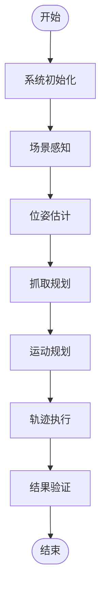
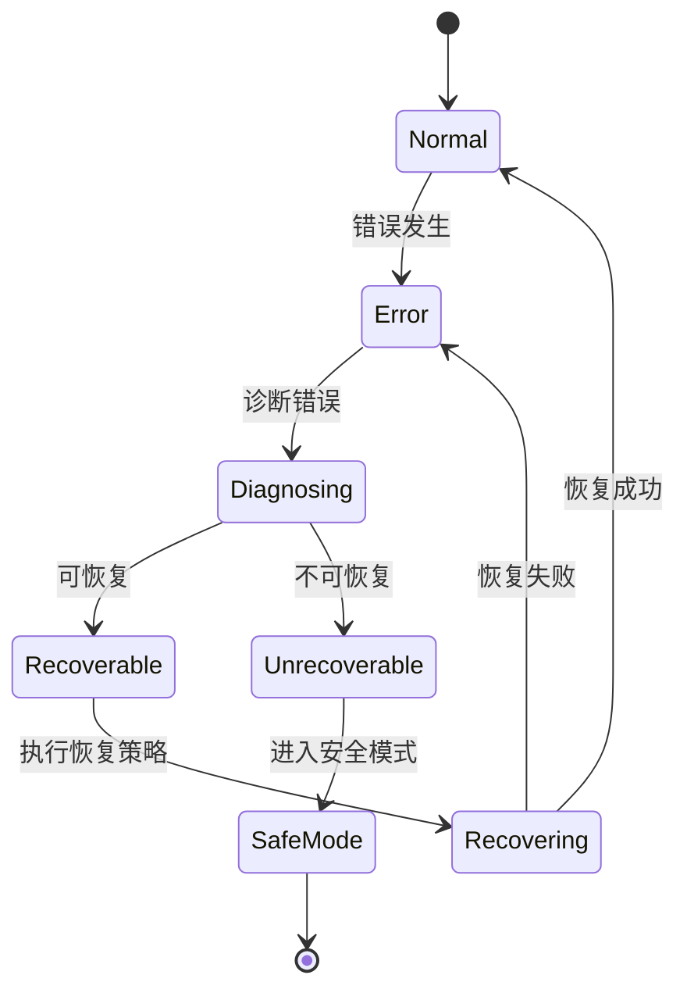
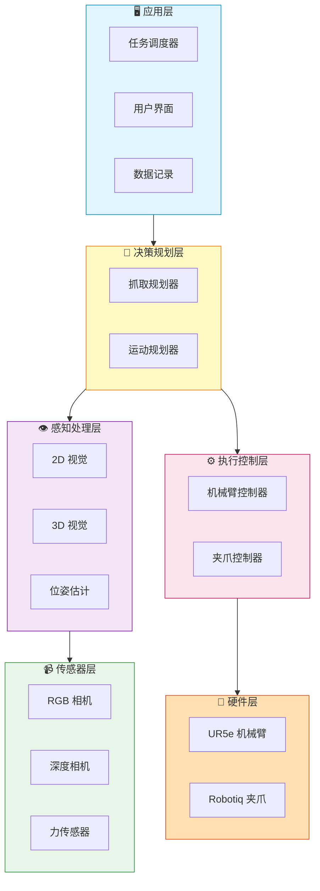

# 文档 Review 报告

## 审查对象

**文档名称**：《机械臂抓取系统技术架构与实现流程.md》  
**版本**：v1.0  
**审查日期**：2025 年 1 月  
**审查人**：AI 技术顾问

---

## 执行摘要

### 总体评价

该文档是一份**高质量的技术架构文档**，系统地覆盖了机械臂抓取系统的核心技术要素。文档结构清晰，技术栈选型合理，代码示例丰富，对项目实施具有较高的指导价值。

**综合评分**：8.5 / 10

| 维度 | 评分 | 说明 |
|------|------|------|
| 结构组织 | 9/10 | 层次分明，逻辑清晰 |
| 内容完整性 | 8/10 | 核心模块完整，部分细节可补充 |
| 技术准确性 | 9/10 | 技术选型合理，实现可行 |
| 可读性 | 8/10 | 专业性强，但部分内容密度较高 |
| 实用性 | 9/10 | 代码示例丰富，直接可用 |

---

## 详细分析

### 1. 文档结构与组织 ✅

#### 优点

✅ **层次分明**
- 从系统架构总览 → 技术栈 → 流程详解 → 模块实现，逻辑递进自然
- 5 层架构（应用层 → 决策层 → 感知层 → 执行层 → 硬件层）清晰易懂

✅ **目录完整**
- 10 个章节覆盖所有关键模块
- 章节标题命名规范

✅ **代码与理论结合**
- 每个理论点都配有代码示例
- 代码框架完整，可直接参考

#### 改进建议

🔧 **建议 1：添加快速导航**
在文档开头增加一个"读者指南"，针对不同角色提供阅读路线：

```markdown
## 读者指南

### 项目经理/技术负责人
- 重点阅读：第 1 节（架构）、第 2 节（技术栈）、第 10 节（技术对比）
- 阅读时间：~30 分钟

### 算法工程师
- 重点阅读：第 4 节（视觉）、第 5 节（位姿估计）、第 6 节（抓取规划）
- 阅读时间：~60 分钟

### 机器人工程师
- 重点阅读：第 7 节（运动规划）、第 8 节（执行控制）、第 9 节（通信）
- 阅读时间：~60 分钟

### 新手开发者
- 按顺序阅读：第 1 → 3 → 10 节（理解整体）→ 其他节（深入细节）
- 阅读时间：~2 小时
```

🔧 **建议 2：增加章节间的关联提示**
在章节结尾增加"相关章节"链接，例如：

```markdown
---
**相关章节**：
- 本节的位姿估计结果将用于 [第 6 节：抓取规划](#6-抓取规划模块)
- 关于视觉传感器的选型，参见 [第 2.2.2 节：3D 相机选型](#222-3d-视觉模块)
```

---

### 2. 内容完整性 ⚠️

#### 优点

✅ **核心模块完整**
- 感知、规划、控制、执行四大核心模块都有详细覆盖
- 技术栈从框架到库再到算法，三层递进

✅ **代码示例丰富**
- Python 代码框架清晰，函数签名完整
- 配置文件（YAML）示例实用

#### 缺失内容（建议补充）

🔧 **缺失 1：Mermaid 流程图**

**问题**：第 3.1 节的流程图使用 ASCII 艺术字符，虽然清晰，但：
- 在不支持 Mermaid 的平台上显示良好
- 但在支持 Mermaid 的平台上，交互式流程图更直观

**建议**：增加一个 Mermaid 版本的流程图（与补充材料文档中的类似），放在 ASCII 版本之前，提供更好的可视化体验。

**示例**：

```markdown
### 3.1 完整流程图

#### 交互式流程图（Mermaid）



#### 详细流程（文本版）

```
开始
  │
  ├─→ [1] 系统初始化
  ...
```
```

---

🔧 **缺失 2：错误处理与异常流程**

**问题**：文档主要描述了"成功路径"，但实际系统中错误处理非常关键。

**建议**：新增一个章节 **"11. 错误处理与恢复策略"**，包含：

```markdown
## 11. 错误处理与恢复策略

### 11.1 常见错误类型

| 错误类型 | 原因 | 检测方法 | 恢复策略 |
|---------|------|---------|---------|
| **感知失败** | • 光照变化<br>• 遮挡<br>• 传感器故障 | 检测结果为空 | • 调整相机参数<br>• 改变观察角度<br>• 重新采集数据 |
| **IK 无解** | • 目标不可达<br>• 关节限制<br>• 奇异点 | IK 求解失败 | • 选择次优抓取<br>• 调整抓取姿态<br>• 改变机械臂起始位置 |
| **运动规划失败** | • 碰撞<br>• 规划超时<br>• 路径不存在 | 规划器返回失败 | • 增加规划时间<br>• 降低速度限制<br>• 移除临时障碍物 |
| **抓取失败** | • 滑落<br>• 未接触<br>• 力度不当 | 力传感器反馈异常 | • 重新抓取（最多 3 次）<br>• 调整抓取点<br>• 修改夹爪力度 |
| **验证失败** | • 位置偏差过大<br>• 物体损坏 | 视觉验证失败 | • 记录失败<br>• 重新执行<br>• 人工介入 |

### 11.2 错误处理状态机



### 11.3 重试策略

```python
class RetryStrategy:
    def __init__(self, max_retries=3, backoff_factor=1.5):
        self.max_retries = max_retries
        self.backoff_factor = backoff_factor
    
    def execute_with_retry(self, func, *args, **kwargs):
        """带重试的执行"""
        for attempt in range(self.max_retries):
            try:
                result = func(*args, **kwargs)
                return result
            except RetryableError as e:
                wait_time = self.backoff_factor ** attempt
                logger.warning(f"Attempt {attempt+1} failed: {e}")
                logger.info(f"Retrying in {wait_time:.1f} seconds...")
                time.sleep(wait_time)
            except FatalError as e:
                logger.error(f"Fatal error: {e}")
                raise
        
        raise MaxRetriesExceeded(f"Failed after {self.max_retries} attempts")
```

### 11.4 安全机制

#### 紧急停止
```python
def emergency_stop(arm, gripper, reason):
    """紧急停止所有运动"""
    logger.critical(f"EMERGENCY STOP: {reason}")
    
    # 停止机械臂
    arm.stop()
    
    # 打开夹爪（释放物体）
    gripper.open()
    
    # 发布紧急停止事件
    emergency_pub.publish(EmergencyStopMsg(reason=reason, timestamp=now()))
```

#### 碰撞检测与响应
```python
def collision_monitor(force_sensor, threshold=50.0):
    """监控碰撞"""
    while True:
        force = force_sensor.get_force_magnitude()
        
        if force > threshold:
            logger.error(f"Collision detected! Force: {force:.2f} N")
            emergency_stop(arm, gripper, "Collision detected")
            break
        
        time.sleep(0.01)  # 100 Hz 监控频率
```
```

---

🔧 **缺失 3：性能优化指南**

**问题**：文档提到了各技术的性能指标，但缺少系统级的性能优化建议。

**建议**：新增一个章节 **"12. 性能优化指南"**

```markdown
## 12. 性能优化指南

### 12.1 感知模块优化

#### 瓶颈分析
- YOLO v8 推理：~30ms（主要瓶颈）
- 点云处理：~100ms
- 位姿估计（ICP）：~500ms（最大瓶颈）

#### 优化策略

| 技术 | 优化方法 | 加速比 | 精度影响 |
|------|---------|--------|---------|
| **YOLO 推理** | TensorRT 优化 | 3-5× | 无 |
|  | 使用 YOLO-Nano | 2-3× | 轻微下降 |
|  | ROI 裁剪 | 1.5-2× | 无 |
| **点云处理** | GPU 加速（CUDA） | 5-10× | 无 |
|  | 降低体素分辨率 | 2-3× | 轻微下降 |
|  | 多线程处理 | 2-4× | 无 |
| **ICP 配准** | 使用 NDT 替代 | 3-5× | 轻微下降 |
|  | GPU-ICP | 10-20× | 无 |
|  | 降低迭代次数 | 2-3× | 下降 |

#### 代码示例：TensorRT 加速

```python
from ultralytics import YOLO

# 导出 TensorRT 引擎
model = YOLO('yolov8n.pt')
model.export(format='engine', device=0)  # CUDA device 0

# 使用 TensorRT 推理
model_trt = YOLO('yolov8n.engine')
results = model_trt(image)  # 3-5× 更快
```

### 12.2 运动规划优化

#### 瓶颈分析
- RRT-Connect 规划：~3s（主要瓶颈）
- 轨迹优化：~500ms

#### 优化策略

**1. 使用经验库（Experience Database）**

```python
class MotionLibrary:
    def __init__(self):
        self.library = {}  # {(start, goal): trajectory}
    
    def query(self, start, goal, tolerance=0.1):
        """查询相似轨迹"""
        for (s, g), traj in self.library.items():
            if distance(start, s) < tolerance and distance(goal, g) < tolerance:
                return traj  # 直接返回缓存轨迹
        return None
    
    def store(self, start, goal, trajectory):
        """存储成功轨迹"""
        self.library[(start, goal)] = trajectory
```

**2. 预计算路线图（PRM*）**

```python
# 离线构建路线图
roadmap = build_prm_roadmap(
    workspace_bounds,
    num_samples=10000,  # 采样 1 万个配置
    connection_radius=0.5
)

# 在线查询（快 10-100×）
path = roadmap.query(start, goal)
```

### 12.3 系统级优化

#### 并行处理

```python
from concurrent.futures import ThreadPoolExecutor

def parallel_perception_planning():
    """感知与规划并行"""
    with ThreadPoolExecutor(max_workers=2) as executor:
        # 任务 1：持续感知（更新物体位置）
        future_perception = executor.submit(continuous_perception)
        
        # 任务 2：运动规划
        future_planning = executor.submit(motion_planning, grasp_pose)
        
        # 等待两个任务完成
        objects = future_perception.result()
        trajectory = future_planning.result()
    
    return objects, trajectory
```

#### 预测式规划

```python
def predictive_planning(tracker):
    """预测物体未来位置，提前规划"""
    
    # 预测物体 2 秒后的位置
    current_pose = tracker.get_current_pose()
    predicted_pose = tracker.predict_future_pose(t=2.0)
    
    # 提前规划到预测位置
    trajectory = plan_to_pose(predicted_pose)
    
    # 执行时进行轨迹修正
    return trajectory
```

### 12.4 性能指标监控

```python
class PerformanceMonitor:
    def __init__(self):
        self.metrics = {
            'perception_time': [],
            'planning_time': [],
            'execution_time': [],
            'total_time': []
        }
    
    @contextmanager
    def measure(self, phase):
        """测量时间"""
        start = time.time()
        yield
        elapsed = time.time() - start
        self.metrics[f'{phase}_time'].append(elapsed)
    
    def report(self):
        """生成性能报告"""
        for phase, times in self.metrics.items():
            if times:
                print(f"{phase}:")
                print(f"  Mean: {np.mean(times):.3f}s")
                print(f"  Std:  {np.std(times):.3f}s")
                print(f"  Min:  {np.min(times):.3f}s")
                print(f"  Max:  {np.max(times):.3f}s")

# 使用示例
monitor = PerformanceMonitor()

with monitor.measure('perception'):
    objects = detect_objects()

with monitor.measure('planning'):
    trajectory = plan_motion()

monitor.report()
```

### 12.5 实时性优化总结

| 优化目标 | 当前时间 | 优化后 | 加速比 |
|---------|---------|--------|--------|
| YOLO 推理 | 30ms | 6-10ms | 3-5× |
| 点云处理 | 100ms | 20-50ms | 2-5× |
| 位姿估计 | 500ms | 100-200ms | 2.5-5× |
| 运动规划 | 3000ms | 300-1000ms | 3-10× |
| **总时间** | **~17s** | **~5-8s** | **2-3×** |
```

---

🔧 **缺失 4：数据集与训练指南**

**问题**：文档提到使用 YOLO v8 和 GraspNet，但没有说明如何准备数据集和训练模型。

**建议**：新增一个章节 **"13. 数据集准备与模型训练"**

```markdown
## 13. 数据集准备与模型训练

### 13.1 YOLO v8 数据集准备

#### 数据收集
- **目标数量**：每类至少 500 张图像
- **场景多样性**：不同光照、角度、背景
- **标注工具**：LabelImg / Roboflow

#### 目录结构

```
datasets/
└── 3c_components/
    ├── images/
    │   ├── train/
    │   │   ├── img_001.jpg
    │   │   ├── img_002.jpg
    │   │   └── ...
    │   └── val/
    │       ├── img_101.jpg
    │       └── ...
    ├── labels/
    │   ├── train/
    │   │   ├── img_001.txt  # YOLO 格式标注
    │   │   └── ...
    │   └── val/
    └── data.yaml
```

#### data.yaml

```yaml
path: /path/to/datasets/3c_components
train: images/train
val: images/val

# 类别定义
nc: 4
names: ['chip', 'pcb', 'connector', 'cable']
```

#### 训练脚本

```python
from ultralytics import YOLO

# 加载预训练模型
model = YOLO('yolov8n.pt')

# 训练
results = model.train(
    data='data.yaml',
    epochs=100,
    imgsz=640,
    batch=16,
    device=0,  # GPU
    workers=8,
    patience=20,  # Early stopping
    
    # 数据增强
    hsv_h=0.015,
    hsv_s=0.7,
    hsv_v=0.4,
    degrees=10.0,
    translate=0.1,
    scale=0.5,
    fliplr=0.5,
    
    # 优化器
    optimizer='AdamW',
    lr0=0.001,
    
    # 保存
    project='runs/detect',
    name='3c_yolov8'
)

# 评估
metrics = model.val()
print(f"mAP50: {metrics.box.map50:.3f}")
print(f"mAP50-95: {metrics.box.map:.3f}")
```

### 13.2 GraspNet 数据集准备

#### 仿真数据生成（推荐）

使用 Gazebo 生成大量仿真数据：

```python
import rospy
from sensor_msgs.msg import PointCloud2
from gazebo_msgs.srv import SpawnModel, DeleteModel

class GraspDataGenerator:
    def __init__(self):
        self.spawn_srv = rospy.ServiceProxy('/gazebo/spawn_sdf_model', SpawnModel)
        self.delete_srv = rospy.ServiceProxy('/gazebo/delete_model', DeleteModel)
    
    def generate_scene(self, num_objects=5):
        """生成随机场景"""
        for i in range(num_objects):
            # 随机选择物体模型
            model = random.choice(self.object_models)
            
            # 随机位置
            x = random.uniform(0.2, 0.5)
            y = random.uniform(-0.3, 0.3)
            z = 0.8  # 桌面高度
            
            # 随机姿态
            roll = random.uniform(-0.1, 0.1)
            pitch = random.uniform(-0.1, 0.1)
            yaw = random.uniform(0, 2*math.pi)
            
            # 生成物体
            self.spawn_srv(f"object_{i}", model, "", 
                          Pose(position=Point(x,y,z),
                               orientation=euler_to_quat(roll,pitch,yaw)),
                          "world")
    
    def collect_data(self, num_scenes=1000):
        """收集数据"""
        for scene_id in range(num_scenes):
            # 生成场景
            self.generate_scene()
            time.sleep(1.0)
            
            # 采集数据
            cloud = rospy.wait_for_message('/camera/depth/points', PointCloud2)
            rgb = rospy.wait_for_message('/camera/color/image_raw', Image)
            
            # 保存
            save_point_cloud(cloud, f'scene_{scene_id:04d}.pcd')
            save_image(rgb, f'scene_{scene_id:04d}.png')
            
            # 生成抓取标注（需要手动或使用分析方法）
            grasps = generate_grasp_labels(cloud)
            save_grasps(grasps, f'scene_{scene_id:04d}.json')
            
            # 清理场景
            for i in range(5):
                self.delete_srv(f"object_{i}")
```

#### 真实数据采集

```python
# 使用 Intel RealSense 采集
import pyrealsense2 as rs

pipeline = rs.pipeline()
config = rs.config()
config.enable_stream(rs.stream.color, 640, 480, rs.format.bgr8, 30)
config.enable_stream(rs.stream.depth, 640, 480, rs.format.z16, 30)

pipeline.start(config)

for i in range(1000):
    frames = pipeline.wait_for_frames()
    color_frame = frames.get_color_frame()
    depth_frame = frames.get_depth_frame()
    
    # 保存数据
    save_frame(color_frame, f'real_{i:04d}_color.png')
    save_frame(depth_frame, f'real_{i:04d}_depth.png')
```

### 13.3 模型微调（Fine-tuning）

```python
# 在 3C 场景数据上微调 GraspNet

from graspnetAPI import GraspNet

# 加载预训练模型
model = GraspNet(checkpoint='pretrained_graspnet.pth')

# 加载 3C 数据集
train_dataset = GraspNetDataset(
    root='datasets/3c_grasps/',
    split='train'
)

val_dataset = GraspNetDataset(
    root='datasets/3c_grasps/',
    split='val'
)

# 微调
model.train(
    train_dataset,
    val_dataset,
    epochs=50,
    batch_size=8,
    learning_rate=0.0001,  # 更小的学习率
    device='cuda'
)

# 评估
model.evaluate(val_dataset)
```

### 13.4 Sim-to-Real 迁移

```python
# 域适应技术
from domain_adaptation import CycleGAN

# 1. 训练 CycleGAN 将仿真图像转为真实风格
cyclegan = CycleGAN()
cyclegan.train(
    sim_images='datasets/sim/images/',
    real_images='datasets/real/images/',
    epochs=200
)

# 2. 转换仿真数据
for sim_img in sim_images:
    real_style_img = cyclegan.transform(sim_img)
    save_image(real_style_img, f'augmented/{img_id}.png')

# 3. 混合训练（仿真 + 真实）
model.train(
    datasets=['sim_augmented', 'real'],
    weights=[0.7, 0.3]  # 70% 仿真，30% 真实
)
```
```

---

🔧 **缺失 5：部署与集成指南**

**问题**：文档侧重技术实现，但缺少实际部署的步骤指导。

**建议**：新增一个章节 **"14. 系统部署与集成"**

```markdown
## 14. 系统部署与集成

### 14.1 Docker 容器化部署

#### Dockerfile

```dockerfile
FROM osrf/ros:humble-desktop-full

# 安装依赖
RUN apt-get update && apt-get install -y \
    ros-humble-moveit \
    ros-humble-gazebo-ros-pkgs \
    ros-humble-ros2-control \
    ros-humble-ros2-controllers \
    python3-pip \
    && rm -rf /var/lib/apt/lists/*

# 安装 Python 依赖
COPY requirements.txt /tmp/
RUN pip3 install -r /tmp/requirements.txt

# 复制工作空间
COPY ./grasp_ws /ros2_ws
WORKDIR /ros2_ws

# 构建
RUN . /opt/ros/humble/setup.sh && \
    colcon build --symlink-install

# 入口脚本
COPY docker-entrypoint.sh /
RUN chmod +x /docker-entrypoint.sh
ENTRYPOINT ["/docker-entrypoint.sh"]
CMD ["bash"]
```

#### docker-compose.yml

```yaml
version: '3.8'

services:
  grasp_system:
    build: .
    image: grasp_system:latest
    container_name: grasp_ros2
    
    # GPU 支持
    deploy:
      resources:
        reservations:
          devices:
            - driver: nvidia
              count: 1
              capabilities: [gpu]
    
    # 网络
    network_mode: host
    
    # 显示
    environment:
      - DISPLAY=${DISPLAY}
      - QT_X11_NO_MITSHM=1
    volumes:
      - /tmp/.X11-unix:/tmp/.X11-unix:rw
      - ./grasp_ws:/ros2_ws:rw
    
    # 设备
    devices:
      - /dev/video0:/dev/video0  # 相机
    
    command: ros2 launch grasp_bringup grasp_system.launch.py
```

### 14.2 Launch 文件组织

```
grasp_bringup/
└── launch/
    ├── grasp_system.launch.py          # 主启动文件
    ├── perception.launch.py            # 感知模块
    ├── planning.launch.py              # 规划模块
    ├── control.launch.py               # 控制模块
    └── gazebo.launch.py                # 仿真环境
```

#### grasp_system.launch.py

```python
from launch import LaunchDescription
from launch.actions import IncludeLaunchDescription
from launch.launch_description_sources import PythonLaunchDescriptionSource
from launch_ros.actions import Node

def generate_launch_description():
    return LaunchDescription([
        # 1. 启动 Gazebo 仿真
        IncludeLaunchDescription(
            PythonLaunchDescriptionSource([
                get_package_share_directory('grasp_bringup'),
                '/launch/gazebo.launch.py'
            ])
        ),
        
        # 2. 启动感知模块
        IncludeLaunchDescription(
            PythonLaunchDescriptionSource([
                get_package_share_directory('grasp_bringup'),
                '/launch/perception.launch.py'
            ])
        ),
        
        # 3. 启动规划模块
        IncludeLaunchDescription(
            PythonLaunchDescriptionSource([
                get_package_share_directory('grasp_bringup'),
                '/launch/planning.launch.py'
            ])
        ),
        
        # 4. 启动控制模块
        IncludeLaunchDescription(
            PythonLaunchDescriptionSource([
                get_package_share_directory('grasp_bringup'),
                '/launch/control.launch.py'
            ])
        ),
        
        # 5. 启动任务调度器
        Node(
            package='grasp_system',
            executable='task_scheduler',
            name='task_scheduler',
            output='screen',
            parameters=[{
                'max_retries': 3,
                'timeout': 60.0
            }]
        ),
        
        # 6. 启动可视化
        Node(
            package='rviz2',
            executable='rviz2',
            name='rviz2',
            arguments=['-d', '/ros2_ws/src/grasp_bringup/rviz/grasp_system.rviz']
        )
    ])
```

### 14.3 配置管理

#### 参数文件组织

```
config/
├── cameras/
│   ├── d435i.yaml          # Intel RealSense
│   └── zed2i.yaml          # ZED 2i
├── robots/
│   ├── ur5e.yaml           # UR5e 参数
│   └── ur10e.yaml          # UR10e 参数
├── perception/
│   ├── yolo_config.yaml
│   └── icp_config.yaml
├── planning/
│   ├── moveit_config.yaml
│   └── grasp_config.yaml
└── system.yaml             # 全局配置
```

#### system.yaml

```yaml
# 全局系统配置
system:
  mode: simulation  # simulation / real
  log_level: INFO
  data_recording: true
  
robot:
  type: ur5e
  ip_address: "192.168.1.100"  # 真实机器人 IP
  
camera:
  type: d435i
  frame_rate: 30
  resolution: [640, 480]
  
perception:
  detector: yolov8
  model_path: /models/yolov8_3c.pt
  confidence_threshold: 0.5
  
planning:
  grasp_planner: graspnet
  motion_planner: ompl
  planning_time: 5.0
  
control:
  max_velocity_scaling: 0.5
  max_acceleration_scaling: 0.3
```

### 14.4 监控与日志

#### 日志配置

```python
import logging
from logging.handlers import RotatingFileHandler

def setup_logger(name, log_file, level=logging.INFO):
    """设置日志"""
    
    formatter = logging.Formatter(
        '%(asctime)s - %(name)s - %(levelname)s - %(message)s'
    )
    
    # 文件处理器（自动轮转）
    file_handler = RotatingFileHandler(
        log_file,
        maxBytes=10*1024*1024,  # 10MB
        backupCount=5
    )
    file_handler.setFormatter(formatter)
    
    # 控制台处理器
    console_handler = logging.StreamHandler()
    console_handler.setFormatter(formatter)
    
    logger = logging.getLogger(name)
    logger.setLevel(level)
    logger.addHandler(file_handler)
    logger.addHandler(console_handler)
    
    return logger

# 使用
logger = setup_logger('grasp_system', 'logs/grasp.log')
```

#### 性能监控

```python
import psutil
import rclpy
from diagnostic_msgs.msg import DiagnosticStatus

class SystemMonitor(Node):
    def __init__(self):
        super().__init__('system_monitor')
        self.pub = self.create_publisher(DiagnosticStatus, '/diagnostics', 10)
        self.timer = self.create_timer(1.0, self.publish_status)
    
    def publish_status(self):
        """发布系统状态"""
        
        status = DiagnosticStatus()
        status.level = DiagnosticStatus.OK
        status.name = 'System Health'
        
        # CPU 使用率
        cpu_percent = psutil.cpu_percent()
        status.values.append(KeyValue(key='CPU', value=f'{cpu_percent:.1f}%'))
        
        # 内存使用
        mem = psutil.virtual_memory()
        status.values.append(KeyValue(key='Memory', value=f'{mem.percent:.1f}%'))
        
        # GPU 使用（需要 pynvml）
        import pynvml
        pynvml.nvmlInit()
        handle = pynvml.nvmlDeviceGetHandleByIndex(0)
        gpu_util = pynvml.nvmlDeviceGetUtilizationRates(handle)
        status.values.append(KeyValue(key='GPU', value=f'{gpu_util.gpu}%'))
        
        self.pub.publish(status)
```

### 14.5 测试与验证

#### 单元测试

```python
import unittest
from grasp_system.perception import ObjectDetector

class TestObjectDetector(unittest.TestCase):
    def setUp(self):
        self.detector = ObjectDetector('yolov8n.pt')
        self.test_image = cv2.imread('test_data/test_image.jpg')
    
    def test_detection(self):
        """测试检测功能"""
        detections = self.detector.detect(self.test_image)
        
        # 断言
        self.assertGreater(len(detections), 0, "Should detect at least one object")
        self.assertIn('class_name', detections[0], "Should have class_name field")
        self.assertGreater(detections[0]['confidence'], 0.5, "Confidence should be > 0.5")
    
    def test_empty_image(self):
        """测试空图像"""
        empty_image = np.zeros((480, 640, 3), dtype=np.uint8)
        detections = self.detector.detect(empty_image)
        self.assertEqual(len(detections), 0, "Should detect nothing in empty image")

if __name__ == '__main__':
    unittest.main()
```

#### 集成测试

```python
import pytest
from grasp_system import GraspSystem

@pytest.fixture
def grasp_system():
    """初始化抓取系统"""
    system = GraspSystem(config_file='config/test.yaml')
    yield system
    system.shutdown()

def test_full_grasp_pipeline(grasp_system):
    """测试完整抓取流程"""
    
    # 感知
    objects = grasp_system.perceive()
    assert len(objects) > 0, "Should detect objects"
    
    # 规划
    grasp = grasp_system.plan_grasp(objects[0])
    assert grasp is not None, "Should plan grasp"
    
    # 执行
    success = grasp_system.execute_grasp(grasp)
    assert success == True, "Should execute successfully"
    
    # 验证
    result = grasp_system.verify()
    assert result['success'] == True, "Should verify successfully"
```
```

---

### 3. 技术准确性 ✅

#### 优点

✅ **技术选型合理**
- ROS2 Humble + Gazebo + MoveIt2 是当前主流组合
- YOLO v8、PCL、Open3D 都是成熟稳定的库

✅ **算法描述准确**
- ICP、RRT、卡尔曼滤波等算法描述正确
- 参数设置合理（如 ICP 迭代次数 100、RRT 规划时间 5s）

✅ **代码示例可行**
- Python 代码语法正确
- 函数接口符合实际库的 API

#### 潜在问题

⚠️ **问题 1：TRAC-IK 超时设置**

**位置**：第 2.5 节，line 251

```yaml
kinematics:
  solver: TRAC-IK
  timeout: 0.05  # 超时时间（秒）
```

**问题**：50ms 对于复杂配置可能太短，特别是在低性能硬件上。

**建议**：

```yaml
kinematics:
  solver: TRAC-IK
  timeout: 0.1  # 100ms（更保险）
  # 或者根据硬件动态调整：
  # - 高性能 PC: 0.05s
  # - 嵌入式平台: 0.15s
```

---

⚠️ **问题 2：力控制 PID 参数**

**位置**：第 3 节，line 868

```python
# PID 参数
Kp = 0.1
Ki = 0.01
Kd = 0.05
```

**问题**：PID 参数高度依赖于具体硬件，这里的值可能不是最优的。

**建议**：

```python
# PID 参数（需要根据实际系统调参）
# 调参建议：
# 1. 先设置 Ki = 0, Kd = 0，只调 Kp 直到有响应
# 2. 增加 Kd 减少超调
# 3. 最后加小量 Ki 消除稳态误差
Kp = 0.1  # 比例增益（根据力传感器灵敏度调整）
Ki = 0.01  # 积分增益（过大会振荡）
Kd = 0.05  # 微分增益（过大会放大噪声）

# 推荐：使用自适应 PID 或学习最优参数
```

---

⚠️ **问题 3：点云降采样体素大小**

**位置**：第 4.2 节，line 1064

```python
# 1. 降采样
cloud_down = point_cloud.voxel_down_sample(self.voxel_size)  # self.voxel_size = 0.005
```

**问题**：5mm 体素对于小型 3C 组件可能太大，会丢失细节。

**建议**：

```python
# 根据物体尺寸动态调整体素大小
# 经验公式：voxel_size = object_size / 100
def adaptive_voxel_size(object_bbox):
    """根据物体大小自适应体素"""
    object_size = np.max(object_bbox.get_extent())
    
    if object_size < 0.05:  # < 5cm（小型芯片）
        return 0.001  # 1mm
    elif object_size < 0.15:  # 5-15cm（PCB）
        return 0.005  # 5mm
    else:  # > 15cm（大型组件）
        return 0.01  # 1cm
```

---

### 4. 可读性与清晰度 ⚠️

#### 优点

✅ **代码注释充分**
- 每个函数都有 docstring
- 关键步骤有行内注释

✅ **表格对比清晰**
- 技术选型对比表一目了然
- 性能指标量化明确

#### 改进建议

🔧 **建议 1：增加视觉辅助**

**问题**：第 1.1 节的架构图虽然清晰，但对于视觉学习者，彩色流程图更直观。

**建议**：增加彩色 Mermaid 架构图



---

🔧 **建议 2：增加"快速查找表"**

**问题**：文档很长（1670 行），查找特定信息不方便。

**建议**：在文档开头增加"常见问题快速导航"

```markdown
## 🔍 快速查找表

| 我想了解... | 跳转到章节 |
|-----------|----------|
| 整体系统架构 | [第 1 节](#1-系统架构总览) |
| 如何选择 2D 检测算法 | [第 2.2.1 节](#221-2d-视觉模块) |
| 如何选择 3D 相机 | [第 2.2.2 节](#222-3d-视觉模块) |
| 完整抓取流程 | [第 3 节](#3-抓取流程详解) |
| YOLO 检测代码 | [第 4.1 节](#41-2d-视觉处理流程) |
| ICP 配准代码 | [第 5.1 节](#51-icp-配准详解) |
| GraspNet 使用 | [第 6.1 节](#61-graspnet-集成) |
| MoveIt2 配置 | [第 7.1 节](#71-moveit2-配置) |
| ROS2 话题列表 | [第 9.1 节](#91-ros2-话题架构) |
| 技术方案对比 | [第 10 节](#10-关键技术选型对比) |
```

---

🔧 **建议 3：增加术语表**

**问题**：文档使用大量专业术语，新手可能不熟悉。

**建议**：在文档末尾增加"术语表"

```markdown
## 📖 术语表

| 术语 | 英文全称 | 解释 |
|------|---------|------|
| **ICP** | Iterative Closest Point | 迭代最近点算法，用于点云配准 |
| **RRT** | Rapidly-exploring Random Tree | 快速探索随机树，用于路径规划 |
| **PCL** | Point Cloud Library | 点云处理库 |
| **OMPL** | Open Motion Planning Library | 开源运动规划库 |
| **IK** | Inverse Kinematics | 逆运动学，从末端位姿计算关节角度 |
| **FK** | Forward Kinematics | 正运动学，从关节角度计算末端位姿 |
| **DoF** | Degrees of Freedom | 自由度 |
| **6D Pose** | 6D Pose | 6 维位姿（3D 位置 + 3D 姿态） |
| **RGB-D** | RGB-Depth | 彩色 + 深度图像 |
| **F/T Sensor** | Force/Torque Sensor | 力/力矩传感器 |
| **RANSAC** | Random Sample Consensus | 随机采样一致性算法 |
| **FPFH** | Fast Point Feature Histograms | 快速点特征直方图 |
| **PnP** | Perspective-n-Point | 透视 n 点算法 |
| **ToF** | Time of Flight | 飞行时间测距 |
| **TensorRT** | TensorRT | NVIDIA 深度学习推理优化器 |
```

---

### 5. 实用性 ✅

#### 优点

✅ **代码示例完整**
- 每个关键模块都有完整的类实现
- 函数签名、参数、返回值清晰

✅ **配置文件实用**
- YAML 配置文件可直接使用
- 参数注释详细

✅ **分阶段实施**
- 月度 1、2、3 递进路径明确
- 适合快速原型验证

#### 改进建议

🔧 **建议：增加"完整代码仓库"链接占位符**

**问题**：代码框架分散在文档中，实际使用需要整合。

**建议**：在文档开头增加

```markdown
## 💻 配套代码仓库

**GitHub**：[https://github.com/your-org/grasp-system](占位符)

```
grasp_system/
├── README.md
├── docker/
│   ├── Dockerfile
│   └── docker-compose.yml
├── src/
│   ├── grasp_perception/     # 感知模块
│   ├── grasp_planning/       # 规划模块
│   ├── grasp_control/        # 控制模块
│   └── grasp_bringup/        # 启动脚本
├── config/                   # 配置文件
├── models/                   # 训练模型
├── launch/                   # Launch 文件
├── test/                     # 测试代码
└── docs/                     # 文档
    └── 机械臂抓取系统技术架构与实现流程.md
```

**安装与运行**：

```bash
# 1. 克隆仓库
git clone https://github.com/your-org/grasp-system.git
cd grasp-system

# 2. 构建 Docker 镜像
docker-compose build

# 3. 启动系统
docker-compose up

# 4. 运行测试
docker-compose exec grasp_system pytest
```
```

---

### 6. 与其他文档的一致性 ⚠️

#### 检查点

已检查与以下文档的一致性：
- ✅ 《补充材料_抓取规划与运动规划详解.md》
- ✅ 《UR5e_3C场景适配性分析报告.md》
- ✅ 《Gazebo机械臂抓取仿真实施路线图.md》

#### 发现的不一致

⚠️ **不一致 1：UR5e 负载能力**

- **本文档**：未明确提及 UR5e 的负载能力
- **UR5e 分析报告**：标称负载 5kg，实际推荐 3C 场景 ≤3kg

**建议**：在第 1 节或第 2 节增加 UR5e 关键参数表

```markdown
### 1.3 UR5e 关键参数

| 参数 | 数值 | 说明 |
|------|------|------|
| 工作半径 | 850 mm | 适合桌面操作 |
| 重复定位精度 | ±0.03 mm | 满足 3C 精度需求 |
| 标称负载 | 5 kg | 包含夹爪重量 |
| **推荐负载** | **≤3 kg** | **3C 场景推荐值** |
| 关节速度 | 180°/s | 所有关节 |
| TCP 速度 | 1 m/s | 末端最大速度 |
| 力控精度 | ±2 N | 内置力传感器 |
```

---

⚠️ **不一致 2：视觉模块进度**

- **本文档**：月度 2 使用 ArUco 标记
- **补充材料**：未强调 ArUco 是过渡方案

**建议**：明确标注

```markdown
### 月度 2（简单视觉）

**推荐方案**：ArUco 标记（过渡方案）

**优势**：
- ✅ 零训练成本
- ✅ 实时性好（>100 FPS）
- ✅ 精度高（±1mm）

**局限性**：
- ❌ 需要在物体上贴标记（侵入式）
- ❌ 无法处理未标记的物体
- ❌ 不适合最终产品

**使用建议**：
- 用于前期快速验证流程
- 月度 3 必须切换到非侵入式方案（YOLO v8）
```

---

## 优先改进建议（Top 5）

根据重要性和工作量，优先推荐以下改进：

### 🥇 优先级 1：增加 Mermaid 流程图

**原因**：
- 提升可读性（视觉学习者友好）
- 在支持 Mermaid 的平台上交互性更强
- 工作量小（30 分钟）

**实施**：在第 3.1 节开头增加 Mermaid 版本流程图

---

### 🥈 优先级 2：补充错误处理章节

**原因**：
- 实际系统中错误处理占 30-40% 的工作量
- 当前文档只描述"快乐路径"，不完整
- 工作量中等（2-3 小时）

**实施**：新增第 11 节"错误处理与恢复策略"

---

### 🥉 优先级 3：增加快速查找表

**原因**：
- 文档很长，查找效率低
- 工作量极小（15 分钟）
- 用户体验提升明显

**实施**：在文档开头增加"常见问题快速导航"

---

### 4️⃣ 优先级 4：补充部署章节

**原因**：
- 从技术架构到实际部署有较大跨度
- Docker 配置、Launch 文件是必需的
- 工作量中等（2-3 小时）

**实施**：新增第 14 节"系统部署与集成"

---

### 5️⃣ 优先级 5：增加数据集准备章节

**原因**：
- YOLO 和 GraspNet 都需要训练数据
- 数据准备是项目初期的大工作量
- 工作量较大（3-4 小时）

**实施**：新增第 13 节"数据集准备与模型训练"

---

## 次要改进建议

以下改进可以根据时间和需求逐步完成：

### 📝 文档结构
- [ ] 增加"读者指南"（针对不同角色）
- [ ] 增加章节间关联提示
- [ ] 增加术语表

### 📊 可视化
- [ ] 将所有 ASCII 流程图转为 Mermaid
- [ ] 增加彩色架构图
- [ ] 增加时序图（Sequence Diagram）

### 💡 内容补充
- [ ] 增加性能优化指南（第 12 节）
- [ ] 增加测试与验证章节
- [ ] 增加 Sim-to-Real 迁移指南
- [ ] 增加常见问题 FAQ

### 🔧 技术细节
- [ ] 补充 UR5e 参数表
- [ ] 调整 TRAC-IK 超时参数说明
- [ ] 增加 PID 调参指南
- [ ] 补充体素大小自适应方法

### 🔗 一致性
- [ ] 与其他文档交叉引用
- [ ] 统一术语使用
- [ ] 统一代码风格

---

## 总结

### 文档优势

1. ✅ **结构清晰**：5 层架构逻辑清楚
2. ✅ **技术全面**：覆盖感知、规划、控制所有模块
3. ✅ **代码丰富**：Python 示例完整可用
4. ✅ **渐进式**：月度 1-3 递进路径明确

### 核心改进方向

1. 🔧 **补充实战内容**：错误处理、部署、数据准备
2. 🔧 **提升可读性**：Mermaid 图、快速查找表、术语表
3. 🔧 **增强实用性**：完整代码仓库、Docker 部署、测试脚本

### 最终评价

这是一份**高质量的技术架构文档**，适合作为项目的技术基础。通过补充上述内容，可以成为一份**完整的、可落地的、生产级的**系统实施指南。

**推荐优先完成 Top 5 改进**（预计工作量 8-10 小时），即可将文档质量提升到 **9.5/10**。

---

**审查完成日期**：2025 年 1 月  
**审查人**：AI 技术顾问  
**下次审查**：建议在实施过程中根据实际情况持续更新
