# 抓取规划与运动规划深度解析

## 文档信息

**版本**：v1.0  
**日期**：2025 年 1 月  
**类型**：技术教程文档  
**相关文档**：可独立阅读，或配合《机械臂抓取系统技术架构与实现流程.md》使用

---

## 目录

0. [完整抓取任务算法流程总览](#0-完整抓取任务算法流程总览)
1. [核心概念对比](#1-核心概念对比)
2. [完整流程图](#2-完整流程图)
3. [空间维度解析](#3-空间维度解析)
4. [代码示例对比](#4-代码示例对比)
5. [常见误区澄清](#5-常见误区澄清)
6. [实战案例](#6-实战案例)
7. [技术深度剖析](#7-技术深度剖析)

---

## 0. 完整抓取任务算法流程总览

### Mermaid 流程图

```mermaid
flowchart TB
    Start([开始抓取任务]) --> Init[系统初始化]
    
    Init --> Sensor[视觉传感器数据采集]
    
    %% 感知阶段
    subgraph Perception["🔍 感知阶段 (Perception Layer)"]
        direction TB
        Sensor --> RGB[RGB 相机<br/>获取彩色图像]
        Sensor --> Depth[深度相机<br/>获取深度图]
        Sensor --> Cloud[点云生成<br/>RGB-D → PointCloud]
        
        RGB --> PreProcess[图像预处理]
        Depth --> PreProcess
        Cloud --> PreProcess
        
        PreProcess --> Detection[物体检测<br/>2D Detection]
        PreProcess --> Segmentation[3D 分割<br/>Point Cloud Segmentation]
        
        Detection --> PoseEst[位姿估计<br/>6D Pose Estimation]
        Segmentation --> PoseEst
        
        PoseEst --> ObjectInfo[物体信息输出<br/>• 3D 模型/点云<br/>• 6D 位姿 x,y,z,r,p,y<br/>• 边界框<br/>• 类别标签]
    end
    
    %% 决策规划阶段
    ObjectInfo --> GraspPlanStart{是否需要<br/>抓取规划?}
    
    GraspPlanStart -->|是| GraspPlanning
    GraspPlanStart -->|否<br/>固定抓取点| FixedGrasp[使用预定义抓取点]
    
    subgraph GraspPlanning["🤏 抓取规划 (Grasp Planning - 任务空间)"]
        direction TB
        GP1[生成候选抓取点<br/>采样 50-100 个候选]
        GP2[抓取质量评估<br/>• 可达性检查 IK<br/>• 碰撞检测<br/>• 力封闭分析<br/>• 稳定性评分]
        GP3[选择最优抓取<br/>Top-1 候选]
        GP4[输出抓取配置<br/>• 位置 x,y,z<br/>• 姿态 qx,qy,qz,qw<br/>• 接近向量<br/>• 夹爪开度]
        
        GP1 --> GP2 --> GP3 --> GP4
    end
    
    FixedGrasp --> IKSolve
    GP4 --> IKSolve
    
    %% 坐标转换
    IKSolve[坐标空间转换<br/>逆运动学 IK Solver<br/>任务空间 → 配置空间<br/>x,y,z,r,p,y → θ₁...θ₆]
    
    IKSolve --> IKCheck{IK 有解?}
    IKCheck -->|无解| GraspReplan[重新规划<br/>尝试次优抓取]
    GraspReplan --> GP3
    IKCheck -->|有解| MotionPlanning
    
    subgraph MotionPlanning["🛣️ 运动规划 (Motion Planning - 配置空间)"]
        direction TB
        MP1[定义规划问题<br/>• 起点: 当前关节角度<br/>• 终点: 目标关节角度<br/>• 约束: 环境障碍物]
        MP2[路径搜索<br/>RRT/RRT*/PRM<br/>在 6D 配置空间搜索]
        MP3[碰撞检测<br/>检查路径上每个点<br/>是否与环境/自身碰撞]
        MP4{路径<br/>可行?}
        MP5[轨迹优化<br/>• 路径平滑<br/>• 时间参数化<br/>• 速度/加速度限制]
        MP6[输出关节轨迹<br/>时间序列<br/>t₀,t₁...tₙ<br/>θ₁...θ₆]
        
        MP1 --> MP2 --> MP3 --> MP4
        MP4 -->|碰撞| MPReplan[调整规划参数<br/>或重新抓取规划]
        MPReplan --> MP2
        MP4 -->|无碰撞| MP5 --> MP6
    end
    
    MPReplan -.->|多次失败| GraspReplan
    
    %% 执行控制阶段
    MP6 --> ExecControl
    
    subgraph Execution["⚙️ 执行控制阶段 (Execution & Control)"]
        direction TB
        ExecControl[轨迹执行控制器]
        
        ExecControl --> Phase1[阶段 1: 移动到预抓取点<br/>Pre-grasp Position<br/>物体上方 10cm]
        Phase1 --> Phase2[阶段 2: 打开夹爪<br/>设置夹爪开度]
        Phase2 --> Phase3[阶段 3: 接近物体<br/>笛卡尔直线下降]
        Phase3 --> Phase4[阶段 4: 闭合夹爪<br/>力控抓取]
        Phase4 --> ForceCheck{力反馈<br/>检查}
        ForceCheck -->|抓取失败| RetryGrasp[重试抓取<br/>或重新规划]
        ForceCheck -->|抓取成功| Phase5[阶段 5: 抬起物体<br/>上升 15cm]
        Phase5 --> Phase6[阶段 6: 移动到放置点<br/>运动规划 + 执行]
        Phase6 --> Phase7[阶段 7: 放置物体<br/>打开夹爪]
    end
    
    RetryGrasp -.-> Phase3
    
    %% 验证阶段
    Phase7 --> Verify
    
    subgraph Verification["✅ 验证阶段 (Verification)"]
        direction TB
        Verify[结果验证]
        Verify --> VisualCheck[视觉验证<br/>检查物体是否在目标位置]
        Verify --> QualityCheck[质量检查<br/>计算放置误差]
        
        VisualCheck --> VerifyResult{验证<br/>通过?}
        QualityCheck --> VerifyResult
    end
    
    VerifyResult -->|失败| RetryTask[记录失败<br/>重试或报告]
    VerifyResult -->|成功| LogResult[记录结果<br/>• 执行时间<br/>• 成功率<br/>• 误差数据]
    
    RetryTask -.->|重试| GraspPlanStart
    
    LogResult --> NextTask{是否有<br/>下一个任务?}
    NextTask -->|是| Sensor
    NextTask -->|否| End([任务完成])
    
    %% 样式定义
    classDef perceptionStyle fill:#e1f5ff,stroke:#0288d1,stroke-width:2px
    classDef graspStyle fill:#fff9c4,stroke:#f57f17,stroke-width:2px
    classDef motionStyle fill:#f3e5f5,stroke:#7b1fa2,stroke-width:2px
    classDef execStyle fill:#e8f5e9,stroke:#388e3c,stroke-width:2px
    classDef verifyStyle fill:#fce4ec,stroke:#c2185b,stroke-width:2px
    classDef decisionStyle fill:#ffe0b2,stroke:#e64a19,stroke-width:2px
    
    class RGB,Depth,Cloud,PreProcess,Detection,Segmentation,PoseEst,ObjectInfo perceptionStyle
    class GP1,GP2,GP3,GP4,FixedGrasp graspStyle
    class MP1,MP2,MP3,MP5,MP6,IKSolve motionStyle
    class ExecControl,Phase1,Phase2,Phase3,Phase4,Phase5,Phase6,Phase7 execStyle
    class Verify,VisualCheck,QualityCheck,LogResult verifyStyle
    class GraspPlanStart,IKCheck,MP4,ForceCheck,VerifyResult,NextTask decisionStyle
```



### 流程图说明

#### 📊 阶段划分

| 阶段 | 名称 | 工作空间 | 主要功能 | 输入 | 输出 | 耗时 |
|------|------|---------|---------|------|------|------|
| **1** | 🔍 感知阶段 | 图像空间 | 数据采集、物体检测、位姿估计 | RGB+深度图 | 物体信息（3D+6D位姿） | 0.5-2s |
| **2** | 🤏 抓取规划 | **任务空间** | 生成候选、质量评估、选择最优 | 物体信息 | 抓取配置（末端位姿） | 0.1-5s |
| **3** | 🔄 坐标转换 | 任务↔配置 | 逆运动学求解 | 末端位姿 | 关节角度 | 0.01-0.05s |
| **4** | 🛣️ 运动规划 | **配置空间** | 路径搜索、碰撞检测、轨迹优化 | 关节角度 | 关节轨迹 | 1-10s |
| **5** | ⚙️ 执行控制 | 配置空间 | 7 阶段执行（预抓取→放置） | 关节轨迹 | 实际运动 | 5-20s |
| **6** | ✅ 验证 | 图像空间 | 视觉验证、质量检查 | 执行结果 | 成功/失败 | 0.1-1s |

#### 🔑 关键节点解释

**节点 1: 视觉传感器数据采集**
- RGB 相机：获取 640×480 或更高分辨率彩色图像
- 深度相机：获取对应深度图（单位：米）
- 点云生成：RGB-D 融合生成 3D 点云（N×3 数组）

**节点 2: 物体检测与分割**
- 2D 检测：YOLO v8 / ArUco 标记检测
- 3D 分割：基于点云的欧氏聚类 / RANSAC 平面分割

**节点 3: 位姿估计**
- 输入：检测框 + 点云片段
- 方法：ICP 配准 / PnP / FoundationPose
- 输出：6D 位姿 \[x, y, z, roll, pitch, yaw\]

**节点 4: 抓取规划（任务空间）**
- 候选生成：在物体表面采样 50-100 个点
- 质量评估：
  - 可达性：IK 快速检查（是否有解）
  - 碰撞：夹爪与物体的几何碰撞
  - 稳定性：力封闭性、对称性、摩擦锥
- 输出：最优抓取配置（末端执行器的 6D 位姿）

**节点 5: 逆运动学（IK）求解**
- 关键转换：**任务空间 → 配置空间**
- 算法：TRAC-IK / KDL / 数值优化
- 可能有多个解：选择最接近当前关节状态的解
- 可能无解：返回抓取规划选择次优候选

**节点 6: 运动规划（配置空间）**
- 路径搜索：RRT-Connect（双向树搜索）
- 搜索空间：6 维配置空间 \[θ₁, θ₂, θ₃, θ₄, θ₅, θ₆\]
- 碰撞检测：前向运动学 + 几何碰撞检查
- 轨迹优化：STOMP / Time Parameterization

**节点 7: 执行控制（7 阶段）**
1. **预抓取**：移动到物体上方（安全距离）
2. **开夹爪**：设置夹爪到目标开度
3. **接近**：笛卡尔直线下降到抓取点
4. **闭夹爪**：力控闭合，监控力反馈
5. **抬起**：垂直上升 10-15cm（避免碰撞）
6. **移动**：运动规划到放置点
7. **放置**：打开夹爪释放物体

**节点 8: 力反馈检查**
- 检查夹爪力传感器：是否成功抓取
- 失败条件：力太小（未抓住）或力太大（滑落）
- 失败处理：重试 2-3 次或重新规划抓取

**节点 9: 验证阶段**
- 视觉验证：再次检测物体位置
- 质量检查：计算实际位置与目标位置的误差
- 记录数据：用于后续优化和分析

#### 🔄 反馈回路

```
失败反馈路径：

1. IK 无解 → 重新选择抓取候选
   └─ 最多尝试 Top-5 候选

2. 运动规划失败 → 调整规划参数或重新抓取规划
   └─ 增加规划时间 / 降低抓取质量要求

3. 抓取失败（力反馈） → 重试抓取（最多 3 次）
   └─ 调整夹爪力度 / 接近速度

4. 验证失败 → 记录失败，可选重试
   └─ 重新执行整个流程（从抓取规划开始）
```

#### ⏱️ 时间分析

**典型执行时间（单次抓取）**：

```
感知阶段：        1.0 s  ████████
抓取规划：        0.5 s  ████
逆运动学：        0.02s  ▌
运动规划：        3.0 s  ████████████████████████
执行控制：        12.0s  ████████████████████████████████████████████████
验证阶段：        0.3 s  ██
─────────────────────────────────────────────────
总计：           16.82s
```

**性能优化方向**：
- 感知：使用更快的检测器（YOLO-Nano）或跳过检测（已知位置）
- 抓取规划：减少候选数（50→20）或使用学习方法（GraspNet）
- 运动规划：使用缓存路径 / 预计算路线图（PRM*）
- 执行控制：优化速度参数（风险与效率权衡）

#### 🎯 空间转换关键

```
┌─────────────────────────────────────────────────┐
│          空间转换是连接两大规划的桥梁            │
└─────────────────────────────────────────────────┘

抓取规划 (任务空间)
    ↓
    输出：grasp_pose = [x, y, z, qx, qy, qz, qw]
    ↓
┌───────────────────────────────────────┐
│   逆运动学 IK Solver                   │
│                                       │
│   f_IK: SE(3) → ℝ⁶                   │
│                                       │
│   将 6D 位姿映射到 6D 关节角度         │
└───────────────────────────────────────┘
    ↓
    输出：joint_state = [θ₁, θ₂, θ₃, θ₄, θ₅, θ₆]
    ↓
运动规划 (配置空间)
```

---

## 1. 核心概念对比

### 1.1 本质区别

| 维度 | **抓取规划**<br>Grasp Planning | **运动规划**<br>Motion Planning |
|------|------------------------------|--------------------------------|
| **核心问题** | ❓ **怎么抓？**<br>How to grasp the object? | ❓ **怎么到达？**<br>How to reach the target? |
| **输入** | 📦 物体信息<br>• 3D 点云/网格<br>• 物体位姿<br>• 材质属性 | 🎯 目标位姿<br>• 抓取配置（来自抓取规划）<br>• 环境信息（障碍物） |
| **输出** | 🤏 抓取配置<br>• 末端位姿（6D）<br>• 夹爪开合度<br>• 接近方向 | 📈 关节轨迹<br>• 关节角度序列<br>• 时间戳<br>• 速度/加速度 |
| **工作空间** | 🌍 **任务空间**（Task Space）<br>笛卡尔坐标系 (x, y, z, roll, pitch, yaw) | 🔧 **配置空间**（Configuration Space）<br>关节角度空间 (θ₁, θ₂, ..., θₙ) |
| **关注点** | 💪 抓取质量<br>• 稳定性<br>• 力封闭性<br>• 可靠性 | 🛣️ 路径可行性<br>• 碰撞避免<br>• 平滑性<br>• 时间最优 |
| **典型算法** | • GraspNet<br>• Dex-Net<br>• GPD<br>• Force Closure 分析 | • RRT/RRT*<br>• PRM<br>• OMPL<br>• STOMP/CHOMP |
| **失败原因** | ❌ 抓取不稳<br>• 接触点不佳<br>• 力封闭失败<br>• 夹爪碰撞物体 | ❌ 无法到达<br>• 路径碰撞<br>• 关节超限<br>• IK 无解 |
| **执行时间** | ⏱️ 0.1 - 5 秒<br>（计算抓取配置） | ⏱️ 0.5 - 10 秒<br>（搜索路径 + 优化） |

---

### 1.2 类比理解

想象你要从桌上拿起一个水杯送到嘴边：

```
┌─────────────────────────────────────────────────────────┐
│  【抓取规划】                                            │
│                                                         │
│  问题："我应该怎么抓这个杯子？"                           │
│                                                         │
│  思考过程：                                              │
│  • 用五根手指还是三根手指？                              │
│  • 抓杯子的把手，还是抓杯身？                            │
│  • 从侧面抓还是从上面抓？                                │
│  • 需要多大的握力？                                      │
│                                                         │
│  决策输出：                                              │
│  ✓ "用拇指和四指抓住杯子把手"                            │
│  ✓ "从侧面 30° 角接近"                                  │
│  ✓ "握力约 5N"                                          │
└─────────────────────────────────────────────────────────┘
                          ↓
┌─────────────────────────────────────────────────────────┐
│  【运动规划】                                            │
│                                                         │
│  问题："我的手臂怎么移动到那个抓取姿态？"                 │
│                                                         │
│  思考过程：                                              │
│  • 肩膀需要转多少度？                                    │
│  • 肘部需要弯曲多少？                                    │
│  • 要绕过桌上的笔筒吗？                                  │
│  • 动作要多快？分几步完成？                              │
│                                                         │
│  决策输出：                                              │
│  ✓ "肩膀从 0° 转到 45°（用时 1 秒）"                    │
│  ✓ "肘部从 90° 弯到 120°（用时 1 秒）"                  │
│  ✓ "绕过笔筒，路径规划完成"                              │
└─────────────────────────────────────────────────────────┘
```

---

## 2. 完整流程图

### 2.1 系统级流程（总览）

```
┌──────────────────────────────────────────────────────────────────┐
│                         感知阶段 (Perception)                     │
│                                                                  │
│  [RGB 相机] ──┐                                                 │
│  [深度相机] ──┼─→ 物体检测 ──→ 位姿估计 ──→ 物体信息             │
│  [点云]    ──┘         ↓                      ↓                 │
│                    物体 3D 模型            物体 6D 位姿           │
│                    (Mesh/Cloud)         (x,y,z,r,p,y)           │
└──────────────────────────────────────────────────────────────────┘
                              ↓
                              ↓ 传递：物体几何信息 + 位姿
                              ↓
┏━━━━━━━━━━━━━━━━━━━━━━━━━━━━━━━━━━━━━━━━━━━━━━━━━━━━━━━━━━━━━━┓
┃              【任务空间】抓取规划阶段 (Grasp Planning)          ┃
┃                                                                ┃
┃  输入：物体信息                                                 ┃
┃  ├─ 物体点云：N × 3 数组                                       ┃
┃  ├─ 物体位姿：[x, y, z, qx, qy, qz, qw]                       ┃
┃  └─ 物体类别：'chip', 'pcb', 'cable' ...                      ┃
┃                                                                ┃
┃  处理流程：                                                     ┃
┃  ┌──────────────────────────────────────────────┐             ┃
┃  │ 步骤 1: 候选抓取生成                          │             ┃
┃  │  • 在物体表面采样 50-100 个候选点              │             ┃
┃  │  • 计算每个点的法向量（接近方向）              │             ┃
┃  │  • 生成不同旋转角度的抓取姿态                 │             ┃
┃  │                                              │             ┃
┃  │  候选抓取 1: pos=[0.30, 0.10, 0.05], rot=[0°, 0°, 0°]      ┃
┃  │  候选抓取 2: pos=[0.30, 0.12, 0.05], rot=[0°, 0°, 45°]     ┃
┃  │  候选抓取 3: pos=[0.32, 0.10, 0.06], rot=[10°, 0°, 0°]     ┃
┃  │  ...                                                        ┃
┃  └──────────────────────────────────────────────┘             ┃
┃                        ↓                                       ┃
┃  ┌──────────────────────────────────────────────┐             ┃
┃  │ 步骤 2: 抓取质量评估                          │             ┃
┃  │  对每个候选抓取打分（0-1）：                   │             ┃
┃  │                                              │             ┃
┃  │  评分维度                         权重        │             ┃
┃  │  ├─ 可达性（IK 是否有解）          30%        │             ┃
┃  │  ├─ 碰撞检测（夹爪与物体）         30%        │             ┃
┃  │  ├─ 力封闭性（稳定性分析）         25%        │             ┃
┃  │  └─ 对齐度（与主轴对齐）           15%        │             ┃
┃  │                                              │             ┃
┃  │  候选抓取 1: 综合评分 0.65                    │             ┃
┃  │  候选抓取 2: 综合评分 0.92 ← 最优             │             ┃
┃  │  候选抓取 3: 综合评分 0.78                    │             ┃
┃  └──────────────────────────────────────────────┘             ┃
┃                        ↓                                       ┃
┃  ┌──────────────────────────────────────────────┐             ┃
┃  │ 步骤 3: 选择最优抓取                          │             ┃
┃  │  选择评分最高的候选（阈值 > 0.5）             │             ┃
┃  └──────────────────────────────────────────────┘             ┃
┃                                                                ┃
┃  输出：抓取配置（Grasp Configuration）                          ┃
┃  ┌────────────────────────────────────────┐                   ┃
┃  │ grasp_pose:                            │                   ┃
┃  │   position:    [0.30, 0.12, 0.05]      │  ← 3D 位置        ┃
┃  │   orientation: [0, 0, 0.383, 0.924]    │  ← 四元数（45°）  ┃
┃  │ approach_vector: [0, 0, -1]            │  ← 接近方向（Z↓）  ┃
┃  │ gripper_width:   0.020                 │  ← 夹爪开度 20mm  ┃
┃  │ pre_grasp_offset: 0.10                 │  ← 预抓取距离 10cm ┃
┃  │ quality_score:   0.92                  │  ← 质量评分       ┃
┃  └────────────────────────────────────────┘                   ┃
┗━━━━━━━━━━━━━━━━━━━━━━━━━━━━━━━━━━━━━━━━━━━━━━━━━━━━━━━━━━━━━━┛
                              ↓
                              ↓ 传递：抓取配置（任务空间）
                              ↓
                      逆运动学转换（IK Solver）
                  Task Space → Configuration Space
                              ↓
┏━━━━━━━━━━━━━━━━━━━━━━━━━━━━━━━━━━━━━━━━━━━━━━━━━━━━━━━━━━━━━━┓
┃            【配置空间】运动规划阶段 (Motion Planning)           ┃
┃                                                                ┃
┃  输入：抓取配置 + 当前状态                                       ┃
┃  ├─ 当前关节角度：[θ₁, θ₂, θ₃, θ₄, θ₅, θ₆]_current           ┃
┃  ├─ 目标关节角度：[θ₁, θ₂, θ₃, θ₄, θ₅, θ₆]_target（IK 解）    ┃
┃  └─ 环境信息：障碍物列表                                        ┃
┃                                                                ┃
┃  处理流程：                                                     ┃
┃  ┌──────────────────────────────────────────────┐             ┃
┃  │ 步骤 1: 逆运动学求解                          │             ┃
┃  │  将目标位姿 [x,y,z,r,p,y] 转为关节角度         │             ┃
┃  │                                              │             ┃
┃  │  目标位姿: [0.30, 0.12, 0.15, 0°, 0°, 45°]    │             ┃
┃  │      ↓ IK Solver (TRAC-IK)                   │             ┃
┃  │  目标关节: [66°, -69°, 100°, -24°, 82°, 45°]  │             ┃
┃  │                                              │             ┃
┃  │  可能有多个解，选择最接近当前姿态的            │             ┃
┃  └──────────────────────────────────────────────┘             ┃
┃                        ↓                                       ┃
┃  ┌──────────────────────────────────────────────┐             ┃
┃  │ 步骤 2: 路径搜索（RRT-Connect）               │             ┃
┃  │                                              │             ┃
┃  │  起点: [0°, -90°, 90°, 0°, 90°, 0°]           │             ┃
┃  │  终点: [66°, -69°, 100°, -24°, 82°, 45°]      │             ┃
┃  │                                              │             ┃
┃  │  算法：快速探索随机树（RRT）                   │             ┃
┃  │  ├─ 从起点/终点生长两棵树                     │             ┃
┃  │  ├─ 随机采样配置空间                         │             ┃
┃  │  ├─ 碰撞检测（每个采样点）                    │             ┃
┃  │  └─ 当两棵树连接时找到路径                    │             ┃
┃  │                                              │             ┃
┃  │  找到路径：20 个关节配置点                     │             ┃
┃  └──────────────────────────────────────────────┘             ┃
┃                        ↓                                       ┃
┃  ┌──────────────────────────────────────────────┐             ┃
┃  │ 步骤 3: 轨迹优化                              │             ┃
┃  │  • 路径平滑（去除锯齿）                        │             ┃
┃  │  • 时间参数化（加速度限制）                    │             ┃
┃  │  • 插值（增加中间点）                         │             ┃
┃  │                                              │             ┃
┃  │  优化前：20 个点，不平滑，耗时不确定            │             ┃
┃  │  优化后：100 个点，平滑曲线，耗时 3.2 秒       │             ┃
┃  └──────────────────────────────────────────────┘             ┃
┃                                                                ┃
┃  输出：关节轨迹（Joint Trajectory）                             ┃
┃  ┌────────────────────────────────────────┐                   ┃
┃  │ trajectory_points:                     │                   ┃
┃  │   t=0.0s: [0°, -90°, 90°, 0°, 90°, 0°]    │  ← 起点        ┃
┃  │   t=0.1s: [2°, -88°, 91°, 1°, 90°, 1°]    │               ┃
┃  │   t=0.2s: [5°, -86°, 92°, 2°, 90°, 2°]    │               ┃
┃  │   ...                                  │               ┃
┃  │   t=3.0s: [60°, -70°, 98°, -22°, 81°, 43°] │               ┃
┃  │   t=3.2s: [66°, -69°, 100°, -24°, 82°, 45°]│  ← 终点        ┃
┃  │                                        │               ┃
┃  │ velocity_limits:   [120°/s, ...]       │               ┃
┃  │ acceleration_limits: [150°/s², ...]    │               ┃
┃  └────────────────────────────────────────┘                   ┃
┗━━━━━━━━━━━━━━━━━━━━━━━━━━━━━━━━━━━━━━━━━━━━━━━━━━━━━━━━━━━━━━┛
                              ↓
                              ↓ 传递：关节轨迹
                              ↓
┌──────────────────────────────────────────────────────────────────┐
│                      执行控制阶段 (Execution)                     │
│                                                                  │
│  [轨迹控制器] ──→ [关节伺服] ──→ [机械臂硬件]                     │
│                                    ↓                             │
│                                实际运动                           │
└──────────────────────────────────────────────────────────────────┘
```

---

### 2.2 并行流程对比图

```
时间轴 →

抓取规划（在任务空间工作）：
│
├─ t=0.0s: 接收物体点云
│           ↓
├─ t=0.2s: 采样 100 个候选抓取点
│           ├─ 候选 1: pos=[0.30, 0.10, 0.05] 
│           ├─ 候选 2: pos=[0.30, 0.12, 0.05] ← 这是末端位置
│           └─ ...
│           ↓
├─ t=1.5s: 评估每个候选（可达性、碰撞、稳定性）
│           ├─ 候选 1: 评分 0.65
│           ├─ 候选 2: 评分 0.92 ← 最优
│           └─ ...
│           ↓
├─ t=2.0s: 输出最优抓取配置
│           grasp_config = {
│             position: [0.30, 0.12, 0.05],
│             orientation: [0, 0, 0.383, 0.924],
│             gripper_width: 0.020
│           }
│
└─ 完成 ✓（不管机械臂关节怎么动）

────────────────────────────────────────────────────────────

运动规划（在配置空间工作）：
│
├─ t=2.0s: 接收抓取配置
│           ↓
├─ t=2.1s: IK 求解（位姿 → 关节角度）
│           [0.30, 0.12, 0.05, ...] ──IK→ [66°, -69°, 100°, ...]
│                                          ↑ 这是关节角度
│           ↓
├─ t=2.2s: RRT 搜索路径
│           起点: [0°, -90°, 90°, 0°, 90°, 0°]（当前位置）
│           终点: [66°, -69°, 100°, -24°, 82°, 45°]（目标）
│           ↓
│           生长随机树...
│           检测碰撞...
│           ↓
├─ t=6.0s: 找到路径（20 个中间点）
│           ├─ 点 1: [2°, -88°, 91°, ...]
│           ├─ 点 2: [5°, -86°, 92°, ...]
│           └─ ...
│           ↓
├─ t=7.0s: 轨迹优化（平滑 + 时间参数化）
│           20 个点 → 100 个点（插值）
│           添加时间戳：t=0, 0.1s, 0.2s, ...
│           ↓
├─ t=7.5s: 输出关节轨迹
│           trajectory = [
│             (t=0.0s, [0°, -90°, 90°, ...]),
│             (t=0.1s, [2°, -88°, 91°, ...]),
│             ...
│             (t=3.2s, [66°, -69°, 100°, ...])
│           ]
│
└─ 完成 ✓（可以让机械臂执行了）
```

---

### 2.3 数据流转换图

```
┌──────────────────────────────────────────────────────────┐
│                    感知模块输出                           │
│                                                          │
│  物体点云：                                               │
│  [[0.295, 0.105, 0.051],                                │
│   [0.298, 0.107, 0.052],                                │
│   [0.301, 0.109, 0.050],                                │
│   ... 共 10,000 个点]                                    │
│                                                          │
│  物体位姿：                                               │
│  position: [0.30, 0.12, 0.05]                           │
│  orientation: [0, 0, 0, 1]  # 四元数                     │
└──────────────────────────────────────────────────────────┘
                        ↓
                        ↓ 输入到抓取规划
                        ↓
┌──────────────────────────────────────────────────────────┐
│              【任务空间】抓取规划模块                      │
│                                                          │
│  处理数据：                                               │
│  • 在点云表面采样                                         │
│  • 计算法向量                                            │
│  • 生成候选抓取                                           │
│                                                          │
│  ┌────────────────────────────────────────┐             │
│  │ 中间结果：候选抓取列表                  │             │
│  │ candidate_1 = {                        │             │
│  │   'position': [0.30, 0.10, 0.05],      │  ← 笛卡尔坐标 │
│  │   'orientation': [0, 0, 0, 1],         │  ← 四元数     │
│  │   'score': 0.65                        │             │
│  │ }                                      │             │
│  │ candidate_2 = {                        │             │
│  │   'position': [0.30, 0.12, 0.05],      │             │
│  │   'orientation': [0, 0, 0.383, 0.924], │  ← 45° 旋转  │
│  │   'score': 0.92                        │  ← 最高分    │
│  │ }                                      │             │
│  └────────────────────────────────────────┘             │
│                                                          │
│  输出：最优抓取配置                                        │
│  grasp_config = {                                        │
│    'position': [0.30, 0.12, 0.05],        # m           │
│    'orientation': [0, 0, 0.383, 0.924],   # quaternion  │
│    'approach_vector': [0, 0, -1],         # 从上方接近   │
│    'gripper_width': 0.020,                # m (20mm)    │
│    'score': 0.92                                        │
│  }                                                       │
└──────────────────────────────────────────────────────────┘
                        ↓
                        ↓ 坐标空间转换（关键步骤！）
                        ↓
                  ╔═══════════════════╗
                  ║  逆运动学求解器    ║
                  ║  (IK Solver)      ║
                  ║                   ║
                  ║  输入：末端位姿     ║
                  ║  [x, y, z, r, p, y]║
                  ║        ↓          ║
                  ║  求解：关节角度     ║
                  ║  [θ₁, θ₂, ..., θ₆] ║
                  ╚═══════════════════╝
                        ↓
┌──────────────────────────────────────────────────────────┐
│             【配置空间】运动规划模块                       │
│                                                          │
│  输入数据：                                               │
│  current_joint_state = [0, -90, 90, 0, 90, 0]  # 度      │
│  target_joint_state  = [66, -69, 100, -24, 82, 45]  # 度 │
│                         ↑                                │
│                         └─ 来自 IK 求解                   │
│                                                          │
│  处理数据：                                               │
│  • RRT 在 6 维配置空间搜索路径                            │
│  • 每个点检查碰撞                                         │
│  • 路径平滑优化                                           │
│                                                          │
│  ┌────────────────────────────────────────┐             │
│  │ 中间结果：粗糙路径（20 个点）           │             │
│  │ waypoint_1 = [0, -90, 90, 0, 90, 0]    │             │
│  │ waypoint_2 = [10, -85, 92, -5, 89, 5]  │             │
│  │ waypoint_3 = [20, -80, 95, -10, 88, 10]│             │
│  │ ...                                    │             │
│  │ waypoint_20 = [66, -69, 100, -24, 82, 45]            │
│  └────────────────────────────────────────┘             │
│                        ↓                                 │
│  ┌────────────────────────────────────────┐             │
│  │ 平滑后：密集轨迹（100 个点 + 时间戳）    │             │
│  │ t=0.0s: [0, -90, 90, 0, 90, 0]         │             │
│  │ t=0.1s: [2.1, -88.3, 90.6, -0.8, 90.1, 1.4]          │
│  │ t=0.2s: [4.3, -86.5, 91.3, -1.5, 90.2, 2.9]          │
│  │ ...                                    │             │
│  │ t=3.2s: [66, -69, 100, -24, 82, 45]    │             │
│  └────────────────────────────────────────┘             │
│                                                          │
│  输出：完整轨迹                                           │
│  trajectory = {                                          │
│    'joint_names': ['shoulder_pan', 'shoulder_lift', ...],│
│    'points': [                                           │
│      {'positions': [0, -90, 90, ...], 'time': 0.0},     │
│      {'positions': [2.1, -88.3, ...], 'time': 0.1},     │
│      ...                                                 │
│      {'positions': [66, -69, 100, ...], 'time': 3.2}    │
│    ],                                                    │
│    'velocities': [...],  # 每个点的速度                  │
│    'accelerations': [...] # 每个点的加速度               │
│  }                                                       │
└──────────────────────────────────────────────────────────┘
                        ↓
                        ↓ 发送到执行控制器
                        ↓
┌──────────────────────────────────────────────────────────┐
│                   轨迹执行控制器                          │
│                                                          │
│  按时间戳逐点执行：                                        │
│  • t=0.0s 时，控制 6 个关节到 [0, -90, 90, ...]          │
│  • t=0.1s 时，控制 6 个关节到 [2.1, -88.3, ...]         │
│  • ...                                                   │
│  • t=3.2s 时，到达目标位置                               │
└──────────────────────────────────────────────────────────┘
```

---

## 3. 空间维度解析

### 3.1 任务空间（Task Space）

**定义**：描述机械臂末端执行器在 3D 世界中的位置和姿态。

```
┌─────────────────────────────────────────┐
│         任务空间（笛卡尔坐标系）          │
│                                         │
│              Z ↑                        │
│                │                        │
│                │    • ← 目标点           │
│                │   (x, y, z)            │
│                │  /                     │
│                │ / 姿态：(roll, pitch, yaw) │
│                │/                       │
│    ────────────●───────→ Y              │
│               /                         │
│              /                          │
│             X                           │
│                                         │
│  维度：6D                                │
│  ├─ 位置（Position）：3D                 │
│  │   x: 前后（forward/backward）        │
│  │   y: 左右（left/right）              │
│  │   z: 上下（up/down）                 │
│  │                                      │
│  └─ 姿态（Orientation）：3D              │
│      roll:  绕 X 轴旋转（翻滚）          │
│      pitch: 绕 Y 轴旋转（俯仰）          │
│      yaw:   绕 Z 轴旋转（偏航）          │
│                                         │
│  示例：                                  │
│  position = [0.30, 0.12, 0.05]  # 米     │
│  orientation = [0°, 0°, 45°]    # 度     │
│                                         │
│  人类直观理解："在前方 30cm、           │
│                左侧 12cm、               │
│                高度 5cm 的位置，          │
│                绕 Z 轴旋转 45°"          │
└─────────────────────────────────────────┘
```

**抓取规划在这个空间工作**：
- ✅ 直观：人类容易理解"从上方抓"、"从侧面抓"
- ✅ 与物体相关：抓取点就在物体表面
- ✅ 独立于机械臂：不管什么机械臂，抓取点是一样的

---

### 3.2 配置空间（Configuration Space）

**定义**：描述机械臂所有关节的角度（或位移）。

```
┌─────────────────────────────────────────┐
│      配置空间（关节角度空间）             │
│                                         │
│  6-DoF 机械臂的配置空间是 6 维超空间：    │
│                                         │
│  维度 1: θ₁ (shoulder_pan)    [-360°, +360°] │
│  维度 2: θ₂ (shoulder_lift)   [-360°, +360°] │
│  维度 3: θ₃ (elbow)           [-360°, +360°] │
│  维度 4: θ₄ (wrist_1)         [-360°, +360°] │
│  维度 5: θ₅ (wrist_2)         [-360°, +360°] │
│  维度 6: θ₆ (wrist_3)         [-360°, +360°] │
│                                         │
│  配置空间中的一个点 = 一个机械臂姿态      │
│                                         │
│  示例：                                  │
│  q = [66°, -69°, 100°, -24°, 82°, 45°]  │
│        ↑                                │
│        └─ 这是一个具体的机械臂姿态        │
│                                         │
│  人类不直观："关节 1 转 66 度...         │
│              关节 2 转 -69 度..."       │
│              → 末端在哪里？？（需要正运动学计算） │
│                                         │
│  障碍物表示：                            │
│  • 任务空间：立方体 [x₁,x₂]×[y₁,y₂]×[z₁,z₂] │
│  • 配置空间：复杂高维流形（难以可视化）    │
└─────────────────────────────────────────┘
```

**运动规划在这个空间工作**：
- ✅ 精确控制：直接指定关节角度
- ✅ 碰撞检测：在配置空间中障碍物有明确边界
- ❌ 不直观：人类难以想象 6 维空间

---

### 3.3 空间转换

```
┌─────────────────────────────────────────────────────────┐
│                   正运动学（FK）                         │
│                Forward Kinematics                       │
│                                                         │
│  配置空间 ──────────────────→ 任务空间                   │
│  关节角度                     末端位姿                   │
│  [θ₁, θ₂, ..., θ₆]  ────→  [x, y, z, roll, pitch, yaw] │
│                                                         │
│  • 唯一解：给定关节角度，末端位置唯一确定                 │
│  • 计算快：矩阵乘法，<1ms                                │
│  • 公式：T = T₁(θ₁) · T₂(θ₂) · ... · T₆(θ₆)            │
└─────────────────────────────────────────────────────────┘

┌─────────────────────────────────────────────────────────┐
│                   逆运动学（IK）                         │
│                Inverse Kinematics                       │
│                                                         │
│  任务空间 ──────────────────→ 配置空间                   │
│  末端位姿                     关节角度                   │
│  [x, y, z, roll, pitch, yaw] ────→ [θ₁, θ₂, ..., θ₆]   │
│                                                         │
│  • 多解：可能有 0、1、2、4、8... 个解                    │
│  • 计算慢：数值优化，10-50ms                             │
│  • 需要：选择最优解（最接近当前姿态）                     │
│                                                         │
│  示例：                                                  │
│  输入位姿: [0.30, 0.12, 0.15, 0°, 0°, 45°]             │
│     ↓ IK Solver                                         │
│  解 1: [66°, -69°, 100°, -24°, 82°, 45°]  ← 选这个      │
│  解 2: [-114°, -111°, -80°, 156°, -98°, -135°]         │
│  ...                                                    │
└─────────────────────────────────────────────────────────┘
```

**关键理解**：
- **抓取规划**输出任务空间的位姿
- **IK 求解器**将其转换为配置空间的关节角度
- **运动规划**在配置空间中搜索路径
- **执行控制器**控制关节按轨迹运动

---

## 4. 代码示例对比

### 4.1 抓取规划代码

```python
# ========== 抓取规划模块 ==========
# 工作在任务空间

class GraspPlanner:
    def __init__(self):
        self.gripper_width = 0.085  # 85mm 最大开度
    
    def plan_grasp(self, object_cloud, object_pose):
        """
        规划如何抓取物体
        
        输入：
            object_cloud: 物体点云 (N × 3)
            object_pose: 物体位姿 [x, y, z, qx, qy, qz, qw]
        
        输出：
            grasp_config: 抓取配置（任务空间）
        """
        
        # 步骤 1: 生成候选抓取点
        candidates = self.generate_grasp_candidates(object_cloud)
        # candidates = [
        #     {'position': [0.30, 0.10, 0.05], 'orientation': [...]},
        #     {'position': [0.30, 0.12, 0.05], 'orientation': [...]},
        #     ...
        # ]
        
        # 步骤 2: 评估每个候选
        scored_grasps = []
        for candidate in candidates:
            score = self.evaluate_grasp_quality(candidate)
            # score 考虑：
            # - 力封闭性（物体会不会滑落）
            # - 夹爪是否会碰到物体
            # - 稳定性（抓取点是否对称）
            scored_grasps.append((score, candidate))
        
        # 步骤 3: 选择最优抓取
        scored_grasps.sort(key=lambda x: x[0], reverse=True)
        best_grasp = scored_grasps[0][1]
        
        # 返回抓取配置（任务空间）
        grasp_config = {
            'position': best_grasp['position'],        # [x, y, z]
            'orientation': best_grasp['orientation'],  # [qx, qy, qz, qw]
            'approach_vector': [0, 0, -1],  # 从上方接近
            'gripper_width': 0.020,  # 夹爪开到 20mm
            'score': scored_grasps[0][0]
        }
        
        return grasp_config
    
    def generate_grasp_candidates(self, cloud):
        """在物体表面采样抓取点"""
        candidates = []
        
        for i in range(50):  # 采样 50 个点
            # 随机选择一个点
            point_idx = np.random.randint(len(cloud))
            grasp_point = cloud[point_idx]  # [x, y, z]
            
            # 计算该点的法向量
            normal = self.estimate_normal(cloud, point_idx)
            
            # 生成抓取姿态（沿法向量接近）
            orientation = self.vector_to_quaternion(-normal)
            
            candidates.append({
                'position': grasp_point,      # ← 任务空间坐标
                'orientation': orientation    # ← 任务空间姿态
            })
        
        return candidates
    
    def evaluate_grasp_quality(self, candidate):
        """评估抓取质量（不涉及具体关节角度）"""
        score = 0.0
        
        # 评估 1: 力封闭性（纯几何分析）
        force_closure = self.check_force_closure(candidate)
        score += 0.4 * force_closure
        
        # 评估 2: 碰撞检测（夹爪与物体）
        collision_free = self.check_gripper_collision(candidate)
        score += 0.3 * collision_free
        
        # 评估 3: 稳定性（抓取点对称性）
        stability = self.compute_stability(candidate)
        score += 0.3 * stability
        
        return score
```

**关键点**：
- ✅ 完全在任务空间工作（只涉及 x, y, z, roll, pitch, yaw）
- ✅ 不关心机械臂关节怎么动
- ✅ 输出是末端执行器的目标位姿

---

### 4.2 运动规划代码

```python
# ========== 运动规划模块 ==========
# 工作在配置空间

class MotionPlanner:
    def __init__(self, arm_group, scene):
        self.arm_group = arm_group  # MoveIt2 规划组
        self.scene = scene          # 碰撞检测场景
    
    def plan_motion(self, target_pose, current_joint_state):
        """
        规划如何到达目标位姿
        
        输入：
            target_pose: 目标位姿（任务空间）
                {'position': [x, y, z], 
                 'orientation': [qx, qy, qz, qw]}
            current_joint_state: 当前关节角度（配置空间）
                [θ₁, θ₂, θ₃, θ₄, θ₅, θ₆]
        
        输出：
            trajectory: 关节轨迹（配置空间）
        """
        
        # 步骤 1: 逆运动学求解（任务空间 → 配置空间）
        target_joint_state = self.solve_ik(target_pose)
        # target_joint_state = [66°, -69°, 100°, -24°, 82°, 45°]
        #                       ↑ 这是关节角度，不是位置！
        
        if target_joint_state is None:
            print("IK 无解！目标位姿不可达")
            return None
        
        # 步骤 2: 在配置空间搜索路径
        path = self.search_path_rrt(
            start=current_joint_state,   # [0°, -90°, 90°, ...]
            goal=target_joint_state       # [66°, -69°, 100°, ...]
        )
        # path = [
        #     [0°, -90°, 90°, 0°, 90°, 0°],      ← 起点
        #     [10°, -85°, 92°, -5°, 89°, 5°],    ← 中间点 1
        #     [20°, -80°, 95°, -10°, 88°, 10°],  ← 中间点 2
        #     ...
        #     [66°, -69°, 100°, -24°, 82°, 45°]  ← 终点
        # ]
        
        if path is None:
            print("路径规划失败！存在碰撞")
            return None
        
        # 步骤 3: 轨迹优化
        trajectory = self.optimize_trajectory(path)
        # trajectory 添加了：
        # - 时间戳
        # - 速度
        # - 加速度
        
        return trajectory
    
    def solve_ik(self, target_pose):
        """逆运动学：位姿 → 关节角度"""
        # 调用 IK 求解器（如 TRAC-IK）
        solutions = self.arm_group.compute_ik(
            position=target_pose['position'],
            orientation=target_pose['orientation'],
            timeout=0.05
        )
        
        if len(solutions) == 0:
            return None  # 无解
        
        # 可能有多个解，选择最接近当前姿态的
        current_joints = self.arm_group.get_current_joint_values()
        best_solution = min(solutions, 
                           key=lambda sol: self.joint_distance(sol, current_joints))
        
        return best_solution  # [θ₁, θ₂, θ₃, θ₄, θ₅, θ₆]
    
    def search_path_rrt(self, start, goal):
        """RRT 算法：在配置空间搜索路径"""
        # 初始化两棵树
        tree_start = RRTree(root=start)
        tree_goal = RRTree(root=goal)
        
        for iteration in range(1000):
            # 在配置空间随机采样
            random_config = self.sample_random_configuration()
            # random_config = [30°, -75°, 105°, -15°, 85°, 20°]
            #                  ↑ 这是 6 维配置空间中的随机点
            
            # 尝试从两棵树扩展到随机点
            node_start = tree_start.extend_to(random_config)
            node_goal = tree_goal.extend_to(random_config)
            
            # 检查扩展的节点是否碰撞
            if self.is_collision_free(node_start):
                tree_start.add_node(node_start)
            
            if self.is_collision_free(node_goal):
                tree_goal.add_node(node_goal)
            
            # 检查两棵树是否连接
            if self.trees_connected(tree_start, tree_goal):
                path = self.extract_path(tree_start, tree_goal)
                return path
        
        return None  # 搜索失败
    
    def is_collision_free(self, joint_config):
        """碰撞检测：检查关节配置是否无碰撞"""
        # 设置机械臂到这个关节配置
        self.arm_group.set_joint_values(joint_config)
        
        # 检查与环境的碰撞
        collision = self.scene.check_collision(self.arm_group)
        
        return not collision
    
    def optimize_trajectory(self, path):
        """轨迹优化：平滑 + 时间参数化"""
        # 平滑路径（去除锯齿）
        smooth_path = self.smooth_path(path)
        
        # 时间参数化（添加时间戳）
        trajectory = []
        t = 0.0
        
        for i in range(len(smooth_path) - 1):
            current = smooth_path[i]
            next_point = smooth_path[i + 1]
            
            # 计算从 current 到 next_point 需要的时间
            delta_t = self.compute_time(current, next_point)
            
            trajectory.append({
                'positions': current,
                'time': t
            })
            
            t += delta_t
        
        # 添加终点
        trajectory.append({
            'positions': smooth_path[-1],
            'time': t
        })
        
        return trajectory
```

**关键点**：
- ✅ 完全在配置空间工作（只涉及关节角度）
- ✅ 需要 IK 将任务空间目标转换为配置空间目标
- ✅ 输出是关节角度的时间序列

---

### 4.3 两者协作的完整示例

```python
# ========== 主程序：抓取任务 ==========

def execute_grasp_task():
    # 1. 感知：获取物体信息
    object_cloud = perception.get_point_cloud()
    object_pose = perception.estimate_pose(object_cloud)
    
    print("=" * 60)
    print("步骤 1: 感知完成")
    print(f"  物体位置: {object_pose['position']}")
    print("=" * 60)
    
    # ┌─────────────────────────────────────┐
    # │  【抓取规划】在任务空间工作         │
    # └─────────────────────────────────────┘
    
    print("\n步骤 2: 抓取规划（任务空间）")
    grasp_planner = GraspPlanner()
    grasp_config = grasp_planner.plan_grasp(object_cloud, object_pose)
    
    print(f"  最优抓取配置:")
    print(f"    位置: {grasp_config['position']}")      # [x, y, z]
    print(f"    姿态: {grasp_config['orientation']}")   # [qx, qy, qz, qw]
    print(f"    评分: {grasp_config['score']:.2f}")
    print(f"  → 这是末端执行器应该到达的位姿")
    
    # ┌─────────────────────────────────────┐
    # │  【运动规划】在配置空间工作         │
    # └─────────────────────────────────────┘
    
    print("\n" + "=" * 60)
    print("步骤 3: 运动规划（配置空间）")
    
    motion_planner = MotionPlanner(arm_group, scene)
    
    # 获取当前关节状态
    current_joints = arm_group.get_current_joint_values()
    print(f"  当前关节: {current_joints}")  # [θ₁, θ₂, θ₃, θ₄, θ₅, θ₆]
    
    # 规划到目标位姿
    trajectory = motion_planner.plan_motion(
        target_pose=grasp_config,  # ← 来自抓取规划（任务空间）
        current_joint_state=current_joints  # ← 配置空间
    )
    
    if trajectory is None:
        print("  ✗ 运动规划失败！")
        return False
    
    print(f"  ✓ 规划成功！轨迹包含 {len(trajectory)} 个点")
    print(f"  起点关节: {trajectory[0]['positions']}")
    print(f"  终点关节: {trajectory[-1]['positions']}")
    print(f"  总时长: {trajectory[-1]['time']:.2f} 秒")
    print(f"  → 这是机械臂 6 个关节应该怎么动")
    
    # ┌─────────────────────────────────────┐
    # │  【执行控制】按轨迹运动             │
    # └─────────────────────────────────────┘
    
    print("\n" + "=" * 60)
    print("步骤 4: 执行轨迹")
    
    for i, point in enumerate(trajectory):
        arm_group.set_joint_values(point['positions'])
        print(f"  t={point['time']:.2f}s: 关节 {point['positions']}")
        time.sleep(0.1)  # 模拟运动
    
    print("\n✓ 抓取任务完成！")
    print("=" * 60)
    
    return True
```

**执行输出示例**：

```
============================================================
步骤 1: 感知完成
  物体位置: [0.30, 0.12, 0.05]
============================================================

步骤 2: 抓取规划（任务空间）
  采样 50 个候选抓取点...
  评估候选 1: 评分 0.65
  评估候选 2: 评分 0.92 ← 最优
  评估候选 3: 评分 0.78
  ...
  
  最优抓取配置:
    位置: [0.30, 0.12, 0.05]
    姿态: [0.0, 0.0, 0.383, 0.924]  # 45° 旋转
    评分: 0.92
  → 这是末端执行器应该到达的位姿

============================================================
步骤 3: 运动规划（配置空间）
  当前关节: [0, -90, 90, 0, 90, 0]
  
  逆运动学求解...
    目标位姿: [0.30, 0.12, 0.05, ...]
    → 关节角度: [66, -69, 100, -24, 82, 45]
  
  RRT 搜索路径...
    迭代 50: 树 A 有 25 个节点，树 B 有 23 个节点
    迭代 100: 树 A 有 51 个节点，树 B 有 48 个节点
    迭代 127: ✓ 两棵树连接！找到路径
  
  轨迹优化...
    原始路径: 20 个点
    平滑后: 100 个点
  
  ✓ 规划成功！轨迹包含 100 个点
  起点关节: [0, -90, 90, 0, 90, 0]
  终点关节: [66, -69, 100, -24, 82, 45]
  总时长: 3.2 秒
  → 这是机械臂 6 个关节应该怎么动

============================================================
步骤 4: 执行轨迹
  t=0.0s: 关节 [0, -90, 90, 0, 90, 0]
  t=0.1s: 关节 [2.1, -88.3, 90.6, -0.8, 90.1, 1.4]
  t=0.2s: 关节 [4.3, -86.5, 91.3, -1.5, 90.2, 2.9]
  ...
  t=3.2s: 关节 [66, -69, 100, -24, 82, 45]

✓ 抓取任务完成！
============================================================
```

---

## 5. 常见误区澄清

### 误区 1："抓取规划不是已经知道位置了吗？为什么还要运动规划？"

**澄清**：

```
抓取规划知道的是：        运动规划要解决的是：
"末端应该在哪里"          "关节应该怎么动到那里"

就像：                    就像：
"我要去机场"              "我应该走哪条路？"
（目的地）                （路径规划）

知道目的地 ≠ 知道怎么去！
```

---

### 误区 2："抓取规划的可达性检查不是已经用了 IK 吗？为什么运动规划还要用 IK？"

**澄清**：

```
抓取规划中的 IK：          运动规划中的 IK：
用途：快速检查"能不能到达"  用途：确定"到达的关节角度"
精度：粗略检查（有解即可）    精度：精确求解（选最优解）
时间：<5ms（快速筛选）       时间：10-50ms（详细计算）

类比：
抓取规划："这个地方车能开到吗？"（看地图）
运动规划："具体怎么开？哪条路？"（导航规划）
```

---

### 误区 3："为什么不能直接在任务空间规划路径？"

**澄清**：

**可以，但有问题**：

| 方法 | 优势 | 劣势 | 适用场景 |
|------|------|------|---------|
| **任务空间规划**<br>（笛卡尔路径） | • 直观<br>• 路径直线 | • 可能无 IK 解<br>• 关节可能突变<br>• 难以避障 | 短距离、无障碍 |
| **配置空间规划**<br>（关节路径） | • 总有解<br>• 避障准确<br>• 关节平滑 | • 末端路径可能弯曲 | 长距离、复杂环境 |

**示例**：

```
任务空间直线路径：
末端从 A 点直线移动到 B 点

问题：
• 中间某个位置可能 IK 无解
• 关节可能突然翻转 180°（虽然末端是直线）
• 机械臂可能撞到自己

配置空间路径：
关节平滑变化从 q_A 到 q_B

优势：
• 关节永远不会突变
• 碰撞检测准确（检查关节配置）
• 总能找到可行路径
```

---

### 误区 4："运动规划看起来也在'规划抓取'？"

**澄清**：

```
"规划"这个词有不同含义：

抓取规划的"规划"：
Planning what to grasp and how to grasp
（规划抓什么、怎么抓）
→ 输出：抓取策略

运动规划的"规划"：
Planning how to move to reach the target
（规划怎么移动到目标）
→ 输出：运动轨迹

类比：
抓取规划 = 决定"用筷子夹哪块肉"
运动规划 = 决定"手怎么移动把筷子送到嘴边"
```

---

## 6. 实战案例

### 案例：从桌上抓取芯片

#### 场景设置

```
桌面上有一个芯片：
• 尺寸：10mm × 10mm × 1mm
• 位置：[0.30, 0.12, 0.05] m（相对于机械臂基座）
• 姿态：水平放置
• 障碍物：旁边有一个立方体障碍物 [0.25, 0.10, 0.10]
```

---

#### 执行流程

**阶段 1：感知（Perception）**

```python
# 采集点云
point_cloud = camera.get_point_cloud()
# 输出：10,523 个点

# 分割物体
objects = segment_objects(point_cloud)
# 找到 2 个物体：芯片 + 障碍物

# 估计芯片位姿
chip_pose = estimate_pose(objects[0])
# chip_pose = {
#   'position': [0.30, 0.12, 0.05],
#   'orientation': [0, 0, 0, 1],  # 无旋转
#   'size': [0.01, 0.01, 0.001]
# }
```

---

**阶段 2：抓取规划（Grasp Planning）**

```python
# 初始化抓取规划器
grasp_planner = GraspPlanner()

# 生成候选抓取
candidates = grasp_planner.generate_candidates(objects[0])
# 生成 50 个候选

# 候选 1: 从正上方
candidate_1 = {
    'position': [0.30, 0.12, 0.06],  # 物体上方 10mm
    'orientation': [0, 0, 0, 1],     # 无旋转
    'approach': [0, 0, -1]           # Z 轴向下
}

# 候选 2: 从侧面 30°
candidate_2 = {
    'position': [0.305, 0.12, 0.055],
    'orientation': [0, 0.259, 0, 0.966],  # 30° 倾斜
    'approach': [-0.5, 0, -0.866]
}

# ... 更多候选

# 评估每个候选
scores = []
for candidate in candidates:
    # 评估 1: 可达性（IK 有解吗？）
    ik_solution = check_ik_solvable(candidate)
    if ik_solution is None:
        continue  # 跳过无解的候选
    
    # 评估 2: 碰撞（夹爪会撞到芯片吗？）
    collision = check_gripper_collision(candidate, chip_model)
    
    # 评估 3: 稳定性（抓取点对称吗？）
    stability = compute_grasp_stability(candidate)
    
    # 综合评分
    score = 0.3 * (1 if ik_solution else 0) + \
            0.3 * (1 if not collision else 0) + \
            0.4 * stability
    
    scores.append((score, candidate))

# 选择最优
best_score, best_grasp = max(scores, key=lambda x: x[0])

print(f"最优抓取配置:")
print(f"  位置: {best_grasp['position']}")
print(f"  评分: {best_score:.2f}")

# 输出示例：
# 最优抓取配置:
#   位置: [0.30, 0.12, 0.06]
#   姿态: [0, 0, 0, 1]
#   接近方向: [0, 0, -1]（从正上方）
#   评分: 0.95
```

---

**阶段 3：运动规划（Motion Planning）**

```python
# 初始化运动规划器
motion_planner = MotionPlanner(arm, scene)

# 添加障碍物到场景
scene.add_box("obstacle", 
              position=[0.25, 0.10, 0.10], 
              size=[0.05, 0.05, 0.05])

# 当前关节状态
current_joints = arm.get_current_joint_values()
# current_joints = [0, -90, 90, 0, 90, 0]  # Home 位置

# 步骤 1: IK 求解
target_joints = motion_planner.solve_ik(best_grasp)
# target_joints = [68, -72, 105, -28, 88, 0]

# 步骤 2: RRT 搜索路径
print("RRT 搜索中...")
path = motion_planner.search_path(
    start=current_joints,
    goal=target_joints,
    obstacle=scene
)

# RRT 过程可视化：
# 迭代 10: 树 A=5 节点, 树 B=4 节点
# 迭代 20: 树 A=11 节点, 树 B=9 节点
# ...
# 迭代 83: ✓ 找到连接！
#
# 找到的路径（18 个中间点）：
# [0, -90, 90, 0, 90, 0]         ← 起点
# [8, -85, 92, -3, 89, 2]        
# [15, -80, 95, -7, 88, 5]       
# [23, -78, 98, -10, 87, 8]      
# ...
# [60, -73, 103, -25, 87, -2]    
# [68, -72, 105, -28, 88, 0]     ← 终点

# 步骤 3: 轨迹优化
trajectory = motion_planner.optimize(path)

# 优化后轨迹（100 个点 + 时间戳）：
# t=0.0s: [0, -90, 90, 0, 90, 0]
# t=0.05s: [1.6, -88.7, 90.4, -0.6, 89.9, 0.4]
# t=0.10s: [3.2, -87.3, 90.9, -1.1, 89.8, 0.8]
# ...
# t=2.8s: [66.5, -72.3, 104.7, -27.8, 87.9, -0.1]
# t=2.9s: [68, -72, 105, -28, 88, 0]

print(f"规划完成！总时长 {trajectory[-1]['time']:.1f} 秒")
```

---

**阶段 4：执行（Execution）**

```python
# 发送轨迹到控制器
arm.execute_trajectory(trajectory)

# 控制器逐点执行：
# t=0.0s: 发送目标 [0, -90, 90, 0, 90, 0]
# t=0.05s: 发送目标 [1.6, -88.7, 90.4, -0.6, 89.9, 0.4]
# ...
# t=2.9s: 到达目标 [68, -72, 105, -28, 88, 0]

# 此时末端执行器应该在 [0.30, 0.12, 0.06]（抓取点上方）
```

---

#### 关键时刻对比

| 时刻 | 抓取规划做了什么 | 运动规划做了什么 |
|------|----------------|----------------|
| **t=0s** | 开始采样候选抓取点 | - |
| **t=0.5s** | 评估候选：<br>候选 1 评分 0.85<br>候选 2 评分 0.95 ← 最优 | - |
| **t=1.0s** | 输出最优抓取配置：<br>position=[0.30, 0.12, 0.06]<br>orientation=[0,0,0,1] | - |
| **t=1.1s** | - | 接收抓取配置 |
| **t=1.2s** | - | IK 求解：<br>[0.30, 0.12, 0.06] → [68°, -72°, ...] |
| **t=1.3s** | - | RRT 搜索开始 |
| **t=2.5s** | - | RRT 找到路径（18 个点） |
| **t=3.0s** | - | 轨迹优化完成（100 个点） |
| **t=3.1s** | - | 发送轨迹到控制器 |
| **t=6.0s** | - | 机械臂到达抓取点 ✓ |

---

## 7. 技术深度剖析

### 7.1 为什么不能合并成一个规划？

**理论原因**：

1. **搜索空间维度不同**
   - 抓取规划：在 SE(3) 流形上搜索（6D 特殊欧氏群）
   - 运动规划：在 R^n 高维空间搜索（n=关节数）

2. **约束条件不同**
   - 抓取规划约束：力封闭、摩擦锥、物体几何
   - 运动规划约束：关节限制、碰撞避免、速度限制

3. **优化目标不同**
   - 抓取规划目标：最大化抓取质量
   - 运动规划目标：最小化路径长度/时间

**实践原因**：

```python
# 如果合并成一个规划（伪代码）
def unified_planning(object_cloud, current_joints):
    best_score = 0
    best_plan = None
    
    # 需要同时搜索抓取配置 + 运动路径
    for grasp_candidate in generate_grasps(object_cloud):  # 50 个
        for motion_path in search_paths(current_joints, grasp_candidate):  # 每个可能有 100 条路径
            # 评估这个组合
            score = evaluate(grasp_candidate, motion_path)
            if score > best_score:
                best_score = score
                best_plan = (grasp_candidate, motion_path)
    
    return best_plan

# 问题：
# 50 个抓取候选 × 100 条路径/候选 = 5000 次搜索
# 每次搜索 5 秒 → 总计 25,000 秒 ≈ 7 小时！！！
```

**分开规划的优势**：

```python
# 分开规划（当前方法）
def decoupled_planning(object_cloud, current_joints):
    # 阶段 1: 抓取规划（独立于当前位置）
    best_grasp = grasp_planner.plan(object_cloud)  # 2 秒
    
    # 阶段 2: 运动规划（针对选定的抓取）
    trajectory = motion_planner.plan(current_joints, best_grasp)  # 5 秒
    
    return best_grasp, trajectory

# 优势：
# 2 秒 + 5 秒 = 7 秒（相比 7 小时快 3600 倍！）
```

---

### 7.2 两者如何协作优化？

虽然分开规划，但可以通过**迭代反馈**优化：

```
┌──────────────────────────────────────┐
│  迭代优化流程                         │
└──────────────────────────────────────┘

第 1 轮：
  抓取规划 → 候选 1（评分 0.95）
    ↓
  运动规划 → 失败！（路径碰撞）
    ↓
  反馈：候选 1 不可达
    ↓
  抓取规划 → 尝试候选 2（评分 0.92）
    ↓
  运动规划 → 成功！（3.2 秒轨迹）
    ↓
  采用候选 2

改进：
  抓取规划评分 = 0.7 × grasp_quality + 0.3 × motion_cost
                 └─ 内在质量        └─ 运动规划反馈
```

---

### 7.3 前沿研究方向

| 方向 | 核心思想 | 优势 | 挑战 |
|------|---------|------|------|
| **联合优化**<br>Joint Optimization | 同时优化抓取和运动 | 全局最优 | 计算复杂度高 |
| **学习式规划**<br>Learning-based | 神经网络端到端学习 | 快速推理 | 需大量数据 |
| **分层强化学习**<br>Hierarchical RL | 高层学抓取，低层学运动 | 可扩展 | 训练不稳定 |
| **预测式规划**<br>Predictive Planning | 抓取规划预测运动可行性 | 减少失败 | 预测不准 |

---

## 总结

### 核心要点

| 方面 | 抓取规划 | 运动规划 |
|------|---------|---------|
| **本质** | 决定"如何与物体交互" | 决定"如何移动机械臂" |
| **输入** | 物体信息 | 目标位姿 |
| **输出** | 抓取配置（任务空间） | 关节轨迹（配置空间） |
| **空间** | SE(3)（6D 位姿） | R^n（关节角度） |
| **类比** | "用哪只手、怎么拿" | "手臂怎么伸过去" |

### 记忆口诀

```
抓取规划问"怎么抓"（What & How to grasp）
  → 输出末端位姿
  → 工作在任务空间
  → 关注抓取质量

运动规划问"怎么到"（How to reach）
  → 输出关节轨迹
  → 工作在配置空间
  → 关注路径可行

两者协作完成抓取！
```

---

**希望这份补充材料彻底解决了你的困惑！**

**如果还有疑问，请告诉我！** 🎯
