# 机械臂抓取系统技术架构与实现流程

## 文档信息

**版本**：v1.1  
**日期**：2025 年 1 月  
**最后更新**：2025 年 1 月  
**适用项目**：3C 领域视觉引导机械臂抓取系统  
**技术栈**：ROS2 Humble + Gazebo + MoveIt2 + OpenCV + PCL  

---

## 💻 配套代码仓库

**GitHub**：`https://github.com/your-org/grasp-system` _(占位符，请替换为实际仓库地址)_

### 仓库结构

```
grasp_system/
├── README.md                       # 项目说明
├── LICENSE                         # 开源协议
├── docker/                         # Docker 配置
│   ├── Dockerfile
│   ├── docker-compose.yml
│   └── docker-entrypoint.sh
├── src/                            # ROS2 功能包
│   ├── grasp_perception/           # 感知模块
│   │   ├── grasp_perception/
│   │   │   ├── detection.py       # YOLO 检测器
│   │   │   ├── point_cloud.py     # 点云处理
│   │   │   └── pose_estimation.py # 位姿估计
│   │   ├── package.xml
│   │   └── setup.py
│   ├── grasp_planning/             # 规划模块
│   │   ├── grasp_planning/
│   │   │   ├── grasp_planner.py   # 抓取规划器
│   │   │   └── motion_planner.py  # 运动规划器
│   │   ├── package.xml
│   │   └── setup.py
│   ├── grasp_control/              # 控制模块
│   │   ├── grasp_control/
│   │   │   ├── arm_controller.py  # 机械臂控制
│   │   │   └── gripper_controller.py # 夹爪控制
│   │   ├── package.xml
│   │   └── setup.py
│   └── grasp_bringup/              # 启动脚本
│       ├── launch/
│       │   ├── grasp_system.launch.py
│       │   ├── perception.launch.py
│       │   ├── planning.launch.py
│       │   └── gazebo.launch.py
│       ├── config/
│       └── package.xml
├── config/                         # 配置文件
│   ├── cameras/
│   │   └── d435i.yaml
│   ├── robots/
│   │   └── ur5e.yaml
│   ├── perception/
│   │   └── yolo_config.yaml
│   └── system.yaml
├── models/                         # 训练模型
│   ├── yolov8_3c.pt
│   └── graspnet_checkpoint.pth
├── urdf/                           # 机器人描述
│   ├── ur5e/
│   └── robotiq_2f_85/
├── worlds/                         # Gazebo 场景
│   └── 3c_workspace.world
├── datasets/                       # 数据集
│   ├── 3c_detection/
│   └── 3c_grasps/
├── scripts/                        # 工具脚本
│   ├── collect_data.py
│   └── train_model.py
├── test/                           # 测试代码
│   ├── test_detection.py
│   ├── test_planning.py
│   └── test_integration.py
├── docs/                           # 文档
│   ├── 机械臂抓取系统技术架构与实现流程.md
│   └── API.md
└── requirements.txt                # Python 依赖
```

### 快速开始

```bash
# 1. 克隆仓库
git clone https://github.com/your-org/grasp-system.git
cd grasp-system

# 2. 构建 Docker 镜像
docker-compose build

# 3. 启动系统（仿真模式）
docker-compose up

# 4. 运行测试
docker-compose exec grasp_system bash
pytest test/

# 5. 运行单个 demo
ros2 launch grasp_bringup grasp_system.launch.py
```

**注意**：完整代码将在项目实施过程中逐步开发并上传到仓库。

---

## 🔍 快速查找表

| 我想了解... | 跳转到章节 | 关键词 |
|-----------|----------|--------|
| **系统架构** | [第 1 节](#1-系统架构总览) | 5层架构、模块划分 |
| **如何选择 2D 检测算法** | [第 2.2.1 节](#221-2d-视觉模块) | YOLO、ArUco、Mask R-CNN |
| **如何选择 3D 相机** | [第 2.2.2 节](#222-3d-视觉模块) | RealSense、Kinect、ZED |
| **位姿估计方法对比** | [第 2.3 节](#23-位姿估计技术栈) | ICP、PnP、FoundationPose |
| **抓取规划算法对比** | [第 2.4 节](#24-抓取规划技术栈) | GraspNet、Dex-Net、强化学习 |
| **运动规划配置** | [第 2.5 节](#25-运动规划技术栈) | RRT、PRM、OMPL |
| **完整抓取流程** | [第 3 节](#3-抓取流程详解) | 8步流程、Mermaid流程图 |
| **系统初始化代码** | [第 3.2 节](#32-关键流程节点详解) | ROS2初始化、Home位置 |
| **YOLO 检测代码** | [第 4.1 节](#41-2d-视觉处理流程) | ObjectDetector类 |
| **点云分割代码** | [第 4.2 节](#42-3d-视觉处理流程) | PointCloudProcessor |
| **ICP 配准代码** | [第 5.1 节](#51-icp-配准详解) | ICPPoseEstimator |
| **深度学习位姿估计** | [第 5.2 节](#52-深度学习位姿估计foundationpose) | DLPoseEstimator |
| **GraspNet 使用** | [第 6.1 节](#61-graspnet-集成) | GraspNetPlanner |
| **MoveIt2 配置** | [第 7.1 节](#71-moveit2-配置) | moveit_config.yaml |
| **ros2_control 配置** | [第 7.2 节](#72-ros2_control-配置) | controller.yaml |
| **执行状态机** | [第 8.1 节](#81-执行状态机) | GraspStateMachine |
| **ROS2 话题列表** | [第 9.1 节](#91-ros2-话题架构) | Topics、Services、Actions |
| **技术方案对比** | [第 10 节](#10-关键技术选型对比) | 视觉、位姿、抓取方法 |
| **错误处理策略** | [第 11 节](#11-错误处理与恢复策略) | 重试、安全机制 |
| **YOLO 训练** | [第 12 节](#12-数据集准备与模型训练) | 数据集、标注、训练脚本 |
| **GraspNet 数据采集** | [第 12.2 节](#122-graspnet-数据集准备) | 仿真数据、真实数据 |
| **专业术语解释** | [术语表](#-术语表) | ICP、RRT、PCL、IK等 |

### 按角色推荐阅读路线

#### 📊 项目经理/技术负责人
- **重点阅读**：第 1 节（架构）、第 2 节（技术栈）、第 10 节（技术对比）
- **阅读时间**：~30 分钟
- **目标**：了解整体架构、技术选型、项目可行性

#### 🤖 算法工程师
- **重点阅读**：第 4 节（视觉）、第 5 节（位姿估计）、第 6 节（抓取规划）、第 12 节（数据集）
- **阅读时间**：~90 分钟
- **目标**：掌握感知算法、抓取规划、模型训练

#### 🛠️ 机器人工程师
- **重点阅读**：第 7 节（运动规划）、第 8 节（执行控制）、第 9 节（通信）、第 11 节（错误处理）
- **阅读时间**：~90 分钟
- **目标**：掌握运动规划、轨迹控制、系统集成

#### 🎓 新手开发者
- **推荐顺序**：第 1 节 → 第 3 节 → 第 10 节（理解整体）→ 其他节（深入细节）
- **阅读时间**：~3 小时
- **目标**：建立完整的知识体系

---

## 目录

1. [系统架构总览](#1-系统架构总览)
2. [完整技术栈](#2-完整技术栈)
3. [抓取流程详解](#3-抓取流程详解)
4. [视觉感知模块](#4-视觉感知模块)
5. [位姿估计与优化](#5-位姿估计与优化)
6. [抓取规划模块](#6-抓取规划模块)
7. [运动规划与控制](#7-运动规划与控制)
8. [执行与反馈](#8-执行与反馈)
9. [数据流与通信](#9-数据流与通信)
10. [关键技术选型对比](#10-关键技术选型对比)
11. [错误处理与恢复策略](#11-错误处理与恢复策略) ⭐ 新增
12. [数据集准备与模型训练](#12-数据集准备与模型训练) ⭐ 新增
13. [术语表](#-术语表) ⭐ 新增

---

## 1. 系统架构总览

### 1.1 整体架构图

```
┌─────────────────────────────────────────────────────────────────────┐
│                        上层应用层（Application Layer）                 │
│  ┌─────────────┐  ┌─────────────┐  ┌─────────────┐  ┌─────────────┐ │
│  │ 任务调度器   │  │ 用户界面    │  │ 数据记录器   │  │ 性能监控    │ │
│  │Task Scheduler│  │  GUI/CLI   │  │Data Logger  │  │ Monitor     │ │
│  └─────────────┘  └─────────────┘  └─────────────┘  └─────────────┘ │
└─────────────────────────────────────────────────────────────────────┘
                              ↓ ROS2 Topics/Services
┌─────────────────────────────────────────────────────────────────────┐
│                    决策规划层（Planning Layer）                        │
│  ┌──────────────────┐         ┌──────────────────┐                  │
│  │  抓取规划器       │ ←────→ │  运动规划器       │                  │
│  │ Grasp Planner    │         │ Motion Planner   │                  │
│  │ - 候选抓取生成    │         │ - MoveIt2        │                  │
│  │ - 抓取质量评估    │         │ - 碰撞检测        │                  │
│  │ - 抓取点选择      │         │ - 轨迹优化        │                  │
│  └──────────────────┘         └──────────────────┘                  │
└─────────────────────────────────────────────────────────────────────┘
                              ↓ Goal Pose
┌─────────────────────────────────────────────────────────────────────┐
│                    感知处理层（Perception Layer）                      │
│  ┌────────────┐  ┌────────────┐  ┌────────────┐  ┌────────────┐   │
│  │ 2D 视觉    │  │ 3D 视觉    │  │ 位姿估计    │  │ 位姿优化    │   │
│  │ 2D Vision  │  │ 3D Vision  │  │Pose Estim. │  │Pose Refine.│   │
│  │- 物体检测   │  │- 点云处理   │  │- ICP配准   │  │- 卡尔曼滤波 │   │
│  │- 分割       │  │- 平面提取   │  │- PnP求解   │  │- Bundle Adj│   │
│  │- 特征提取   │  │- 聚类       │  │- 深度学习   │  │- 多视角融合 │   │
│  └────────────┘  └────────────┘  └────────────┘  └────────────┘   │
└─────────────────────────────────────────────────────────────────────┘
                              ↓ Sensor Data
┌─────────────────────────────────────────────────────────────────────┐
│                    传感器层（Sensor Layer）                            │
│  ┌────────────┐  ┌────────────┐  ┌────────────┐  ┌────────────┐   │
│  │ RGB 相机   │  │ 深度相机    │  │ 力/力矩传感器│ │ 关节编码器  │   │
│  │RGB Camera  │  │Depth Camera│  │Force Sensor│  │Joint Encoder│  │
│  └────────────┘  └────────────┘  └────────────┘  └────────────┘   │
└─────────────────────────────────────────────────────────────────────┘
                              ↓ Control Commands
┌─────────────────────────────────────────────────────────────────────┐
│                    执行控制层（Execution Layer）                       │
│  ┌──────────────────┐         ┌──────────────────┐                  │
│  │  机械臂控制器     │ ←────→ │  夹爪控制器       │                  │
│  │  Arm Controller  │         │Gripper Controller│                  │
│  │ - 关节控制        │         │ - 开合控制        │                  │
│  │ - 笛卡尔控制      │         │ - 力控制          │                  │
│  │ - 力控模式        │         │ - 位置反馈        │                  │
│  └──────────────────┘         └──────────────────┘                  │
└─────────────────────────────────────────────────────────────────────┘
                              ↓ Hardware Interface
┌─────────────────────────────────────────────────────────────────────┐
│                    硬件层（Hardware Layer）                            │
│            ┌──────────────┐         ┌──────────────┐                │
│            │  UR5e 机械臂  │         │ Robotiq 夹爪 │                │
│            │  (Gazebo仿真) │         │  (仿真模型)   │                │
│            └──────────────┘         └──────────────┘                │
└─────────────────────────────────────────────────────────────────────┘
```

---

### 1.2 模块功能划分

| 模块层 | 核心功能 | 输入 | 输出 | 关键技术 |
|--------|---------|------|------|---------|
| **应用层** | 任务管理、用户交互 | 用户指令 | 任务序列 | ROS2 Actions |
| **决策层** | 抓取规划、运动规划 | 物体位姿 | 运动轨迹 | MoveIt2, OMPL |
| **感知层** | 视觉处理、位姿估计 | 传感器数据 | 物体位姿 | OpenCV, PCL |
| **执行层** | 运动控制、力控制 | 轨迹指令 | 关节命令 | ros2_control |
| **硬件层** | 机械臂、传感器 | 控制信号 | 状态反馈 | Gazebo, UR Driver |

---

## 2. 完整技术栈

### 2.1 核心框架

| 组件类型 | 技术选型 | 版本 | 用途 | 理由 |
|---------|---------|------|------|------|
| **操作系统** | Ubuntu | 22.04 LTS | 基础环境 | ROS2 Humble 官方支持 |
| **中间件** | ROS2 | Humble Hawksbill | 机器人框架 | LTS 版本，生态成熟 |
| **仿真器** | Gazebo | Classic 11 / Sim | 物理仿真 | ROS2 集成完善 |
| **运动规划** | MoveIt2 | 2.5+ | 路径规划 | ROS2 标准规划框架 |
| **编程语言** | Python | 3.10 | 快速开发 | 原型验证、算法集成 |
|  | C++ | 17 | 性能关键模块 | 实时控制、点云处理 |

---

### 2.2 视觉感知技术栈

#### 2.2.1 2D 视觉模块

| 功能模块 | 技术选型 | 版本 | 应用场景 | 性能指标 |
|---------|---------|------|---------|---------|
| **图像处理** | OpenCV | 4.8+ | 基础图像处理 | CPU/GPU 加速 |
| **物体检测** | YOLO v8 | 8.0 | 实时目标检测 | 30 FPS @ 640×480 |
|  | YOLO v5 | 7.0 | 轻量级检测 | 60 FPS @ 640×480 |
| **实例分割** | Mask R-CNN | PyTorch | 精确分割 | 10 FPS @ 640×480 |
|  | YOLOv8-Seg | 8.0 | 实时分割 | 25 FPS @ 640×480 |
| **特征检测** | ORB | OpenCV | 快速特征点 | 实时 |
|  | SIFT | OpenCV | 高精度特征 | 准实时 |
| **边缘检测** | Canny | OpenCV | 轮廓提取 | 实时 |
| **颜色分割** | HSV Threshold | OpenCV | 简单场景 | 实时（100+ FPS） |
| **标记识别** | ArUco | OpenCV | 快速定位 | 实时 |
| **深度学习框架** | PyTorch | 2.0+ | 模型训练推理 | CUDA 加速 |
|  | TensorRT | 8.6+ | 模型优化 | 推理加速 3-5× |

**技术选型建议**（按月度递进）：

| 阶段 | 推荐方案 | 理由 |
|------|---------|------|
| **月度 1（无视觉）** | - | 硬编码坐标 |
| **月度 2（简单视觉）** | ArUco 标记 / HSV 颜色阈值 | 零训练，快速验证 |
| **月度 3（深度学习）** | YOLO v8 + TensorRT | 鲁棒性强，实时性好 |

---

#### 2.2.2 3D 视觉模块

| 功能模块 | 技术选型 | 版本 | 应用场景 | 性能指标 |
|---------|---------|------|---------|---------|
| **点云库** | PCL (Point Cloud Library) | 1.12+ | 点云处理基础 | C++ 高性能 |
|  | Open3D | 0.18+ | Python 友好 | 易用性强 |
| **点云滤波** | VoxelGrid | PCL | 降采样 | 10-100× 加速 |
|  | PassThrough | PCL | 区域裁剪 | 实时 |
|  | StatisticalOutlierRemoval | PCL | 噪声去除 | 准实时 |
| **平面提取** | RANSAC | PCL | 桌面检测 | <100ms |
|  | Region Growing | PCL | 平面分割 | <200ms |
| **聚类分割** | Euclidean Clustering | PCL | 物体分离 | <50ms |
|  | DBSCAN | scikit-learn | 密度聚类 | 灵活 |
| **配准算法** | ICP (Iterative Closest Point) | PCL | 精细配准 | 1-5s |
|  | GICP (Generalized ICP) | PCL | 鲁棒配准 | 2-10s |
|  | NDT (Normal Distributions Transform) | PCL | 快速配准 | 0.5-2s |
| **特征描述** | FPFH (Fast Point Feature Histograms) | PCL | 快速描述子 | <100ms |
|  | SHOT (Signature of Histograms) | PCL | 高精度描述子 | <500ms |
| **深度学习** | PointNet++ | PyTorch | 点云语义分割 | GPU 加速 |
|  | VoteNet | PyTorch | 3D 物体检测 | GPU 加速 |

**3D 相机选型**：

| 相机型号 | 技术原理 | 分辨率 | 精度 | 价格 | 推荐场景 |
|---------|---------|--------|------|------|---------|
| **Intel RealSense D435i** | 双目结构光 | 1280×720 | ±2% @ 1m | $200 | **通用首选** |
| **Kinect Azure** | ToF | 1024×1024 | ±1% @ 1m | $400 | 大场景 |
| **Orbbec Astra** | 结构光 | 640×480 | ±3% @ 1m | $150 | 成本敏感 |
| **ZED 2i** | 双目视觉 | 2208×1242 | ±1% @ 1m | $450 | 高精度 |
| **仿真相机** | Gazebo 深度插件 | 可配置 | 理想 | 免费 | **月度 1-2** |

---

### 2.3 位姿估计技术栈

| 方法类别 | 技术 | 输入 | 精度 | 速度 | 适用场景 |
|---------|------|------|------|------|---------|
| **2D 方法** | PnP (Perspective-n-Point) | 2D 特征点 + 深度 | ±5mm | <10ms | 已知 CAD 模型 |
|  | Template Matching | RGB 图像 | ±10mm | <50ms | 规则形状 |
| **3D 方法** | ICP 配准 | 点云 | ±1mm | 1-5s | 高精度需求 |
|  | RANSAC + ICP | 点云 | ±2mm | 0.5-3s | 有噪声场景 |
|  | NDT 配准 | 点云 | ±3mm | 0.2-1s | 快速场景 |
| **深度学习** | PoseNet | RGB 图像 | ±10mm | <20ms | 端到端 |
|  | DenseFusion | RGB-D | ±5mm | 100ms | 6D 位姿 |
|  | FoundationPose | RGB-D | ±2mm | 200ms | NVIDIA 最新 |
| **混合方法** | 2D 检测 + 3D 精配准 | RGB-D | ±2mm | 0.5-2s | **推荐方案** |

---

### 2.4 抓取规划技术栈

| 类型 | 方法 | 输入 | 输出 | 优势 | 劣势 |
|------|------|------|------|------|------|
| **分析式方法** | Force Closure | 物体几何 | 抓取配置 | 理论保证 | 计算复杂 |
|  | Form Closure | 物体几何 | 抓取配置 | 稳定性高 | 需精确模型 |
| **采样式方法** | GraspIt! | 物体模型 | 候选抓取点 | 成熟稳定 | 依赖模型 |
|  | 随机采样 + 评估 | 点云 | 抓取姿态 | 泛化能力强 | 成功率中等 |
| **学习式方法** | GraspNet (点云) | 点云 | 抓取姿态 + 质量 | 泛化性好 | 需大量数据 |
|  | Contact-GraspNet | 点云 | 接触点 + 姿态 | 精度高 | GPU 依赖 |
|  | Dex-Net (图像) | 深度图 | 平行夹爪抓取 | 快速 | 仅平行夹爪 |
| **强化学习** | PPO/SAC | 状态观测 | 策略网络 | 自主学习 | 训练时间长 |

**月度 1-3 推荐路径**：

```
月度 1：固定抓取点（硬编码）
         ↓
月度 2：ArUco 标记定位 + 简单抓取规则
         ↓
月度 3：GraspNet 点云抓取 / YOLO + 启发式规则
```

---

### 2.5 运动规划技术栈

| 层次 | 技术 | 库/框架 | 用途 | 性能 |
|------|------|---------|------|------|
| **全局规划** | RRT (Rapidly-exploring Random Tree) | OMPL | 快速探索 | 中速 |
|  | RRT* | OMPL | 渐进最优 | 慢速 |
|  | PRM (Probabilistic Roadmap) | OMPL | 预构建路线图 | 快速查询 |
|  | Pilz Industrial Motion | MoveIt2 | 工业标准运动 | 快速 |
| **局部规划** | Cartesian Path Planning | MoveIt2 | 笛卡尔直线 | 快速 |
|  | Time-Optimal Trajectory | MoveIt2 | 时间最优 | 中速 |
| **轨迹优化** | STOMP | MoveIt2 | 平滑轨迹 | 慢速 |
|  | CHOMP | MoveIt2 | 避障优化 | 中速 |
|  | TrajOpt | MoveIt2 | 约束优化 | 慢速 |
| **逆运动学** | KDL (Kinematics and Dynamics Library) | MoveIt2 | 数值求解 | 快速 |
|  | TRAC-IK | MoveIt2 | 鲁棒求解 | 中速 |
|  | IKFast | OpenRAVE | 解析解 | **最快** |

**推荐配置**（MoveIt2）：

```yaml
planning:
  pipeline: ompl  # 规划管线
  planner: RRTConnect  # 快速连接
  planning_time: 5.0  # 规划时间限制（秒）
  max_velocity_scaling_factor: 0.5  # 速度限制 50%
  max_acceleration_scaling_factor: 0.3  # 加速度限制 30%

kinematics:
  solver: TRAC-IK  # 逆运动学求解器
  timeout: 0.05  # 超时时间（秒）
```

---

### 2.6 控制技术栈

| 控制层次 | 方法 | 框架 | 频率 | 用途 |
|---------|------|------|------|------|
| **高层控制** | 任务空间控制 | MoveIt2 | 10-50 Hz | 位姿目标 |
|  | 关节空间控制 | ros2_control | 100-500 Hz | 关节角目标 |
| **中层控制** | 轨迹跟踪控制 | JointTrajectoryController | 100 Hz | 轨迹执行 |
|  | 笛卡尔控制 | CartesianController | 100 Hz | 末端控制 |
| **底层控制** | PID 控制 | ros2_control | 500-1000 Hz | 关节伺服 |
|  | 力/阻抗控制 | UR5e 内置 | 500 Hz | 柔性交互 |
| **夹爪控制** | 位置控制 | GripperActionController | 20 Hz | 开合控制 |
|  | 力控制 | 自定义控制器 | 100 Hz | 力度控制 |

**ros2_control 架构**：

```
┌──────────────────────────────────────────┐
│    Controller Manager (控制器管理器)      │
├──────────────────────────────────────────┤
│  ┌────────────────┐  ┌────────────────┐ │
│  │Joint Trajectory│  │Gripper Action  │ │
│  │   Controller   │  │   Controller   │ │
│  └────────────────┘  └────────────────┘ │
├──────────────────────────────────────────┤
│         Hardware Interface (硬件接口)     │
│  ┌────────────────┐  ┌────────────────┐ │
│  │   UR5e Driver  │  │ Robotiq Driver │ │
│  └────────────────┘  └────────────────┘ │
└──────────────────────────────────────────┘
```

---

## 3. 抓取流程详解

### 3.1 完整流程图（Mermaid 可视化）

```mermaid
flowchart TD
    Start([开始抓取任务]) --> Init[系统初始化<br/>5-10秒]
    
    Init --> |启动完成| Sense[场景感知<br/>0.1-1秒]
    
    subgraph Perception["🔍 感知阶段"]
        Sense --> Acquire[采集图像/点云]
        Acquire --> Preprocess[预处理<br/>滤波、裁剪]
        Preprocess --> Detect[目标检测<br/>2D: YOLO<br/>3D: 聚类]
    end
    
    Detect --> PoseEst[位姿估计<br/>0.2-2秒]
    
    subgraph PoseEstimation["📐 位姿估计"]
        PoseEst --> Coarse[粗定位<br/>2D→3D映射]
        Coarse --> Fine[精细配准<br/>ICP/NDT]
        Fine --> Optimize[位姿优化<br/>卡尔曼滤波]
    end
    
    Optimize --> GraspPlan[抓取规划<br/>0.1-5秒]
    
    subgraph GraspPlanning["🤏 抓取规划 - 任务空间"]
        GraspPlan --> GenCand[生成候选抓取<br/>采样50-100个点]
        GenCand --> EvalGrasp[质量评估<br/>可达性、碰撞、稳定性]
        EvalGrasp --> SelectGrasp[选择最优<br/>Top-1]
    end
    
    SelectGrasp --> |抓取配置| IKSolve{IK求解<br/>有解?}
    
    IKSolve -->|无解| RetryGrasp[尝试次优候选]
    RetryGrasp --> SelectGrasp
    IKSolve -->|有解| MotionPlan[运动规划<br/>1-5秒]
    
    subgraph MotionPlanning["🛣️ 运动规划 - 配置空间"]
        MotionPlan --> PreGrasp[预抓取规划<br/>RRT-Connect]
        PreGrasp --> Approach[接近规划<br/>笛卡尔直线]
        Approach --> Lift[抬起规划<br/>避障]
        Lift --> Place[放置规划<br/>RRT-Connect]
    end
    
    Place --> |轨迹生成| Execute[轨迹执行<br/>5-15秒]
    
    subgraph Execution["⚙️ 执行控制"]
        Execute --> P1[阶段1: 移动到预抓取]
        P1 --> P2[阶段2: 打开夹爪]
        P2 --> P3[阶段3: 下降到抓取点]
        P3 --> P4[阶段4: 闭合夹爪]
        P4 --> ForceCheck{力反馈<br/>检查}
        ForceCheck -->|失败| Retry[重试抓取<br/>最多3次]
        Retry -.-> P3
        ForceCheck -->|成功| P5[阶段5: 抬起物体]
        P5 --> P6[阶段6: 移动到目标]
        P6 --> P7[阶段7: 下降]
        P7 --> P8[阶段8: 打开夹爪]
        P8 --> P9[阶段9: 撤回]
    end
    
    P9 --> Verify[结果验证<br/>0.1-1秒]
    
    subgraph Verification["✅ 验证"]
        Verify --> VisCheck[视觉验证<br/>物体位置检查]
        VisCheck --> QualCheck[质量检查<br/>误差计算]
        QualCheck --> Log[记录结果<br/>成功/失败/时间]
    end
    
    Log --> VerifyResult{验证<br/>通过?}
    VerifyResult -->|失败| Failed[记录失败<br/>分析原因]
    VerifyResult -->|成功| Success[任务成功]
    
    Success --> NextTask{是否有<br/>下一个任务?}
    Failed --> NextTask
    
    NextTask -->|是| Sense
    NextTask -->|否| Home[回到Home位置]
    Home --> End([结束])
    
    %% 样式定义
    classDef perceptionStyle fill:#e1f5ff,stroke:#0288d1,stroke-width:2px
    classDef planningStyle fill:#fff9c4,stroke:#f57f17,stroke-width:2px
    classDef motionStyle fill:#f3e5f5,stroke:#7b1fa2,stroke-width:2px
    classDef execStyle fill:#e8f5e9,stroke:#388e3c,stroke-width:2px
    classDef verifyStyle fill:#fce4ec,stroke:#c2185b,stroke-width:2px
    classDef decisionStyle fill:#ffe0b2,stroke:#e64a19,stroke-width:2px
    
    class Acquire,Preprocess,Detect perceptionStyle
    class Coarse,Fine,Optimize perceptionStyle
    class GenCand,EvalGrasp,SelectGrasp planningStyle
    class PreGrasp,Approach,Lift,Place motionStyle
    class P1,P2,P3,P4,P5,P6,P7,P8,P9 execStyle
    class VisCheck,QualCheck,Log verifyStyle
    class IKSolve,ForceCheck,VerifyResult,NextTask decisionStyle
```



**流程图说明**：

- 🔍 **蓝色**：感知阶段（图像采集、物体检测、位姿估计）
- 🤏 **黄色**：抓取规划（任务空间，生成抓取配置）
- 🛣️ **紫色**：运动规划（配置空间，生成关节轨迹）
- ⚙️ **绿色**：执行控制（9个执行阶段）
- ✅ **粉色**：结果验证（视觉确认、质量检查）
- 🔶 **橙色**：决策节点（分支判断）

**典型执行时间**：单次抓取 ~17秒
- 感知：1秒
- 位姿估计：1秒
- 抓取规划：2秒
- 运动规划：3秒
- 执行：10秒

---

### 3.2 完整流程图（文本版）

```
开始
  │
  ├─→ [1] 系统初始化
  │    - 启动 ROS2 节点
  │    - 加载机械臂/夹爪驱动
  │    - 初始化传感器
  │    - 回到 Home 位置
  │
  ├─→ [2] 场景感知
  │    ├─ 2.1 采集图像/点云
  │    ├─ 2.2 预处理（滤波、裁剪）
  │    └─ 2.3 目标检测
  │         - 2D 检测（YOLO）
  │         - 3D 分割（点云聚类）
  │
  ├─→ [3] 位姿估计
  │    ├─ 3.1 粗定位
  │    │    - 2D 边界框 → 3D ROI
  │    │    - 质心计算
  │    ├─ 3.2 精细配准
  │    │    - ICP / NDT
  │    │    - 深度学习位姿估计
  │    └─ 3.3 位姿优化
  │         - 卡尔曼滤波
  │         - 多帧融合
  │
  ├─→ [4] 抓取规划
  │    ├─ 4.1 生成候选抓取
  │    │    - 采样抓取点
  │    │    - GraspNet 推理
  │    ├─ 4.2 抓取质量评估
  │    │    - 碰撞检测
  │    │    - 可达性检查（IK）
  │    │    - 稳定性评分
  │    └─ 4.3 选择最优抓取
  │         - 按评分排序
  │         - 选择 Top-1
  │
  ├─→ [5] 运动规划
  │    ├─ 5.1 预抓取规划
  │    │    - 目标：物体上方 10cm
  │    │    - 算法：RRT-Connect
  │    ├─ 5.2 接近规划
  │    │    - 目标：抓取点
  │    │    - 算法：笛卡尔直线
  │    ├─ 5.3 抬起规划
  │    │    - 目标：安全高度
  │    │    - 避障：桌面、其他物体
  │    └─ 5.4 放置规划
  │         - 目标：目标位置
  │         - 算法：RRT-Connect
  │
  ├─→ [6] 轨迹执行
  │    ├─ 6.1 移动到预抓取
  │    ├─ 6.2 打开夹爪
  │    ├─ 6.3 下降到抓取点
  │    ├─ 6.4 闭合夹爪
  │    │    - 力控模式（检测接触）
  │    ├─ 6.5 验证抓取
  │    │    - 力传感器反馈
  │    │    - 视觉确认
  │    ├─ 6.6 抬起物体
  │    ├─ 6.7 移动到目标
  │    ├─ 6.8 下降到放置高度
  │    ├─ 6.9 打开夹爪（释放）
  │    └─ 6.10 撤回安全位置
  │
  ├─→ [7] 结果验证
  │    ├─ 7.1 视觉验证
  │    │    - 物体是否在目标位置
  │    ├─ 7.2 质量检查
  │    │    - 位置误差
  │    │    - 姿态误差
  │    └─ 7.3 记录结果
  │         - 成功/失败
  │         - 执行时间
  │         - 错误类型
  │
  └─→ [8] 循环或结束
       - 如有下一个目标 → 返回步骤 2
       - 否则 → 回到 Home，结束
```

---

### 3.3 关键流程节点详解

#### 节点 1：系统初始化（5-10 秒）

**目的**：确保所有子系统正常工作

```python
# 伪代码示例
def initialize_system():
    # 1. 启动 ROS2 节点
    rclpy.init()
    node = Node('grasp_system')
    
    # 2. 连接机械臂
    arm = MoveItPy(node_name="moveit_py")
    arm_group = arm.get_planning_component("ur_manipulator")
    
    # 3. 连接夹爪
    gripper = GripperController('/gripper_controller/command')
    
    # 4. 初始化传感器
    camera = CameraSubscriber('/camera/color/image_raw')
    depth_camera = DepthSubscriber('/camera/depth/points')
    force_sensor = ForceSensor('/wrench')
    
    # 5. 回到 Home 位置
    arm_group.set_goal_state(configuration_name="home")
    arm_group.plan()
    arm_group.execute()
    
    # 6. 打开夹爪
    gripper.open()
    
    return node, arm, gripper, camera, depth_camera, force_sensor
```

**验收标准**：
- [ ] 所有话题正常发布（`ros2 topic list`）
- [ ] 机械臂能响应指令
- [ ] 相机图像清晰
- [ ] 无错误日志

---

#### 节点 2：场景感知（0.1-1 秒）

**2.1 数据采集**

```python
def acquire_sensor_data():
    # 采集 RGB 图像
    rgb_image = camera.get_latest_image()  # 640×480×3
    
    # 采集深度图/点云
    depth_image = depth_camera.get_depth_image()  # 640×480
    point_cloud = depth_camera.get_point_cloud()  # N×3
    
    return rgb_image, depth_image, point_cloud
```

**2.2 预处理**

```python
def preprocess_data(rgb, depth, cloud):
    # RGB 预处理
    rgb = cv2.GaussianBlur(rgb, (5, 5), 0)  # 降噪
    rgb = cv2.resize(rgb, (640, 480))  # 标准化尺寸
    
    # 点云预处理
    cloud = voxel_grid_downsample(cloud, voxel_size=0.005)  # 降采样
    cloud = passthrough_filter(cloud, axis='z', limits=[0.3, 1.0])  # 裁剪
    cloud = remove_outliers(cloud, nb_neighbors=20, std_ratio=2.0)  # 去噪
    
    return rgb, depth, cloud
```

**2.3 目标检测**

```python
def detect_objects_2d(rgb_image):
    # YOLO v8 检测
    results = yolo_model(rgb_image)
    
    detections = []
    for result in results:
        for box in result.boxes:
            detection = {
                'class': box.cls,
                'confidence': box.conf,
                'bbox': box.xyxy,  # [x1, y1, x2, y2]
                'center': [(box.xyxy[0] + box.xyxy[2])/2,
                          (box.xyxy[1] + box.xyxy[3])/2]
            }
            detections.append(detection)
    
    return detections

def segment_objects_3d(point_cloud):
    # 平面提取（桌面）
    plane_model, inliers = ransac_plane_fit(point_cloud)
    plane_cloud = point_cloud[inliers]
    object_cloud = point_cloud[~inliers]
    
    # 欧式聚类（分离物体）
    clusters = euclidean_clustering(object_cloud, 
                                   tolerance=0.02, 
                                   min_size=100, 
                                   max_size=10000)
    
    objects = []
    for cluster in clusters:
        obj = {
            'cloud': cluster,
            'centroid': np.mean(cluster, axis=0),
            'bbox': compute_3d_bbox(cluster)
        }
        objects.append(obj)
    
    return objects
```

---

#### 节点 3：位姿估计（0.2-2 秒）

**3.1 粗定位（2D → 3D 映射）**

```python
def coarse_localization(detection_2d, objects_3d, camera_intrinsics):
    """将 2D 检测映射到 3D 点云对象"""
    
    # 计算 2D 检测框中心在图像中的像素坐标
    u, v = detection_2d['center']
    
    # 找到最近的 3D 聚类
    min_distance = float('inf')
    matched_object = None
    
    for obj in objects_3d:
        # 将 3D 点云中心投影到 2D
        obj_center_3d = obj['centroid']
        obj_center_2d = project_3d_to_2d(obj_center_3d, camera_intrinsics)
        
        # 计算距离
        distance = np.linalg.norm([u - obj_center_2d[0], v - obj_center_2d[1]])
        
        if distance < min_distance:
            min_distance = distance
            matched_object = obj
    
    return matched_object
```

**3.2 精细配准（ICP）**

```python
def fine_registration(target_cloud, source_model, initial_transform):
    """使用 ICP 精确配准"""
    
    # 配置 ICP
    icp = o3d.pipelines.registration.registration_icp(
        source=source_model,  # CAD 模型点云
        target=target_cloud,  # 场景点云
        max_correspondence_distance=0.01,
        init=initial_transform,
        estimation_method=o3d.pipelines.registration.TransformationEstimationPointToPoint(),
        criteria=o3d.pipelines.registration.ICPConvergenceCriteria(
            max_iteration=100
        )
    )
    
    # 提取位姿
    transformation = icp.transformation
    
    # 转换为位置 + 四元数
    position = transformation[:3, 3]
    rotation_matrix = transformation[:3, :3]
    quaternion = rotation_matrix_to_quaternion(rotation_matrix)
    
    pose = {
        'position': position,  # [x, y, z]
        'orientation': quaternion,  # [qx, qy, qz, qw]
        'fitness': icp.fitness,  # 配准质量
        'inlier_rmse': icp.inlier_rmse  # 内点均方根误差
    }
    
    return pose
```

**3.3 位姿优化（卡尔曼滤波）**

```python
class PoseTracker:
    """使用卡尔曼滤波跟踪物体位姿"""
    
    def __init__(self):
        # 状态向量：[x, y, z, qx, qy, qz, qw, vx, vy, vz]
        self.state = np.zeros(10)
        
        # 状态协方差
        self.P = np.eye(10) * 0.1
        
        # 过程噪声
        self.Q = np.eye(10) * 0.01
        
        # 测量噪声
        self.R = np.eye(7) * 0.005  # 位置 + 姿态
    
    def predict(self, dt):
        """预测下一时刻状态"""
        # 状态转移矩阵（匀速运动模型）
        F = np.eye(10)
        F[0, 7] = dt  # x = x + vx * dt
        F[1, 8] = dt
        F[2, 9] = dt
        
        # 预测
        self.state = F @ self.state
        self.P = F @ self.P @ F.T + self.Q
    
    def update(self, measurement):
        """用新测量更新状态"""
        # 测量矩阵
        H = np.zeros((7, 10))
        H[:7, :7] = np.eye(7)  # 只测量位置和姿态
        
        # 卡尔曼增益
        S = H @ self.P @ H.T + self.R
        K = self.P @ H.T @ np.linalg.inv(S)
        
        # 更新
        innovation = measurement - H @ self.state
        self.state = self.state + K @ innovation
        self.P = (np.eye(10) - K @ H) @ self.P
        
        return self.state[:7]  # 返回优化后的位姿
```

---

#### 节点 4：抓取规划（0.1-5 秒）

**4.1 生成候选抓取点（采样方法）**

```python
def generate_grasp_candidates(object_cloud, num_samples=50):
    """在物体表面采样候选抓取点"""
    
    candidates = []
    
    for i in range(num_samples):
        # 随机选择一个点
        point_idx = np.random.randint(len(object_cloud))
        grasp_point = object_cloud[point_idx]
        
        # 计算局部法向量
        normal = estimate_normal(object_cloud, point_idx, radius=0.01)
        
        # 生成抓取姿态（法向量为接近方向）
        approach_vector = -normal  # 沿法向量反方向接近
        
        # 生成旋转矩阵
        rotation = compute_rotation_from_vectors(approach_vector)
        
        # 随机旋转角度（绕接近轴）
        angle = np.random.uniform(0, 2*np.pi)
        rotation = rotate_around_axis(rotation, approach_vector, angle)
        
        candidate = {
            'position': grasp_point,
            'orientation': rotation_matrix_to_quaternion(rotation),
            'approach_vector': approach_vector,
            'width': 0.08  # 夹爪宽度（根据物体调整）
        }
        
        candidates.append(candidate)
    
    return candidates
```

**4.2 抓取质量评估**

```python
def evaluate_grasp_quality(grasp, object_cloud, arm_group):
    """评估抓取质量（0-1 分数）"""
    
    score = 0.0
    weights = {'reachability': 0.3, 'collision': 0.3, 
               'stability': 0.2, 'alignment': 0.2}
    
    # 1. 可达性检查（IK 是否有解）
    target_pose = create_pose_stamped(grasp['position'], grasp['orientation'])
    arm_group.set_goal_state(pose_stamped_msg=target_pose, pose_link="tool0")
    plan_result = arm_group.plan()
    
    if plan_result:
        score += weights['reachability']
    else:
        return 0.0  # IK 无解，直接淘汰
    
    # 2. 碰撞检测
    collision_free = check_collision_free(grasp, object_cloud)
    if collision_free:
        score += weights['collision']
    
    # 3. 稳定性评估（力封闭）
    stability = estimate_force_closure(grasp, object_cloud)
    score += weights['stability'] * stability
    
    # 4. 对齐度评估（与主轴对齐更好）
    alignment = compute_alignment_score(grasp, object_cloud)
    score += weights['alignment'] * alignment
    
    return score
```

**4.3 选择最优抓取**

```python
def select_best_grasp(candidates, object_cloud, arm_group):
    """选择评分最高的抓取"""
    
    scored_grasps = []
    
    for grasp in candidates:
        score = evaluate_grasp_quality(grasp, object_cloud, arm_group)
        scored_grasps.append((score, grasp))
    
    # 按分数排序
    scored_grasps.sort(key=lambda x: x[0], reverse=True)
    
    # 选择 Top-1
    if scored_grasps[0][0] > 0.5:  # 阈值：至少 0.5 分
        return scored_grasps[0][1]
    else:
        return None  # 无合适抓取
```

---

#### 节点 5：运动规划（1-5 秒）

**5.1 预抓取位置规划**

```python
def plan_to_pre_grasp(arm_group, grasp_pose, pre_grasp_distance=0.1):
    """规划到预抓取位置（物体上方）"""
    
    # 计算预抓取位姿（沿接近方向后退 10cm）
    approach_vector = grasp_pose['approach_vector']
    pre_grasp_position = (grasp_pose['position'] - 
                         pre_grasp_distance * approach_vector)
    
    pre_grasp_pose = create_pose_stamped(
        pre_grasp_position, 
        grasp_pose['orientation']
    )
    
    # 使用 RRT-Connect 规划
    arm_group.set_goal_state(pose_stamped_msg=pre_grasp_pose, pose_link="tool0")
    arm_group.set_planning_pipeline_id("ompl")
    arm_group.set_planner_id("RRTConnect")
    
    plan_result = arm_group.plan()
    
    return plan_result
```

**5.2 笛卡尔直线接近**

```python
def plan_approach_motion(arm_group, current_pose, grasp_pose):
    """笛卡尔空间直线运动"""
    
    # 生成路径点
    waypoints = []
    
    # 当前位置
    waypoints.append(current_pose)
    
    # 目标位置（分 5 个插值点）
    for i in range(1, 6):
        alpha = i / 5.0
        intermediate_pose = interpolate_pose(current_pose, grasp_pose, alpha)
        waypoints.append(intermediate_pose)
    
    # 计算笛卡尔路径
    (plan, fraction) = arm_group.compute_cartesian_path(
        waypoints,
        eef_step=0.01,  # 1cm 步长
        jump_threshold=0.0
    )
    
    if fraction > 0.95:  # 至少完成 95% 的路径
        return plan
    else:
        return None  # 规划失败
```

---

#### 节点 6：轨迹执行（5-15 秒）

**6.1 执行运动**

```python
def execute_pick_and_place(arm_group, gripper, grasp_pose, place_pose):
    """完整执行拾取放置流程"""
    
    # 阶段 1：移动到预抓取
    logger.info("Phase 1: Moving to pre-grasp")
    plan = plan_to_pre_grasp(arm_group, grasp_pose)
    arm_group.execute(plan)
    time.sleep(0.5)
    
    # 阶段 2：打开夹爪
    logger.info("Phase 2: Opening gripper")
    gripper.open()
    time.sleep(1.0)
    
    # 阶段 3：接近抓取点
    logger.info("Phase 3: Approaching grasp point")
    current_pose = arm_group.get_current_pose()
    plan = plan_approach_motion(arm_group, current_pose, grasp_pose)
    arm_group.execute(plan)
    time.sleep(0.5)
    
    # 阶段 4：闭合夹爪
    logger.info("Phase 4: Closing gripper")
    gripper.close()
    time.sleep(1.0)
    
    # 阶段 5：验证抓取
    logger.info("Phase 5: Verifying grasp")
    grasp_success = verify_grasp(force_sensor, threshold=5.0)
    
    if not grasp_success:
        logger.error("Grasp failed! No contact detected.")
        return False
    
    # 阶段 6：抬起物体
    logger.info("Phase 6: Lifting object")
    lift_pose = grasp_pose.copy()
    lift_pose['position'][2] += 0.1  # Z 轴上升 10cm
    plan = plan_cartesian_motion(arm_group, lift_pose)
    arm_group.execute(plan)
    time.sleep(0.5)
    
    # 阶段 7：移动到放置位置上方
    logger.info("Phase 7: Moving to place location")
    pre_place_pose = place_pose.copy()
    pre_place_pose['position'][2] += 0.1
    plan = plan_to_pose(arm_group, pre_place_pose)
    arm_group.execute(plan)
    time.sleep(0.5)
    
    # 阶段 8：下降到放置高度
    logger.info("Phase 8: Descending to place")
    plan = plan_cartesian_motion(arm_group, place_pose)
    arm_group.execute(plan)
    time.sleep(0.5)
    
    # 阶段 9：打开夹爪（释放）
    logger.info("Phase 9: Releasing object")
    gripper.open()
    time.sleep(1.0)
    
    # 阶段 10：撤回
    logger.info("Phase 10: Retracting")
    retract_pose = place_pose.copy()
    retract_pose['position'][2] += 0.1
    plan = plan_cartesian_motion(arm_group, retract_pose)
    arm_group.execute(plan)
    
    logger.info("Pick and place completed successfully!")
    return True
```

**6.2 力控制抓取**

```python
def grasp_with_force_control(gripper, force_sensor, target_force=10.0):
    """基于力反馈的自适应抓取"""
    
    # 参数
    force_tolerance = 2.0  # ±2N
    max_iterations = 20
    dt = 0.05  # 50ms 控制周期
    
    # PID 参数
    Kp = 0.1
    Ki = 0.01
    Kd = 0.05
    
    error_sum = 0.0
    last_error = 0.0
    
    for i in range(max_iterations):
        # 读取当前力
        current_force = force_sensor.get_force_magnitude()
        
        # 计算误差
        error = target_force - current_force
        error_sum += error * dt
        error_derivative = (error - last_error) / dt
        
        # PID 控制
        control_output = Kp * error + Ki * error_sum + Kd * error_derivative
        
        # 转换为夹爪位置指令
        gripper_position = gripper.get_current_position() + control_output * 0.01
        gripper_position = np.clip(gripper_position, 0.0, 0.085)  # 0-85mm
        
        # 发送指令
        gripper.set_position(gripper_position)
        
        # 检查是否达到目标
        if abs(error) < force_tolerance:
            logger.info(f"Target force reached: {current_force:.2f} N")
            return True
        
        last_error = error
        time.sleep(dt)
    
    logger.warning("Force control timeout")
    return False
```

---

#### 节点 7：结果验证（0.1-1 秒）

```python
def verify_pick_and_place(camera, expected_position, tolerance=0.01):
    """验证物体是否在目标位置"""
    
    # 采集新图像
    rgb_image = camera.get_latest_image()
    
    # 检测物体
    detections = detect_objects_2d(rgb_image)
    
    if len(detections) == 0:
        logger.error("No object detected in verification")
        return False
    
    # 计算位置误差
    detected_position = detections[0]['center_3d']
    error = np.linalg.norm(detected_position - expected_position)
    
    if error < tolerance:
        logger.info(f"Verification passed! Error: {error*1000:.2f} mm")
        return True
    else:
        logger.warning(f"Verification failed! Error: {error*1000:.2f} mm")
        return False
```

---

## 4. 视觉感知模块

### 4.1 2D 视觉处理流程

#### 物体检测（YOLO v8）

**完整代码示例**：

```python
from ultralytics import YOLO
import cv2

class ObjectDetector:
    def __init__(self, model_path='yolov8n.pt', confidence_threshold=0.5):
        self.model = YOLO(model_path)
        self.conf_threshold = confidence_threshold
        
        # 类别名称（根据训练数据集）
        self.class_names = ['chip', 'pcb', 'connector', 'cable']
    
    def detect(self, image):
        """
        检测图像中的物体
        
        Args:
            image: numpy array, shape (H, W, 3), BGR format
        
        Returns:
            detections: list of dict, 每个检测包含:
                - class_id: int
                - class_name: str
                - confidence: float
                - bbox: [x1, y1, x2, y2]
                - center: [cx, cy]
        """
        # 推理
        results = self.model(image, conf=self.conf_threshold)
        
        detections = []
        
        for result in results:
            boxes = result.boxes
            
            for box in boxes:
                class_id = int(box.cls[0])
                confidence = float(box.conf[0])
                bbox = box.xyxy[0].cpu().numpy()  # [x1, y1, x2, y2]
                
                # 计算中心点
                center_x = (bbox[0] + bbox[2]) / 2
                center_y = (bbox[1] + bbox[3]) / 2
                
                detection = {
                    'class_id': class_id,
                    'class_name': self.class_names[class_id],
                    'confidence': confidence,
                    'bbox': bbox,
                    'center': [center_x, center_y]
                }
                
                detections.append(detection)
        
        return detections
    
    def visualize(self, image, detections):
        """可视化检测结果"""
        vis_image = image.copy()
        
        for det in detections:
            bbox = det['bbox'].astype(int)
            label = f"{det['class_name']} {det['confidence']:.2f}"
            
            # 绘制边界框
            cv2.rectangle(vis_image, 
                         (bbox[0], bbox[1]), 
                         (bbox[2], bbox[3]), 
                         (0, 255, 0), 2)
            
            # 绘制标签
            cv2.putText(vis_image, label, 
                       (bbox[0], bbox[1] - 10),
                       cv2.FONT_HERSHEY_SIMPLEX, 
                       0.5, (0, 255, 0), 2)
            
            # 绘制中心点
            center = tuple(map(int, det['center']))
            cv2.circle(vis_image, center, 5, (0, 0, 255), -1)
        
        return vis_image
```

**使用示例**：

```python
# 初始化检测器
detector = ObjectDetector(model_path='custom_yolov8_3c.pt')

# 订阅相机话题
image_sub = node.create_subscription(
    Image,
    '/camera/color/image_raw',
    lambda msg: detector.detect(bridge.imgmsg_to_cv2(msg)),
    10
)
```

---

### 4.2 3D 视觉处理流程

#### 点云分割与聚类

```python
import open3d as o3d
import numpy as np

class PointCloudProcessor:
    def __init__(self):
        self.voxel_size = 0.005  # 5mm 体素
        self.plane_threshold = 0.01  # 1cm 平面阈值
        self.cluster_tolerance = 0.02  # 2cm 聚类距离
    
    def preprocess(self, point_cloud):
        """预处理点云"""
        # 1. 降采样
        cloud_down = point_cloud.voxel_down_sample(self.voxel_size)
        
        # 2. 去除离群点
        cloud_filtered, _ = cloud_down.remove_statistical_outlier(
            nb_neighbors=20,
            std_ratio=2.0
        )
        
        # 3. 估计法向量
        cloud_filtered.estimate_normals(
            search_param=o3d.geometry.KDTreeSearchParamHybrid(
                radius=0.01, max_nn=30
            )
        )
        
        return cloud_filtered
    
    def segment_plane(self, point_cloud):
        """提取桌面平面"""
        plane_model, inliers = point_cloud.segment_plane(
            distance_threshold=self.plane_threshold,
            ransac_n=3,
            num_iterations=1000
        )
        
        # 分离平面和物体点云
        plane_cloud = point_cloud.select_by_index(inliers)
        object_cloud = point_cloud.select_by_index(inliers, invert=True)
        
        return plane_cloud, object_cloud, plane_model
    
    def cluster_objects(self, point_cloud):
        """欧式聚类分离物体"""
        # 转换为 numpy 进行聚类
        points = np.asarray(point_cloud.points)
        
        # 使用 DBSCAN 聚类
        labels = np.array(
            point_cloud.cluster_dbscan(
                eps=self.cluster_tolerance,
                min_points=10
            )
        )
        
        # 提取每个聚类
        max_label = labels.max()
        clusters = []
        
        for i in range(max_label + 1):
            cluster_indices = np.where(labels == i)[0]
            
            if len(cluster_indices) > 50:  # 至少 50 个点
                cluster_cloud = point_cloud.select_by_index(cluster_indices)
                clusters.append(cluster_cloud)
        
        return clusters
    
    def compute_object_features(self, cluster):
        """计算物体特征"""
        points = np.asarray(cluster.points)
        
        features = {
            'centroid': np.mean(points, axis=0),
            'bbox_min': np.min(points, axis=0),
            'bbox_max': np.max(points, axis=0),
            'num_points': len(points),
            'volume': self.compute_convex_hull_volume(cluster)
        }
        
        # 计算主轴方向（PCA）
        pca = o3d.geometry.PointCloud.get_oriented_bounding_box(cluster)
        features['orientation'] = pca.R  # 旋转矩阵
        
        return features
    
    def compute_convex_hull_volume(self, cluster):
        """计算凸包体积"""
        hull, _ = cluster.compute_convex_hull()
        volume = hull.get_volume()
        return volume
```

---

## 5. 位姿估计与优化

### 5.1 ICP 配准详解

```python
class ICPPoseEstimator:
    def __init__(self, model_path):
        # 加载 CAD 模型点云
        self.model_cloud = o3d.io.read_point_cloud(model_path)
        self.model_cloud = self.preprocess_model(self.model_cloud)
    
    def preprocess_model(self, cloud):
        """预处理模型点云"""
        # 降采样
        cloud_down = cloud.voxel_down_sample(0.002)
        
        # 计算法向量
        cloud_down.estimate_normals()
        
        # 计算 FPFH 特征
        fpfh = o3d.pipelines.registration.compute_fpfh_feature(
            cloud_down,
            o3d.geometry.KDTreeSearchParamHybrid(radius=0.01, max_nn=100)
        )
        
        return cloud_down, fpfh
    
    def estimate_pose(self, scene_cloud, initial_guess=None):
        """估计物体位姿"""
        
        # 预处理场景点云
        scene_down, scene_fpfh = self.preprocess_model(scene_cloud)
        
        # 如果没有初始猜测，进行全局配准
        if initial_guess is None:
            initial_guess = self.global_registration(
                self.model_cloud[0], scene_down,
                self.model_cloud[1], scene_fpfh
            )
        
        # 精细配准（ICP）
        result = o3d.pipelines.registration.registration_icp(
            self.model_cloud[0], scene_down,
            max_correspondence_distance=0.01,
            init=initial_guess,
            estimation_method=o3d.pipelines.registration.TransformationEstimationPointToPlane(),
            criteria=o3d.pipelines.registration.ICPConvergenceCriteria(
                max_iteration=100
            )
        )
        
        # 提取位姿
        T = result.transformation
        position = T[:3, 3]
        rotation = T[:3, :3]
        
        pose = {
            'position': position,
            'rotation_matrix': rotation,
            'quaternion': self.rotation_to_quaternion(rotation),
            'fitness': result.fitness,
            'rmse': result.inlier_rmse
        }
        
        return pose
    
    def global_registration(self, source, target, source_fpfh, target_fpfh):
        """全局配准（RANSAC）"""
        result = o3d.pipelines.registration.registration_ransac_based_on_feature_matching(
            source, target,
            source_fpfh, target_fpfh,
            mutual_filter=True,
            max_correspondence_distance=0.05,
            estimation_method=o3d.pipelines.registration.TransformationEstimationPointToPoint(),
            ransac_n=4,
            checkers=[
                o3d.pipelines.registration.CorrespondenceCheckerBasedOnEdgeLength(0.9),
                o3d.pipelines.registration.CorrespondenceCheckerBasedOnDistance(0.05)
            ],
            criteria=o3d.pipelines.registration.RANSACConvergenceCriteria(
                max_iteration=4000000,
                confidence=0.999
            )
        )
        
        return result.transformation
```

---

### 5.2 深度学习位姿估计（FoundationPose）

```python
import torch
from foundation_pose import FoundationPose

class DLPoseEstimator:
    def __init__(self, model_path, device='cuda'):
        self.model = FoundationPose(model_path)
        self.model.to(device)
        self.model.eval()
        self.device = device
    
    def estimate_pose(self, rgb_image, depth_image, object_mask, intrinsics):
        """
        使用深度学习估计 6D 位姿
        
        Args:
            rgb_image: (H, W, 3)
            depth_image: (H, W)
            object_mask: (H, W), binary mask
            intrinsics: camera intrinsic matrix
        
        Returns:
            pose: dict with 'position' and 'quaternion'
        """
        # 预处理
        rgb_tensor = torch.from_numpy(rgb_image).permute(2, 0, 1).float() / 255.0
        depth_tensor = torch.from_numpy(depth_image).float()
        mask_tensor = torch.from_numpy(object_mask).float()
        
        # 添加 batch 维度
        rgb_tensor = rgb_tensor.unsqueeze(0).to(self.device)
        depth_tensor = depth_tensor.unsqueeze(0).unsqueeze(0).to(self.device)
        mask_tensor = mask_tensor.unsqueeze(0).unsqueeze(0).to(self.device)
        
        # 推理
        with torch.no_grad():
            outputs = self.model(rgb_tensor, depth_tensor, mask_tensor)
        
        # 解析输出
        translation = outputs['translation'][0].cpu().numpy()  # (3,)
        rotation_matrix = outputs['rotation'][0].cpu().numpy()  # (3, 3)
        confidence = outputs['confidence'][0].item()
        
        pose = {
            'position': translation,
            'rotation_matrix': rotation_matrix,
            'quaternion': self.rotation_to_quaternion(rotation_matrix),
            'confidence': confidence
        }
        
        return pose
```

---

## 6. 抓取规划模块

### 6.1 GraspNet 集成

```python
from graspnetAPI import GraspNet

class GraspNetPlanner:
    def __init__(self, checkpoint_path, device='cuda'):
        self.graspnet = GraspNet(
            checkpoint_path=checkpoint_path,
            device=device
        )
    
    def plan_grasp(self, point_cloud, camera_pose, top_k=10):
        """
        使用 GraspNet 规划抓取
        
        Args:
            point_cloud: (N, 3) numpy array
            camera_pose: (4, 4) transformation matrix
            top_k: number of top grasps to return
        
        Returns:
            grasps: list of grasp candidates
        """
        # GraspNet 推理
        gg = self.graspnet.predict(
            point_cloud,
            camera_pose,
            collision_thresh=0.01
        )
        
        # 按分数排序
        gg = gg.nms().sort_by_score()
        
        # 提取 top-k
        grasps = []
        for i in range(min(top_k, len(gg))):
            grasp = gg[i]
            
            grasp_dict = {
                'position': grasp.translation,  # (3,)
                'rotation_matrix': grasp.rotation_matrix,  # (3, 3)
                'width': grasp.width,  # gripper width
                'depth': grasp.depth,  # grasp depth
                'score': grasp.score
            }
            
            grasps.append(grasp_dict)
        
        return grasps
```

---

## 7. 运动规划与控制

### 7.1 MoveIt2 配置

**moveit_config.yaml**：

```yaml
# 规划器配置
planning_pipelines:
  ompl:
    planning_plugin: ompl_interface/OMPLPlanner
    request_adapters: >-
      default_planner_request_adapters/AddTimeOptimalParameterization
      default_planner_request_adapters/FixWorkspaceBounds
      default_planner_request_adapters/FixStartStateBounds
      default_planner_request_adapters/FixStartStateCollision
      default_planner_request_adapters/FixStartStatePathConstraints
    start_state_max_bounds_error: 0.1
    
    # OMPL 规划器参数
    planner_configs:
      RRTConnect:
        type: geometric::RRTConnect
        range: 0.0  # 0.0 means auto-detect
      
      RRTstar:
        type: geometric::RRTstar
        range: 0.0
        goal_bias: 0.05
        
      PRM:
        type: geometric::PRM
        max_nearest_neighbors: 10

  pilz_industrial_motion_planner:
    planning_plugin: pilz_industrial_motion_planner/CommandPlanner
    capabilities: >-
      pilz_industrial_motion_planner/MoveGroupSequenceAction
      pilz_industrial_motion_planner/MoveGroupSequenceService

# 运动学求解器
kinematics:
  ur_manipulator:
    kinematics_solver: TRAC-IK
    kinematics_solver_search_resolution: 0.005
    kinematics_solver_timeout: 0.05
    kinematics_solver_attempts: 3

# 控制器
trajectory_execution:
  allowed_execution_duration_scaling: 1.2
  allowed_goal_duration_margin: 0.5
  allowed_start_tolerance: 0.01
```

---

### 7.2 ros2_control 配置

**controller.yaml**：

```yaml
controller_manager:
  ros__parameters:
    update_rate: 100  # Hz
    
    # 控制器列表
    joint_trajectory_controller:
      type: joint_trajectory_controller/JointTrajectoryController
    
    gripper_controller:
      type: position_controllers/GripperActionController

# 关节轨迹控制器
joint_trajectory_controller:
  ros__parameters:
    joints:
      - shoulder_pan_joint
      - shoulder_lift_joint
      - elbow_joint
      - wrist_1_joint
      - wrist_2_joint
      - wrist_3_joint
    
    command_interfaces:
      - position
    
    state_interfaces:
      - position
      - velocity
    
    state_publish_rate: 50.0
    action_monitor_rate: 20.0
    
    constraints:
      stopped_velocity_tolerance: 0.01
      goal_time: 0.6
      shoulder_pan_joint:
        trajectory: 0.05
        goal: 0.01
      shoulder_lift_joint:
        trajectory: 0.05
        goal: 0.01
      # ... 其他关节

# 夹爪控制器
gripper_controller:
  ros__parameters:
    joint: robotiq_85_left_knuckle_joint
    action_monitor_rate: 20.0
    goal_tolerance: 0.01
    max_effort: 100.0
    allow_stalling: true
    stall_velocity_threshold: 0.001
    stall_timeout: 1.0
```

---

## 8. 执行与反馈

### 8.1 执行状态机

```python
from enum import Enum

class GraspState(Enum):
    IDLE = 0
    SENSING = 1
    PLANNING_GRASP = 2
    PLANNING_MOTION = 3
    EXECUTING = 4
    VERIFYING = 5
    SUCCESS = 6
    FAILED = 7

class GraspStateMachine:
    def __init__(self):
        self.state = GraspState.IDLE
        self.error_count = 0
        self.max_retries = 3
    
    def run(self, perception, planner, executor):
        """执行抓取状态机"""
        
        while self.state != GraspState.SUCCESS:
            if self.state == GraspState.IDLE:
                self.state = GraspState.SENSING
                logger.info("State: IDLE -> SENSING")
            
            elif self.state == GraspState.SENSING:
                # 感知场景
                objects = perception.detect_objects()
                
                if len(objects) > 0:
                    self.target_object = objects[0]
                    self.state = GraspState.PLANNING_GRASP
                    logger.info("State: SENSING -> PLANNING_GRASP")
                else:
                    logger.error("No objects detected")
                    self.state = GraspState.FAILED
            
            elif self.state == GraspState.PLANNING_GRASP:
                # 规划抓取
                grasp = planner.plan_grasp(self.target_object)
                
                if grasp is not None:
                    self.grasp_plan = grasp
                    self.state = GraspState.PLANNING_MOTION
                    logger.info("State: PLANNING_GRASP -> PLANNING_MOTION")
                else:
                    logger.error("Grasp planning failed")
                    self.handle_failure()
            
            elif self.state == GraspState.PLANNING_MOTION:
                # 规划运动
                trajectory = planner.plan_motion(self.grasp_plan)
                
                if trajectory is not None:
                    self.trajectory = trajectory
                    self.state = GraspState.EXECUTING
                    logger.info("State: PLANNING_MOTION -> EXECUTING")
                else:
                    logger.error("Motion planning failed")
                    self.handle_failure()
            
            elif self.state == GraspState.EXECUTING:
                # 执行
                success = executor.execute(self.trajectory, self.grasp_plan)
                
                if success:
                    self.state = GraspState.VERIFYING
                    logger.info("State: EXECUTING -> VERIFYING")
                else:
                    logger.error("Execution failed")
                    self.handle_failure()
            
            elif self.state == GraspState.VERIFYING:
                # 验证
                success = perception.verify_grasp(self.target_object)
                
                if success:
                    self.state = GraspState.SUCCESS
                    logger.info("State: VERIFYING -> SUCCESS")
                else:
                    logger.error("Verification failed")
                    self.handle_failure()
            
            elif self.state == GraspState.FAILED:
                logger.error("Grasp failed!")
                break
        
        return self.state == GraspState.SUCCESS
    
    def handle_failure(self):
        """处理失败"""
        self.error_count += 1
        
        if self.error_count < self.max_retries:
            logger.warning(f"Retry {self.error_count}/{self.max_retries}")
            self.state = GraspState.SENSING  # 重新感知
        else:
            logger.error("Max retries reached")
            self.state = GraspState.FAILED
```

---

## 9. 数据流与通信

### 9.1 ROS2 话题架构

```
感知模块发布的话题：
/camera/color/image_raw         (sensor_msgs/Image) - RGB 图像
/camera/depth/image_raw         (sensor_msgs/Image) - 深度图
/camera/depth/points            (sensor_msgs/PointCloud2) - 点云
/detected_objects               (custom_msgs/DetectionArray) - 检测结果
/object_poses                   (geometry_msgs/PoseArray) - 物体位姿

规划模块发布的话题：
/grasp_candidates               (custom_msgs/GraspArray) - 候选抓取
/selected_grasp                 (custom_msgs/Grasp) - 选定抓取
/planned_trajectory             (trajectory_msgs/JointTrajectory) - 轨迹

控制模块发布的话题：
/joint_states                   (sensor_msgs/JointState) - 关节状态
/wrench                         (geometry_msgs/WrenchStamped) - 力/力矩
/gripper_state                  (control_msgs/GripperState) - 夹爪状态

服务接口：
/plan_grasp                     (custom_srvs/PlanGrasp) - 规划抓取服务
/execute_grasp                  (custom_srvs/ExecuteGrasp) - 执行抓取服务

Action 接口：
/pick_place                     (custom_actions/PickPlace) - 拾取放置动作
/move_to_pose                   (moveit_msgs/MoveGroupAction) - 移动动作
```

---

## 10. 关键技术选型对比

### 10.1 视觉检测方法对比

| 方法 | 精度 | 速度 | 训练难度 | 推荐月度 |
|------|------|------|---------|---------|
| ArUco 标记 | ±1mm | >100 FPS | 无需训练 | 月度 2 |
| 颜色阈值 | ±5mm | >100 FPS | 无需训练 | 月度 2 |
| YOLO v8 | ±3mm | 30-60 FPS | 中等 | 月度 3 |
| Mask R-CNN | ±2mm | 5-10 FPS | 困难 | 可选 |

### 10.2 位姿估计方法对比

| 方法 | 精度 | 速度 | 依赖 | 推荐场景 |
|------|------|------|------|---------|
| ICP | ±1mm | 1-5s | 需CAD模型 | 已知物体 |
| PnP | ±5mm | <10ms | 特征点 | 纹理丰富 |
| DenseFusion | ±5mm | 100ms | GPU | 未知物体 |
| FoundationPose | ±2mm | 200ms | GPU | 通用场景 |

### 10.3 抓取规划方法对比

| 方法 | 泛化性 | 速度 | 成功率 | 推荐场景 |
|------|--------|------|--------|---------|
| 固定点 | 差 | 快 | 高（固定） | 月度 1 |
| 启发式规则 | 中 | 快 | 中 | 月度 2 |
| GraspNet | 好 | 中 | 高 | 月度 3 |
| 强化学习 | 最好 | 慢（训练） | 高 | 长期研究 |

---

## 总结

本文档系统地介绍了机械臂抓取系统的完整技术架构，涵盖：

1. **分层架构**：从传感器到应用的 5 层结构
2. **技术栈**：2D/3D 视觉、位姿估计、运动规划、控制的完整技术选型
3. **详细流程**：从感知到执行的 8 步完整流程
4. **代码框架**：关键模块的 Python 实现示例
5. **选型对比**：不同技术方案的横向对比

**核心技术栈总结**：

| 层次 | 月度 1 | 月度 2 | 月度 3 |
|------|--------|--------|--------|
| **视觉** | 无 | ArUco / 颜色 | YOLO v8 + PCL |
| **位姿** | 固定坐标 | 简单几何 | ICP / DL |
| **规划** | 硬编码 | 启发式 | GraspNet |
| **控制** | 位置控制 | 位置控制 | 位置+力控 |

**下一步**：基于本文档的技术架构，生成具体的实施代码和配置文件。

---

## 📖 术语表

| 术语 | 英文全称 | 中文解释 | 相关章节 |
|------|---------|---------|---------|
| **ROS2** | Robot Operating System 2 | 机器人操作系统第2版，提供硬件抽象、底层设备控制等功能 | 全文 |
| **Gazebo** | - | 开源3D机器人仿真器，支持物理引擎和传感器模拟 | 1.2, 2.1 |
| **MoveIt2** | - | ROS2的运动规划框架，提供逆运动学、轨迹规划等功能 | 2.5, 7.1 |
| **YOLO** | You Only Look Once | 实时物体检测算法，单次前向传播完成检测 | 2.2.1, 4.1, 12.1 |
| **PCL** | Point Cloud Library | 点云处理库，提供滤波、分割、配准等算法 | 2.2.2, 4.2 |
| **ICP** | Iterative Closest Point | 迭代最近点算法，用于点云配准和位姿估计 | 2.3, 5.1 |
| **RRT** | Rapidly-exploring Random Tree | 快速探索随机树，用于运动规划的路径搜索 | 2.5, 7.1 |
| **OMPL** | Open Motion Planning Library | 开源运动规划库，包含多种规划算法 | 2.5 |
| **IK** | Inverse Kinematics | 逆运动学，从末端位姿计算关节角度 | 2.5, 3.3 |
| **FK** | Forward Kinematics | 正运动学，从关节角度计算末端位姿 | - |
| **DoF** | Degrees of Freedom | 自由度，机械臂可独立运动的关节数量 | 1.1 |
| **6D Pose** | 6-Dimensional Pose | 6维位姿，包含3D位置(x,y,z)和3D姿态(roll,pitch,yaw) | 2.3, 5.1 |
| **RGB-D** | RGB-Depth | 彩色图像+深度信息，由RGB相机和深度相机提供 | 2.2.2, 4.2 |
| **F/T Sensor** | Force/Torque Sensor | 力/力矩传感器，测量接触力和扭矩 | 1.1, 3.3, 11.4 |
| **RANSAC** | Random Sample Consensus | 随机采样一致性算法，用于鲁棒估计模型参数 | 2.2.2, 4.2 |
| **FPFH** | Fast Point Feature Histograms | 快速点特征直方图，用于点云特征描述 | 2.2.2, 5.1 |
| **PnP** | Perspective-n-Point | 透视n点算法，从2D-3D对应关系估计位姿 | 2.3, 5.2 |
| **ToF** | Time of Flight | 飞行时间测距，深度相机的一种工作原理 | 2.2.2 |
| **TensorRT** | - | NVIDIA深度学习推理优化器，加速模型推理 | 2.2.1, 12.1 |
| **UR5e** | Universal Robots 5e | 优傲协作机器人UR5系列增强版 | 1.1, 6-robot-selection/ |
| **Robotiq** | - | 机器人夹爪制造商，2F-85为常用平行夹爪 | 1.1 |
| **ArUco** | - | 基于OpenCV的方形基准标记，用于快速定位 | 2.2.1, 10.1 |
| **GraspNet** | - | 基于深度学习的抓取规划网络 | 2.4, 6.1, 12.2 |
| **Dex-Net** | Dexterity Network | 抓取灵巧性网络，用于平行夹爪抓取规划 | 2.4 |
| **SE(3)** | Special Euclidean Group 3 | 特殊欧氏群，描述3D空间的刚体变换(旋转+平移) | - |
| **Jacobian** | - | 雅可比矩阵，描述关节速度与末端速度的关系 | - |
| **Singularity** | - | 奇异点，机械臂失去一个或多个自由度的配置 | 11.1 |
| **Workspace** | - | 工作空间，机械臂末端可到达的3D空间区域 | 11.4 |
| **Collision-Free** | - | 无碰撞，路径或配置不与环境或自身发生碰撞 | 2.5, 3.3, 7.1 |
| **Trajectory** | - | 轨迹，随时间变化的关节角度或末端位姿序列 | 2.5, 3.3 |
| **Cartesian Path** | - | 笛卡尔路径，末端在笛卡尔空间中的直线或曲线运动 | 2.5, 3.3 |
| **PID** | Proportional-Integral-Derivative | 比例-积分-微分控制器，经典反馈控制算法 | 3.3 |
| **Voxel** | Volume Element | 体素，3D空间中的最小单元，用于点云降采样 | 2.2.2, 4.2 |
| **Ground Truth** | - | 真值，人工标注或精确测量得到的参考数据 | 12.1 |
| **mAP** | mean Average Precision | 平均精度均值，物体检测的评价指标 | 12.1 |
| **IoU** | Intersection over Union | 交并比，预测框与真值框的重叠度评价指标 | 12.1 |
| **ROS2 Control** | - | ROS2的控制框架，提供控制器管理和硬件接口 | 2.6, 7.2 |
| **URDF** | Unified Robot Description Format | 统一机器人描述格式，XML格式的机器人模型 | 1.1 |
| **SDF** | Simulation Description Format | 仿真描述格式，Gazebo使用的场景描述文件 | 1.1 |
| **STOMP** | Stochastic Trajectory Optimization | 随机轨迹优化，用于平滑运动规划结果 | 2.5 |
| **CHOMP** | Covariant Hamiltonian Optimization | 协变哈密顿优化，用于轨迹优化 | 2.5 |
| **NDT** | Normal Distributions Transform | 正态分布变换，用于快速点云配准 | 2.2.2, 2.3 |
| **Kalman Filter** | - | 卡尔曼滤波，用于状态估计和传感器融合 | 3.3 |
| **CycleGAN** | Cycle-Consistent GAN | 循环一致生成对抗网络，用于域适应 | 12.3 |
| **Sim-to-Real** | Simulation to Real | 仿真到真实的迁移，将仿真训练的模型应用到真实环境 | 12.3 |
| **ros2_control** | - | ROS2的实时控制框架 | 2.6, 7.2 |
| **Action** | - | ROS2中的长时间异步任务通信机制 | 9.1 |
| **Service** | - | ROS2中的同步请求-响应通信机制 | 9.1 |
| **Topic** | - | ROS2中的异步发布-订阅通信机制 | 9.1 |

### 术语使用建议

1. **文档引用**：使用术语时应保持中英文一致性
2. **代码注释**：优先使用英文缩写，注释中可添加中文解释
3. **团队沟通**：根据团队习惯选择中文或英文术语
4. **学习路径**：新手可先理解中文含义，再记忆英文缩写

### 相关资源

- **ROS2官方文档**：https://docs.ros.org/en/humble/
- **MoveIt2文档**：https://moveit.picknik.ai/humble/index.html
- **PCL教程**：https://pcl.readthedocs.io/
- **YOLO官方**：https://docs.ultralytics.com/
- **术语词典**：机器人学术语在线词典 (robotics-dictionary.org)

---

**文档版本**：v1.1  
**最后更新**：2025 年 1 月  
**作者**：AI 研究助手  
**适用项目**：3C 领域视觉引导机械臂抓取系统  

**变更日志**：
- v1.1 (2025-01): 新增完整代码库链接、快速查找表、Mermaid流程图、错误处理章节、数据集准备章节、术语表
- v1.0 (2025-01): 初始版本，包含系统架构、技术栈、流程详解
