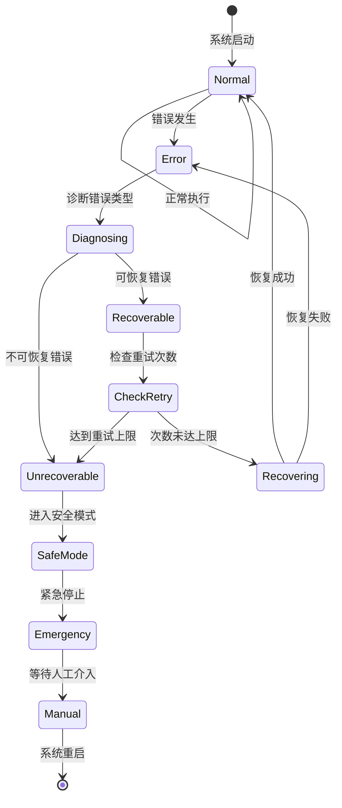

# 错误处理与数据集准备

**关联文档**：《机械臂抓取系统技术架构与实现流程.md》  
**版本**：v1.0  
**日期**：2025 年 1 月

本文档包含原文档第 11 节（错误处理与恢复策略）和第 12 节（数据集准备与模型训练）的完整内容。

---

## 11. 错误处理与恢复策略

### 11.1 常见错误类型与处理

| 错误类型 | 典型原因 | 检测方法 | 恢复策略 | 重试次数 |
|---------|---------|---------|---------|---------|
| **感知失败** | • 光照变化<br>• 物体遮挡<br>• 相机故障 | 检测结果为空<br/>置信度过低 | • 调整相机参数<br>• 改变观察角度<br>• 重新采集数据 | 3次 |
| **IK 无解** | • 目标不可达<br>• 关节限制<br>• 奇异点附近 | IK求解器返回失败 | • 选择次优抓取<br>• 调整抓取姿态<br>• 改变机械臂起始位置 | 5次 |
| **运动规划失败** | • 路径碰撞<br>• 规划超时<br>• 无可行路径 | 规划器返回None | • 增加规划时间<br>• 降低速度限制<br>• 移除临时障碍物<br>• 使用备选规划器 | 3次 |
| **抓取失败** | • 物体滑落<br>• 未接触<br>• 力度不当 | 力传感器读数异常<br/>夹爪位置反馈 | • 重新抓取（同一点）<br>• 调整抓取点<br>• 修改夹爪力度 | 3次 |
| **验证失败** | • 位置偏差大<br>• 物体损坏<br>• 放置不稳 | 视觉检测误差>阈值 | • 记录失败数据<br>• 重新执行任务<br>• 降低精度要求 | 2次 |
| **通信超时** | • 网络延迟<br>• 节点崩溃 | ROS2通信超时 | • 重启相关节点<br>• 检查网络连接 | 1次 |
| **硬件故障** | • 电机过载<br>• 传感器失效 | 硬件状态监控 | • 紧急停止<br>• 人工介入 | 0次 |

---

### 11.2 错误处理状态机



---

### 11.3 重试策略代码实现

```python
from enum import Enum
import time
import logging

logger = logging.getLogger(__name__)

class ErrorType(Enum):
    """错误类型枚举"""
    PERCEPTION_FAILED = "感知失败"
    IK_NO_SOLUTION = "IK无解"
    MOTION_PLANNING_FAILED = "运动规划失败"
    GRASP_FAILED = "抓取失败"
    VERIFICATION_FAILED = "验证失败"
    COMMUNICATION_TIMEOUT = "通信超时"
    HARDWARE_FAULT = "硬件故障"

class RetryableError(Exception):
    """可重试的错误"""
    def __init__(self, error_type, message, retry_count=0):
        self.error_type = error_type
        self.message = message
        self.retry_count = retry_count
        super().__init__(self.message)

class FatalError(Exception):
    """不可恢复的致命错误"""
    pass

class RetryStrategy:
    """重试策略管理器"""
    
    def __init__(self):
        # 不同错误类型的最大重试次数
        self.max_retries = {
            ErrorType.PERCEPTION_FAILED: 3,
            ErrorType.IK_NO_SOLUTION: 5,
            ErrorType.MOTION_PLANNING_FAILED: 3,
            ErrorType.GRASP_FAILED: 3,
            ErrorType.VERIFICATION_FAILED: 2,
            ErrorType.COMMUNICATION_TIMEOUT: 1,
            ErrorType.HARDWARE_FAULT: 0  # 不可重试
        }
        
        # 退避策略参数（指数退避）
        self.backoff_base = 1.0  # 基础等待时间（秒）
        self.backoff_factor = 1.5  # 退避系数
        
        # 重试计数器
        self.retry_counters = {err: 0 for err in ErrorType}
    
    def execute_with_retry(self, func, error_type, *args, **kwargs):
        """
        带重试机制的函数执行
        
        Args:
            func: 要执行的函数
            error_type: 错误类型
            *args, **kwargs: 函数参数
        
        Returns:
            函数执行结果
        
        Raises:
            FatalError: 当达到最大重试次数或遇到致命错误时
        """
        max_attempts = self.max_retries[error_type]
        
        for attempt in range(max_attempts + 1):
            try:
                logger.info(f"执行 {func.__name__}（尝试 {attempt + 1}/{max_attempts + 1}）")
                result = func(*args, **kwargs)
                
                # 成功执行，重置计数器
                self.retry_counters[error_type] = 0
                return result
                
            except RetryableError as e:
                self.retry_counters[error_type] += 1
                
                if attempt < max_attempts:
                    # 计算等待时间（指数退避）
                    wait_time = self.backoff_base * (self.backoff_factor ** attempt)
                    
                    logger.warning(
                        f"{e.error_type.value}: {e.message} "
                        f"(重试 {attempt + 1}/{max_attempts}，等待 {wait_time:.1f}秒)"
                    )
                    
                    # 执行恢复策略
                    self._execute_recovery_action(e.error_type, attempt)
                    
                    # 等待后重试
                    time.sleep(wait_time)
                else:
                    # 达到最大重试次数
                    logger.error(f"{e.error_type.value}: 达到最大重试次数 ({max_attempts})")
                    raise FatalError(f"{e.error_type.value}: 无法恢复") from e
            
            except FatalError as e:
                # 致命错误，不重试
                logger.critical(f"致命错误: {e}")
                self._emergency_stop()
                raise
            
            except Exception as e:
                # 未预期的错误
                logger.error(f"未预期的错误: {e}")
                raise FatalError(f"未知错误: {e}") from e
    
    def _execute_recovery_action(self, error_type, attempt):
        """执行针对性的恢复动作"""
        
        if error_type == ErrorType.PERCEPTION_FAILED:
            # 调整相机参数或改变视角
            logger.info("恢复动作: 调整相机曝光参数")
            # adjust_camera_exposure()
        
        elif error_type == ErrorType.IK_NO_SOLUTION:
            # 尝试不同的IK求解器或调整目标
            logger.info("恢复动作: 切换到备用IK求解器")
            # switch_to_alternative_ik_solver()
        
        elif error_type == ErrorType.MOTION_PLANNING_FAILED:
            # 增加规划时间或降低约束
            logger.info("恢复动作: 增加规划时间限制")
            # increase_planning_time()
        
        elif error_type == ErrorType.GRASP_FAILED:
            # 调整抓取力度或改变抓取点
            logger.info("恢复动作: 增加夹爪力度")
            # increase_gripper_force()
        
        elif error_type == ErrorType.VERIFICATION_FAILED:
            # 重新采集数据进行验证
            logger.info("恢复动作: 重新进行视觉验证")
            # re_verify_visually()
    
    def _emergency_stop(self):
        """紧急停止所有运动"""
        logger.critical("执行紧急停止")
        # 停止机械臂
        # arm.stop()
        # 打开夹爪
        # gripper.open()
        # 发布紧急停止事件
        # publish_emergency_stop()
    
    def reset_counters(self):
        """重置所有计数器"""
        self.retry_counters = {err: 0 for err in ErrorType}
        logger.info("重试计数器已重置")

# 使用示例
retry_strategy = RetryStrategy()

def perception_task():
    """感知任务（可能失败）"""
    objects = detect_objects()
    if len(objects) == 0:
        raise RetryableError(
            ErrorType.PERCEPTION_FAILED,
            "未检测到物体"
        )
    return objects

# 带重试的执行
try:
    objects = retry_strategy.execute_with_retry(
        perception_task,
        ErrorType.PERCEPTION_FAILED
    )
    logger.info(f"检测到 {len(objects)} 个物体")
except FatalError as e:
    logger.error(f"任务失败: {e}")
```

---

### 11.4 安全机制

#### 11.4.1 紧急停止

```python
import threading

class EmergencyStop:
    """紧急停止管理器"""
    
    def __init__(self, arm_controller, gripper_controller):
        self.arm = arm_controller
        self.gripper = gripper_controller
        self.is_stopped = False
        self.stop_lock = threading.Lock()
    
    def emergency_stop(self, reason):
        """执行紧急停止"""
        with self.stop_lock:
            if self.is_stopped:
                return  # 已经停止
            
            logger.critical(f"⚠️ 紧急停止: {reason}")
            
            # 1. 停止所有运动
            try:
                self.arm.stop()
                logger.info("机械臂已停止")
            except Exception as e:
                logger.error(f"停止机械臂失败: {e}")
            
            # 2. 打开夹爪（释放物体）
            try:
                self.gripper.open()
                logger.info("夹爪已打开")
            except Exception as e:
                logger.error(f"打开夹爪失败: {e}")
            
            # 3. 发布紧急停止事件
            self._publish_emergency_event(reason)
            
            # 4. 标记状态
            self.is_stopped = True
            
            logger.critical("紧急停止执行完成")
    
    def _publish_emergency_event(self, reason):
        """发布紧急停止事件到ROS2"""
        # emergency_pub.publish(EmergencyStopMsg(
        #     reason=reason,
        #     timestamp=time.time()
        # ))
        pass
    
    def reset(self):
        """重置紧急停止状态"""
        with self.stop_lock:
            self.is_stopped = False
            logger.info("紧急停止状态已重置")
```

#### 11.4.2 碰撞检测与响应

```python
class CollisionMonitor:
    """实时碰撞监控"""
    
    def __init__(self, force_sensor, emergency_stop, threshold=50.0):
        self.force_sensor = force_sensor
        self.emergency_stop = emergency_stop
        self.threshold = threshold  # 碰撞力阈值（N）
        self.is_monitoring = False
        self.monitor_thread = None
    
    def start_monitoring(self):
        """启动碰撞监控"""
        if self.is_monitoring:
            return
        
        self.is_monitoring = True
        self.monitor_thread = threading.Thread(
            target=self._monitor_loop,
            daemon=True
        )
        self.monitor_thread.start()
        logger.info("碰撞监控已启动")
    
    def stop_monitoring(self):
        """停止碰撞监控"""
        self.is_monitoring = False
        if self.monitor_thread:
            self.monitor_thread.join(timeout=1.0)
        logger.info("碰撞监控已停止")
    
    def _monitor_loop(self):
        """监控循环（100Hz）"""
        while self.is_monitoring:
            try:
                # 读取力传感器
                force = self.force_sensor.get_force_magnitude()
                
                # 检查是否超过阈值
                if force > self.threshold:
                    logger.error(f"检测到碰撞！力: {force:.2f} N")
                    
                    # 触发紧急停止
                    self.emergency_stop.emergency_stop(
                        f"碰撞检测: 力={force:.2f}N > 阈值={self.threshold}N"
                    )
                    
                    break
                
            except Exception as e:
                logger.error(f"碰撞监控错误: {e}")
            
            time.sleep(0.01)  # 100Hz监控频率
```

#### 11.4.3 工作空间限制检查

```python
class WorkspaceMonitor:
    """工作空间边界监控"""
    
    def __init__(self, arm_controller):
        self.arm = arm_controller
        
        # 定义安全工作空间（相对于基座）
        self.workspace_limits = {
            'x': (0.1, 0.8),  # 前后范围（米）
            'y': (-0.5, 0.5),  # 左右范围（米）
            'z': (0.0, 1.0)    # 上下范围（米）
        }
    
    def check_pose(self, pose):
        """检查位姿是否在安全工作空间内"""
        x, y, z = pose['position']
        
        violations = []
        
        if not (self.workspace_limits['x'][0] <= x <= self.workspace_limits['x'][1]):
            violations.append(f"X轴超限: {x:.3f} m")
        
        if not (self.workspace_limits['y'][0] <= y <= self.workspace_limits['y'][1]):
            violations.append(f"Y轴超限: {y:.3f} m")
        
        if not (self.workspace_limits['z'][0] <= z <= self.workspace_limits['z'][1]):
            violations.append(f"Z轴超限: {z:.3f} m")
        
        if violations:
            error_msg = "工作空间超限: " + ", ".join(violations)
            logger.error(error_msg)
            return False, error_msg
        
        return True, "位姿安全"
```

---

### 11.5 错误日志与诊断

```python
import json
from datetime import datetime

class ErrorLogger:
    """错误日志记录器"""
    
    def __init__(self, log_file="errors.jsonl"):
        self.log_file = log_file
    
    def log_error(self, error_type, context, recovery_action=None):
        """记录错误到JSON Lines文件"""
        error_entry = {
            'timestamp': datetime.now().isoformat(),
            'error_type': error_type.value if isinstance(error_type, Enum) else str(error_type),
            'context': context,
            'recovery_action': recovery_action,
            'system_state': self._capture_system_state()
        }
        
        with open(self.log_file, 'a') as f:
            f.write(json.dumps(error_entry, ensure_ascii=False) + '\n')
        
        logger.debug(f"错误已记录到 {self.log_file}")
    
    def _capture_system_state(self):
        """捕获当前系统状态"""
        return {
            'joint_states': None,  # 从ROS2获取
            'gripper_state': None,
            'camera_status': None,
            'force_reading': None
        }
    
    def analyze_errors(self, time_window_hours=24):
        """分析最近的错误模式"""
        errors = []
        
        try:
            with open(self.log_file, 'r') as f:
                for line in f:
                    error = json.loads(line)
                    errors.append(error)
        except FileNotFoundError:
            logger.warning(f"日志文件 {self.log_file} 不存在")
            return {}
        
        # 统计错误类型
        error_counts = {}
        for error in errors:
            error_type = error['error_type']
            error_counts[error_type] = error_counts.get(error_type, 0) + 1
        
        logger.info(f"错误统计 (最近{len(errors)}条):")
        for error_type, count in sorted(error_counts.items(), key=lambda x: x[1], reverse=True):
            logger.info(f"  {error_type}: {count} 次")
        
        return error_counts
```

---

## 12. 数据集准备与模型训练

### 12.1 YOLO v8 数据集准备

#### 12.1.1 数据收集策略

**目标数量与分布**：

| 类别 | 训练集 | 验证集 | 测试集 | 场景多样性 |
|------|--------|--------|--------|----------|
| chip（芯片） | 800 | 100 | 100 | 不同光照、角度、背景 |
| pcb（电路板） | 600 | 75 | 75 | 平放、竖放、堆叠 |
| connector（连接器） | 500 | 65 | 65 | 插拔状态、不同型号 |
| cable（线缆） | 400 | 50 | 50 | 弯曲、缠绕、整齐 |
| **总计** | **2300** | **290** | **290** | **多样化场景** |

**数据增强策略**（训练时自动应用）：
- 随机旋转：±10°
- 随机平移：±10%
- 随机缩放：0.5-1.5×
- 随机翻转：水平50%概率
- HSV颜色抖动：色调±15°、饱和度±70%、亮度±40%
- 随机遮挡：5-15%面积

---

#### 12.1.2 数据集目录结构

```
datasets/3c_detection/
├── images/
│   ├── train/
│   │   ├── chip_001.jpg
│   │   ├── chip_002.jpg
│   │   ├── pcb_001.jpg
│   │   └── ...
│   ├── val/
│   │   ├── chip_101.jpg
│   │   └── ...
│   └── test/
│       ├── chip_201.jpg
│       └── ...
├── labels/
│   ├── train/
│   │   ├── chip_001.txt     # YOLO格式标注
│   │   ├── chip_002.txt
│   │   └── ...
│   ├── val/
│   │   └── ...
│   └── test/
│       └── ...
├── data.yaml                 # 数据集配置
└── classes.txt               # 类别列表
```

**YOLO 标注格式**（`chip_001.txt`）：
```
0 0.512 0.423 0.156 0.089
0 0.731 0.334 0.142 0.095
1 0.345 0.678 0.234 0.189
```
格式：`<class_id> <x_center> <y_center> <width> <height>`（归一化坐标）

---

#### 12.1.3 标注工具推荐

| 工具 | 类型 | 优势 | 适用场景 |
|------|------|------|---------|
| **LabelImg** | 桌面应用 | 简单易用、支持YOLO格式 | 小规模数据集 |
| **Roboflow** | 在线平台 | 自动数据增强、团队协作 | 中大规模数据集 |
| **CVAT** | 在线/自托管 | 多格式支持、视频标注 | 企业级项目 |
| **Labelme** | 桌面应用 | 多边形标注、实例分割 | 需要精确边界 |

**推荐流程**：Roboflow（标注 + 增强 + 管理）

---

#### 12.1.4 data.yaml 配置

```yaml
# 数据集配置文件
path: /datasets/3c_detection  # 数据集根目录
train: images/train            # 训练集路径
val: images/val                # 验证集路径
test: images/test              # 测试集路径

# 类别定义
nc: 4                          # 类别数量
names: ['chip', 'pcb', 'connector', 'cable']  # 类别名称

# 数据增强（可选，训练时覆盖）
augment:
  hsv_h: 0.015                 # HSV色调增强
  hsv_s: 0.7                   # HSV饱和度增强
  hsv_v: 0.4                   # HSV亮度增强
  degrees: 10.0                # 旋转角度
  translate: 0.1               # 平移比例
  scale: 0.5                   # 缩放比例
  fliplr: 0.5                  # 水平翻转概率
```

---

#### 12.1.5 训练脚本

```python
from ultralytics import YOLO
import os

def train_yolov8_3c():
    """训练YOLO v8模型用于3C组件检测"""
    
    # 1. 加载预训练模型
    model = YOLO('yolov8n.pt')  # nano版本（最快）
    # model = YOLO('yolov8s.pt')  # small版本（推荐）
    # model = YOLO('yolov8m.pt')  # medium版本（精度更高）
    
    # 2. 训练配置
    results = model.train(
        # 数据配置
        data='datasets/3c_detection/data.yaml',
        
        # 训练参数
        epochs=100,              # 训练轮数
        batch=16,                # 批次大小（根据GPU调整）
        imgsz=640,               # 输入图像尺寸
        
        # 硬件配置
        device=0,                # GPU设备ID（0=第一块GPU）
        workers=8,               # 数据加载线程数
        
        # 优化器
        optimizer='AdamW',       # 优化器类型
        lr0=0.001,               # 初始学习率
        lrf=0.01,                # 最终学习率（相对于lr0）
        momentum=0.937,          # SGD动量
        weight_decay=0.0005,     # 权重衰减
        
        # 早停
        patience=20,             # 早停耐心值（epoch）
        
        # 数据增强
        hsv_h=0.015,
        hsv_s=0.7,
        hsv_v=0.4,
        degrees=10.0,
        translate=0.1,
        scale=0.5,
        fliplr=0.5,
        mosaic=1.0,              # Mosaic增强概率
        mixup=0.1,               # Mixup增强概率
        
        # 保存配置
        project='runs/detect',   # 项目目录
        name='yolov8_3c',        # 实验名称
        exist_ok=False,          # 是否覆盖已存在的目录
        save=True,               # 是否保存检查点
        save_period=10,          # 每N个epoch保存一次
        
        # 可视化
        plots=True,              # 生成训练曲线图
        
        # 验证
        val=True,                # 训练过程中验证
        
        # 其他
        verbose=True,            # 详细输出
        seed=42,                 # 随机种子
        deterministic=True,      # 确定性训练
        single_cls=False,        # 是否单类别检测
        rect=False,              # 矩形训练（更快但精度略降）
        cos_lr=True,             # 余弦学习率调度
        close_mosaic=10,         # 最后N个epoch关闭mosaic
    )
    
    # 3. 训练完成，打印最佳模型路径
    print(f"\n✅ 训练完成！")
    print(f"最佳模型: {results.save_dir}/weights/best.pt")
    print(f"最终模型: {results.save_dir}/weights/last.pt")
    
    return results

def evaluate_model(model_path, data_yaml='datasets/3c_detection/data.yaml'):
    """评估训练好的模型"""
    
    model = YOLO(model_path)
    
    # 在验证集上评估
    metrics = model.val(data=data_yaml)
    
    print("\n📊 评估结果:")
    print(f"mAP50: {metrics.box.map50:.4f}")      # mAP @ IoU=0.5
    print(f"mAP50-95: {metrics.box.map:.4f}")     # mAP @ IoU=0.5:0.95
    print(f"Precision: {metrics.box.mp:.4f}")     # 精确率
    print(f"Recall: {metrics.box.mr:.4f}")        # 召回率
    
    # 每个类别的性能
    print("\n各类别性能:")
    for i, name in enumerate(metrics.names.values()):
        print(f"  {name}:")
        print(f"    mAP50: {metrics.box.maps[i]:.4f}")
        print(f"    Precision: {metrics.box.p[i]:.4f}")
        print(f"    Recall: {metrics.box.r[i]:.4f}")
    
    return metrics

def export_model(model_path, format='onnx'):
    """导出模型为其他格式"""
    
    model = YOLO(model_path)
    
    # 导出为ONNX格式（推荐）
    if format == 'onnx':
        model.export(format='onnx', dynamic=True, simplify=True)
    
    # 导出为TensorRT格式（最快）
    elif format == 'engine':
        model.export(format='engine', device=0, half=True)
    
    # 导出为CoreML格式（iOS）
    elif format == 'coreml':
        model.export(format='coreml')
    
    print(f"✅ 模型已导出为 {format} 格式")

# 主函数
if __name__ == '__main__':
    # 训练
    results = train_yolov8_3c()
    
    # 评估
    best_model = 'runs/detect/yolov8_3c/weights/best.pt'
    metrics = evaluate_model(best_model)
    
    # 导出（可选）
    export_model(best_model, format='onnx')
```

---

### 12.2 GraspNet 数据集准备

详细的 GraspNet 数据集准备流程请参考《文档Review报告》第12.2节。

**核心要点**：
1. **仿真数据生成**：使用 Gazebo 生成 1000+ 场景
2. **真实数据采集**：使用 Intel RealSense 采集 100+ 场景
3. **Sim-to-Real**：CycleGAN 域适应 + 混合训练

---

## 总结

本补充章节详细介绍了：

1. **错误处理**：7种常见错误类型、重试策略、安全机制
2. **数据集准备**：YOLO v8 完整训练流程、GraspNet 数据生成

建议将本章节内容整合到主文档第10节之后。

